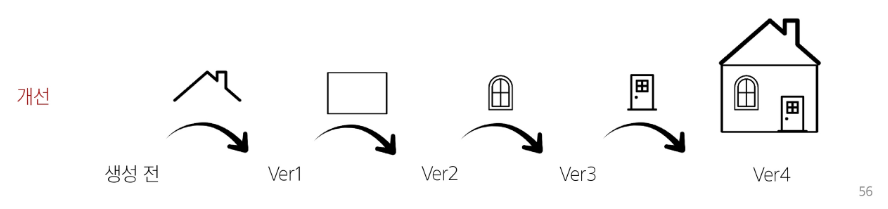

# Git
분산 버전 관리 시스템

- 버전 관리
  - 변화를 기록하고 추적하는 것
  - .git(파일) : 변경사항을 기록해 둔 폴더
  - git은 코드를 관리해준다

    
    
- 분산
  - 중앙 집중식 : 버전은 중앙 서버에 저장되고 중앙 서버에서 파일을 가져와 다시 중앙에 업로드
  
    
  
    - 단점 : 회사에 불이 났을 때 회사 서버(중앙 집중)의 버전은 다 삭제된다. 

  - 분산식 : 버전을 여러 개의 복제된 저장소에 저장 및 관리
  
    
  
  - 분산 구조에서의 장점
    - 중앙 서버에 의존하지 않고도 동시에 다양한 작업을 수행할 수 있음
      - 개발자들 간의 작업 충돌을 줄여주고 개발 생산성을 향상
    - 중앙 서버의 장애나 손실에 대비하여 백업과 복구가 용이
    - 인터넷에 연결되지 않은 환경에서도 작업을 계속할 수 있음
      - 변경 이력과 코드를 로컬 저장소에 기록하고, 나중에 중앙 서버와 동기화
  
  - git의 역할
    - 코드의 버전(히스토리)를 관리
    - 개발되어 온 과정 파악
    - 이전 버전과의 변경 사항 비교

## git의 영역

- Working Directory : 실제 작업 중인 파일들이 위치하는 영역

- Staging Area : Working Directory에서 변경된 파일 중, 다음 버전에 포함시킬 파일들을 선택적으로 추가하거나 제외할 수 있는 중간 준비 영역
- Repository : 버전`commit` 이력과 파일들이 영구적으로 저장되는 영역, 모든 버전`commit`과 변경 이력이 기록됨
- Commit(버전) : 변경된 파일들을 저장하는 행위이며, 마치 사진을 찍듯이 기록한다 하여 'snapshot'이라고도 함

## git의 동작
### git init
- 로컬 저장소 설정(초기화)
=> git의 버전 관리를 시작할 디렉토리에서 진행
### git add
- 변경사항이 있는 파일을 staging area에 추가
### git restore --staged `file`
- 커밋한 파일 되돌리기
### git rm --cached `file`
- staging area 파일에서 빼기
### git commit
- staging area에 있는 파일들을 저장소에 기록
=> 해당 시점의 버전을 생성하고 변경 이력을 남기는 것
- 옵션
  - -m : 메세지 작성

### git status
- git의 상태확인

  

### 계정 등록
  

### 계정 수정
  

  

### git config --global -l
- git global 설정 정보 보기

### git log
- commit history 보기
- git log --oneline : commit 목록 한줄로 보기
  

## 로컬 & 원격 저장소
### 원격 저장소에 저장

  

  - https://github.com/sojaeheon/TIL.git 이 주소를 origin이라고 부른다.
  - 별칭을 사용해 로컬 저장소 한 개에 여러 원격 저장소를 추가 할 수 있음

  - git push -u origin master : 원격 저장소에 저장
    
    - -u : git push만 써도 git push origin master로 저장됨

### 원격 저장소에 있는 git 폴더 옮기기

  

  - git clone https://github.com/sojaeheon/TIL.git

### 서브 모듈
- 깃으로 관리하고 있는 폴더 안에 새로운 깃을 만드는 것
- 서브 모듈 안에 있는 파일의 내용이 확인이 안될 수 있다