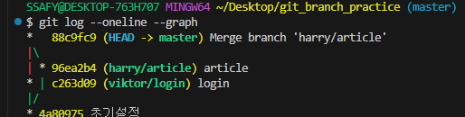
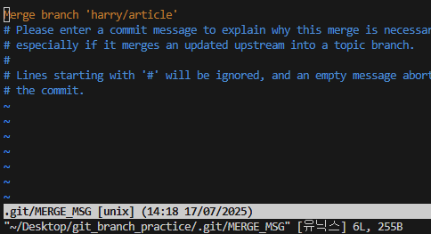
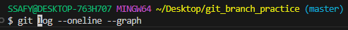
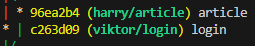
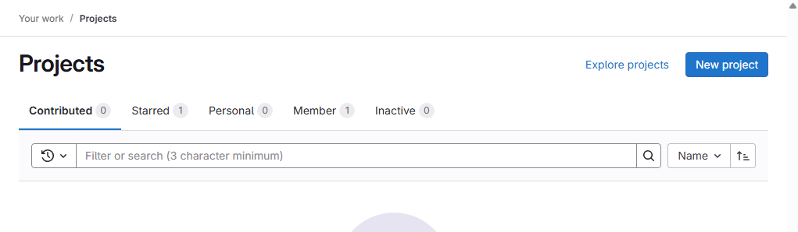
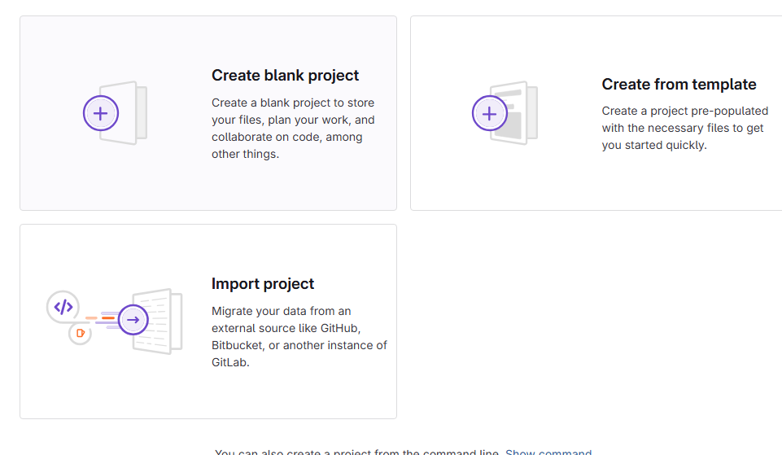
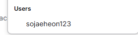
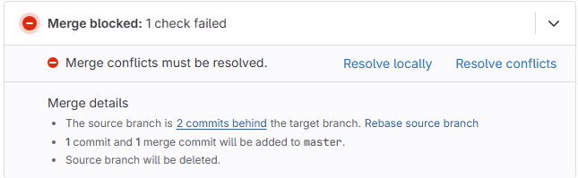

## Branch
나뭇가지처럼 여러 갈래로 작업 공간을 나누어 독립적으로 작업할 수 있도록 도와주는 git의 도구

### branch 장점
- 독립된 개발 환경을 형성하기 때문에 원본(master)에 대해 안전
- 하나의 작업은 하나의 브랜치로 나누어 진행되므로 체계적으로 협업과 개발이 가능
- 손쉽게 브랜치를 생성하고 브랜치 사이를 이동할 수 있음

### branch를 꼭 사용해야 할까?
- 만약 상용 중인 서비스에 발생한 에러를 해결하려면?
  1. 브랜치를 통해 별도의 작업 공간을 만든다
  2. 브랜치에서 에러가 발생한 버전을 이전 버전으로 되돌리거나 삭제한다
  3. 브랜치는 완전하게 독립 되어있어서 작업 내용이 master 브랜치에 아무런 영향을 끼치지 못한다
  4. 이후 에러가 해결됐다면? 그 내용을 master 브랜치에 반영할 수 있다

### Master(main) 브랜치의 의미와 역할
- 기분 브랜치
  
  저장소의 초기 상태를 나타내며, 일반적으로 프로젝트의 가장 최신 버전 또는 배포 가능한 안정적인 코드를 포함

- 기준점
  
  다른 브랜치가 파생되는 기준점으로 사용됨

## Branch Command
### 상황
1. 팀원 A는 로그인 기능을 작업한다
2. 팀원 B는 게시글 작성 기능을 작업한다
3. 팀원 A와 B는 모두 settings.py의 내용을 필요로 한다

### 브랜치 만들기
`git branch -c viktor/login`

### branch 확인
`gir branch`

### 작업환경 branch 옮기기
`git switch viktor/login`

### master 브랜치에서 합치기
- master 브랜치에서 `git merge viktor/login`(A작업)=> `패스트포워드 merge`라고 부른
- `패스트포워드merge`인 이유
  
  

  - master입장에서는 viktor앞으로만 오면 됌

- B작업 merge => `쓰리웨이 merge`
  
  

- 위 그림이 나오면 :q
- B 작업만 vim을 갖다오는 이유

  

  - B작업 입장에서는 master commit과 article commit이 다르다.

  

### branch 삭제
`git branch -d viktor/login`

### git lab 원격 저장소 만들기
- `new project`
  
  

- `create blank project`
  
  

- project url에서 user선택

  

- repository에 manage에 members들어가서 invite members로 초대

- repository 삭제
  - 본인이 만든 repository 로 들어가서
  - settings의 general에서 advanced에서 delete project클릭, 프로젝트 명을 입력하고 삭제

### merge시 충돌(comflict)이 생겼을 때
- master에서 merge를 수행할 때 충돌이 생겼을 때 수정할 부분만 accept 해준다.

### gitlab에서 충돌이 생겼을 때

  

- 충돌이 난 부분은 원격 저장소이다.
- 로컬 `master branch`에 있는 버전을 최신화한다
  - `git pull origin master`
- 다른 브랜치로 변경 후 merge하고 다시 `git push`
- 원격에서는 새로운 merge 요청 수락

## 주의사항

1. master 브랜치는 아무도 수정하지 않는다
2. master 브랜치는 최초 설정(모든 팀원이 함께 쓸 내용 생성시만 사용)
    - git add, git commit, push까지 모두 진행
3. 팀장이 develop(혹은 dev) 브랜치를 생성한다.

### 브랜치 워크 플로우
`master branch` : 제품으로 출시될 수 있는 브랜치 

`release branch` : 이번 출시 버전을 준비하는 브랜치

`dev branch` : 다음 출시 버전을 개발하는 브랜치

`Feature branch` : 기능을 개발하는 브랜치

`hotfix branch` : 출시 버전에서 발생한 버그를 수정하는 브랜치