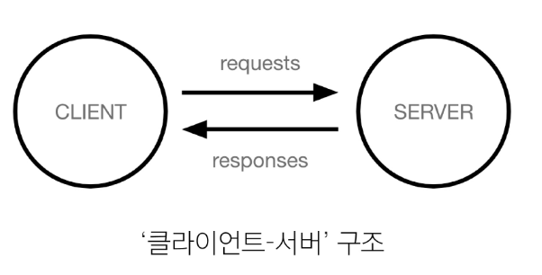

# ChatGPT
### Generative AI
오디오, 비디오, 이미지, 텍스트, 코드, 시뮬레이션 등의 새로운 콘텐츠를 생성하는 인공지능 모델

생성 모델 / 사전 훈련/ 트랜스포머 AI 모델

### chatgpt 주요개념
- Generative ai
  기존 패턴을 기반으로 오디오, 비디오, 이미지, 텍스트, 코드, 시뮬레이션 등의 새로운 콘텐츠를 생성하는 인공지능 모델

- pre-trained
  거대 언어 모델 + 추가 학습 데이터 + 추가 강화 학습

- Transformer
  문장 속의 단어 간 관계를 추적해 맥락과 의미를 학습
  인간처럼 일관되고 연관성이 높은 언어를 구사하여 대화형 작업에 강점

### 트랜스포머
문장의 맥락을 효과적으로 이해하고 처리 `Attention 메커니즘`

- 주요 개념
  - self-attention 메커니즘
    입력 데이터 간의 관계와 중요도를 계산
  - 병렬 처리 가능
    RNN과 달리 순차 처리가 필요 없어 속도가 빠름
  - 스케일링 가능
    대규모 데이터 및 파라미터로 확장 가능

    ※ GPT 모델은 특히 Transformer의 `디코더` 부분만을 사용

### Attention 메커니즘

- ai가 데이터의 맥락과 중요도를 이해하도록 돕는 필수 기술
- 입력 데이터의 각 요소가 출력에 얼마나 중요한지 중요도(weight)를 계산하는 기법
- "중요한 것에 집중한다"는 아이디어를 바탕으로 설계됨
- 종류
  - Self-Attention : 입력 데이터 내부에서 각 요소 간 중요도를 계산
  - Multi-Head Attention : 다양한 관심사(관점)를 병렬로 계산하여 성능 향상

### 질문하기(prompting)
- 같은 질문을 해도 매번 같은 응답을 줄 수도, 다른 응답을 줄 수도 있음
- 근거가 없을 가능성이 있음
- 마지막 학습 이후에 나타난 객관적 사실의 정확도가 상대적으로 떨어짐
- prompt engineering이 가장 중요

## 클라이언트와 서버
웹의 동작 방식

  

- 클라이언트 : 서비스를 요청하는 쪽
  
  예) 사용자의 웹 브라우저, 모바일 웹

- 서버(server) : 요청을 받아서 처리하고, 결과를 응답해주는 쪽

  예) 웹 서버, 데이터베이스 서버

# API(Application Programming Interface)
두 소프트웨어(또는 시스템)가 서로 통신할 수 있게 하는 메커니즘

-> `약속된 방식의 인터페이스`로, 특정 규칙에 따라 데이터를 요청하고 응답하는 규칙을 제공

### Interface
서로 다른 두개의 시스템(기기, 소프트웨어 등)이 정보를 교환할 때, 그 사이에 존재하는 접점
-> 사용자가 기기를 쉽게 동작 시키거나, 기계와 기계가 통신할 때 필요한 '약속된 방식'

### Application
특정 기능을 수행하는 모든 소프트웨어

-> 웹,모바일,데스크톱 앱 등, 우리가 만든 서비스나 프로그램도 모두 앱의 일종

### open api 공식 문서
[open api공식 문서](https://platform.openai.com/docs/overview)

사용방법은 데이터트랙_gpt_api실습_기초 파일

