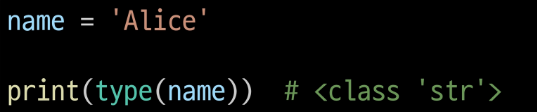
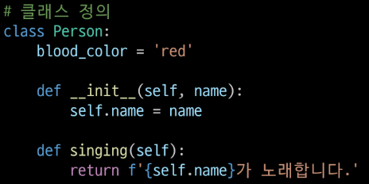
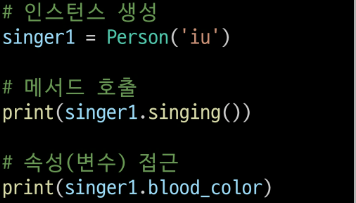
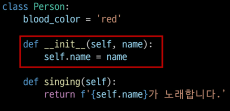
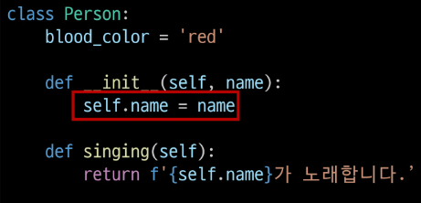
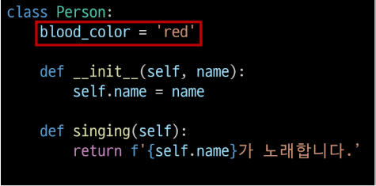
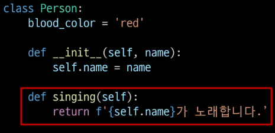
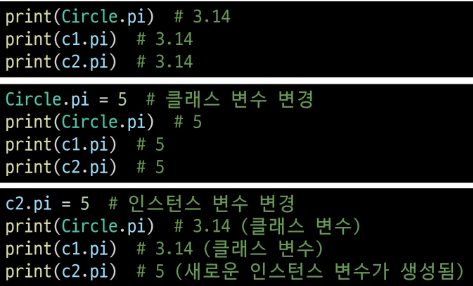
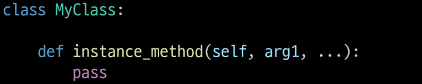

# 객체
### 클래스
파이썬에서 타입을 표현하는 방법
- 객체를 생성하기 위한 설계도
- 데이터와 기능을 함께 묶는 방법을 제공

### 객체
클래스에서 정의한 것을 토대로 메모리에 할당된 것

`속성`과 `행동`으로 구성된 모든것
- 속성(변수) : 직업(가수), 생년월일, 국적
- 행동(메서드) : 랩(), 댄스(), 소몰이()

### 클래스와 객체
- 클래스로 만든 객체를 `인스턴스`라고 부름
- 클래스(가수)와 객체(아이유)

    클래스를 만든다 == 타입(list)을 만든다

- 변수 name의 타입으 str클래스다
    - 변수 name은 `str클래스의 인스턴스`이다

    

- 하나의 객체(object)는 특정 타입의 인스턴스(nstance)이다

### 객체 정리
- 타입(type) : 어떤 연산자(operator)와 조작(method)이 가능한가?
- 속성(attribute) : 어떤 상태(데이터)를 가지는가?
- 조작법(method) : 어떤 행위(함수)를 할 수 있는가?

객체(object) = 속성(attribue) + 기능(method)

# 클래스
## 클래스 정의
- class키워드
- 클래스 이름은 파스칼 케이스(Pascal Case) 방식으로 작성

### 인스턴스 생성 및 활용

## 클래스 구성요소
### 생성자 함수

- 객체를 생성할 때 자동으로 호출되는 특별한 메서드
- __init__메서드로 정의되며, 객체 초기화를 담당
- 생성자 함수를 통해 인스턴스를 생성하고 필요한 초기값을 설정

### 인스턴스 변수

- 인스턴스마다 별도로 유지되는 변수
- 인스턴스마다 독립적인 값을 가지며, 인스턴스가 생성될 때마다 초기화됨

### 클래스 변수

- 클래스 내부에 선언된 변수
- 클래스로 생성된 `모든 인스턴스들이 공유하는 변수`

### 인스턴스 메서드

- 각 인스턴스에서 호출할 수 있는 메서드
- `인스턴스 변수에 접근`하고 수정하는 등의 작업을 수행

### 클래스 변수와 인스턴스 변수으 ㅣ차이

## 메서드
### 메서드의 종류
1. 인스턴스 메서드
2. 클래스 메서드
3. 정적 메서드

### 인스턴스 메서드

- 클래스로부터 생성된 각 인스턴스에서 호출할 수 있는 메서드
    - 인스턴스의 상태를 조작하거나 동작을 수행
- 반드시 첫 번재 매개변수로 인스턴스 자신(self)을 전달받음
    - self는 매개변수 이름일 뿐이며 다른 이름으로 설정 가능, 하지만 다른 이름을 사용하지 않을 것을 강력히 권장

