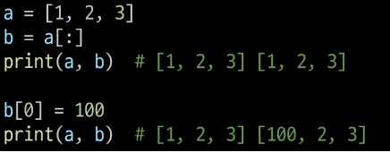
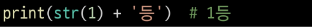
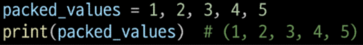

# Data types / Control of flow / Functions
# 1. Data Types
- Numeric Types
  - int(정수), float(실수), complex(복소수)

- Non-sequence Types
  - set, dict

- Text Seqduence Type
  - str

- sequence Types
  - list, tuple, range

- 기타
  - Boolean, none, Functions

## 타입과 메서드
### 메서드
- 객체에 속한 함수
- 객체의 상태를 조작하거나 동작을 수행

### 메서드 특징d
- 메서드는 클래스(class)내부에 정의되는 함수
- 클래스는 파이썬에서 '타입을 표현하는 방법'
- help 함수를 통해 str을 호출해보면 class 라는 것을 확인 가능

## numberic Types
- int
  - 정수 자료형
- float
  - 실수 자료형
- 지수 표현 방식 : e 또는 E를 사용한 지수 표현

  

## Sequence Types
여러 개의 값들을 순서대로 나열하여 저장하는 자료형(str, list, tuple, range)

### Sequence Types 특징

1. 순서(Sequence)
    - 값들이 순서대로 저장(정렬x)
2. 인덱싱(Indexing)
    - 각 값에 고유한 인덱스(번호)를 가지고 있음
    - 인덱스를 사용하여 특정 위치의 값을 선택하거나 수정할 수 있음
3. 슬라이싱(Slicing)
    - 인덱스 범위를 조절해 부분적인 값을 추출할 수 있음
4. 길이(Length)
    - len() 함수를 사용하여 저장된 값의 개수(길이)를 구할 수 있음
5. 반복(Iteration)
    - 반복문을 사용하여 저장된 값들을 반복적으로 처리할 수 있음

## str
- 문자들의 순서가 있는 변경 불가능한 시퀀스 자료형
- 문자열은 단일 문자나 여러 문자의 조합으로 이루어짐
- 작은 따옴표(') 또는 큰따옴표(")로 감싸서 표현

### f-string
- 문자열 f 또는 F 접두어를 붙이고 표현식을 {expression}로 작성하여 문자열에 파이썬 표현식의 값을 삽입할 수 있음

### pythoen의 index

### 슬라이싱
시퀀스의 일부분을 선택하여 추출하는 작업

> 시작 인덱스와 끝 인덱스를 지정하여 해당 범위의 값을 포함하는 새로운 시퀀스를 생성

예시) my_str[:3], my_str[3:],my_str[0:5:2],my_str[::-1]

## str메서드

## list
- 여러 개의 값을 순서대로 저장하는 변경 가능한 시퀀스 자료형
- 0개 이상의 객체를 포함하며 데이터 목록을 저장
- 대괄효([])로 표기
- 데이터는 어떤 자료형도 저장할 수 있음

### 리스트는 가변(변경 가능)

### 중첩된 리스트 접근

## list 메서드
### 리스트 값 추가 및 삭제 메서드

### 리스트 탐색 및 정렬 메서드

## tuple
- 여러 개의 값을 순서대로 저장하는 변경 불가능한 시퀀스 자료형
- 0개 이상의 객체를 포함하며 데이터 목록을 저장
- 소괄호(())로 표기
- 데이터는 어떤 자료형도 저장할 수 있음

### 튜플은 불변(변경 불가)

### 튜플 사용 목적
- 튜플의 불변 특성을 사용한 여러 개의 값을 전달, 그룹화, 다중 할당 등
- 개발자가 직접 사용하기 보다 '파이썬 내부 동작'에서 주로 사용됨

## range
연속된 정수 시퀀스를 생성하는 변경 불가능한 자료형
> range(시작 값, 끝 값, 증가 값)

> range(n)

0부터 n-1까지의 숫자의 시퀀스

>range(n,m)

n부터 m-1까지의 숫자 시퀀스

### range특징
- 증가 값이 없으면 1씩 증가
- 증가 값이 음수이면 감소 / 증가 값이 양수이면 증가
- 증가 값이 0이면 에러

### range 활용 예시

## Non-Sequence Types
### dict딕셔너리
key-value 쌍으로 이루어진 순서와 중복이 없는 변경 가능한 자료형

### 딕셔너리 표현
- key는 변경 불가능한 자료형만 사용 가능(str, int, float, tuple, range...)
- value는 모든 자료형 사용 가능
- 중괄효({})로 표기

### key를 통해 value에 접근

### dict 메서드

## set
- 순서와 `중복이 없는 변경 가능한 자료형`
- 수학에서 집합과 동일한 연산 처리 가능
- 중괄호({})로 표기

### 세트 집합 연산

### set 메서드

## Other Types
### None
- 파이썬에서 '값이 없음'을 표현하는 자료형

### boolean
- 참(True)과 거짓(False)을 포현하는 자료형
- 비교 / 논리 연산의 평가 결과로 사용됨
- 주로 조건 / 반복문과 함께 사용

## 복사
### 데이터 타입과 복사
- 파이썬에서는 데이터에 분류에 따라 복사가 달라짐
- "변경 가능한 데이터 타입"과 "변경 불가능한 데이터 타입"을 다르게 다룸

### 변경 가능한 데이터 타입의 복사

### 변경 불가능한 데이터 타입의 복사

## 복사 유형
### 할당

### 얕은 복사

- 얕은 복사의 한계
  - 2차원 리스트와 같이 변경 가능한 객체 안에 변경 가능한 객체가 있는 경우

    
  
  - a와 b의 주소는 다르지만, 내부 객체의 주소는 같기 때문에 함께 변경됨

    

### 깊은 복사(1/2)

- 내부에 중첩된 모든 객체까지 새로운 객체 주소를 참조하도록 함

  

## Type Conversion
### 암시적 형변환
- 파이썬이 자동으로 형변환을 하는 것
- Boolean과 Numeric Type

 

### 명시적 형변환
- 개발자가 직접 형변환을 하는 것
- 암시적 형변환이 아닌 경우를 모두 포함
- str -> integer : 형식에 맞는 숫자만 가능
    

- integer -> str : 모두 가능
    

### 형변환 정리

# 2. Operator
## 기본 연산자
### 산술 연산자

### 복합 연산자

### 비교 연산자

### is 비교 연산자
- 메모리 내에서 같은 객체를 참조하는지 확인
- ==는 동등성(equality), is는 식별성(identity)
- 값을 비교하는 ==와 다름

### 논리 연산자

## 단축평가
- 논리 연산에서 두 번째 피연산자를 평가하지 않고 결과를 결정하는 동작

## 멤버십 연산자
- 특정 값이 시퀀스나 다른 컬렌션에 속하는지 여부를 확인

## 시퀀스형 연산자
- +와 *는 시퀀스 간 연산에서 산술 연산자일때와 다른 역할을 가짐

### 연산자 우선순위 정리

#  Control Of Flow
## 제어문
- 코드의 실행 흐름을 제어하는 데 사용되는 구문
- 조건에 따라 코드 블록을 실행하거나 반복적으로 코드르 실행
- 조건문 : if, elif, else
- 반복문 :  for, while
- 반복문 제어 : break, continue, pass

## 조건문
### if statement의 기본구조

## 반복문
- 임의의 시퀀스의 항목들을 그 시퀀스에 들어있는 순서대로 반복

### 반복 가능한 객체(iterable)
반복문에서 순회할 수 있는 객체(시퀀스 객체 뿐만 아니라 dict, set 등도 포함)

### 인덱스로 리스트 순회
- 리스트의 요소가 아닌 인덱스로 접근하여 해당 요소들을 변경하기

### 중첩 리스트 순회
- 안쪽 리스트 요소에 접근하려면 바깥 리스트를 순회하면서 중첩 반복을 사용해 각 안쪽 반복을 순회

### whil
- 주어진 조건식이 참(True)인 동안 코드를 반복해서 실행
- ==조건식이 거짓(False)가 될 때 까지 반복

### 적절한 반복문 활용하기
- for
  - 반복 횟수가 명확하게 정해져 있는 경우에 유용
  - 예를 들어 리스트, 튜플, 문자열 등과 같은 시퀀스 형식의 데이터를 처리할 때

- while
  - 반복 횟수가 불명확하거나 조건에 따라 반복을 종료해야 할 때 유용
  - 예를 들어 사용자의 입력을 받아서 특정 조건이 충족될 때까지 반복하는 경우

### 반복문 제어 키워드
- break : 반복을 즉시 중지
- continue : 다음 반복으로 건너뜀
- pass : 아무런 동작도 수행하지 않고 넘어감

## List Comprehension
- 간결하고 효율적인 리스트 생성 방법

# Functions
## 함수
### 함수 구조

### 파이썬 함수의 특징
- def 키워드를 사용하여 정의
- 일급 객체
  - 함수가 변수에 할당될 수 있음
  - 함수가 다른 함수의 인자로 전달될 수 있음
  - 함수가 다른 함수에 의해 반환될 수 있음
- 익명 함수로 사용 가능(람다 표현식)

## 매개변수와 인자
### 매개변수와 인자 간 구분
- 매개변수(parameter)
  - 함수를 정의할 때, 함수가 받을 값을 나타내는 변수
- 인자(argument)
  - 함수를 호출할 때, 실제로 전달되는 값

### 다양한 인자 종류
1. Positional Argument(위치인자)
    - 함수 호출 시 인자의 위치에 따라 전달되는 인자
    - 위치인자는 함수 호출 시 반드시 값을 전달해야함
      

2. Default Argument Values(기본 인자 값)
    - 함수 정의에서 매개변수에 기본 값을 할당하는 것
    - 함수 호출 시 인자를 전달하지 않으면, 기본값이 매개변수에 할당됨

    

3. Keyword Arguments(키워드 인자)
    - 함수 호출 시 인자의 이름과 함께 값을 전달하는 인자
    - 매개변수와 인자를 일치시키지 않고, 특정 매개변수에 값을 할당할 수 있음
    - 인자의 순서는 중요하지 않으며, 인자의 이름을 명시하여 전달
    - 단, 호출 시 키워드 인자는 위치 인자 뒤에 위치해야 함
      
      

4. Arbitrary Argument Lists(임의의 인자 목록)
    - 정해지지 않은 개수의 인자를 처리하는 인자
    - 함수 정의 시 매개변수 앞에 '*'를 붙여 사용하며, 여러개의 인자를 tuple로 처리

      

5. Arbitrary Keyword Argument Lists(임의의 키워드 인자 목록)
    - 정해지지 않은 개수의 키워드 인자를 처리하는 인자
    - 함수 정의 시 매개변수 앞이 '**'를 붙여 사용하며, 여러 개의 인자를 dictionary로 묶어 처리

      

### 함수 인자 권장 작성순서
- 위치 -> 기본 -> 가변 -> 가변 키워드
- 호출 시 인자를 전달하는 과정에서 혼란을 줄일 수 있도록 함
- 단, 모든 상황에 적용되는 절대적인 규칙은 아니며, 상황에 따라 유연하게 조정될 수 있음
  

### 인자의 모든 종류를 적용한 예시

## Packing & Unpacking
### Packing
- 여러 개의 값을 하나의 변수를 묶어서 담는 것
- 변수에 담긴 값들은 튜플(tuple) 형태로 묶임
  
  

### '*'을 활용한 패킹
- *b는 남은 요소들을 리스트로 패킹하여 할당

### unpacking
- 패킹된 변수의 값을 개별적인 변수로 분리하여 할당하는 것
- 튜플이나 리스트 등의 객체의 요소들을 개별 변수에 할당

### '*'을 활용한 언패킹
- * 는 리스트의 요소를 언패킹하여 인자로 전달

### '**'을 활용한 언패킹
- **는 딕셔너리의 키-값 쌍을 언패킹하여 함수의 키워드 인자로 전달

## 내장함수

## 람다표현식
- 익명 함수를 만드는 데 사용되는 표현식
- 한줄로 간단한 함수를 정의

### 람다 표현식 기본구조

