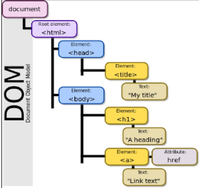
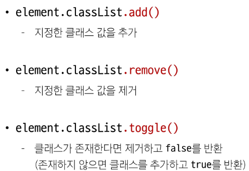
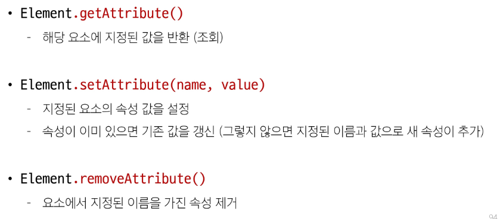
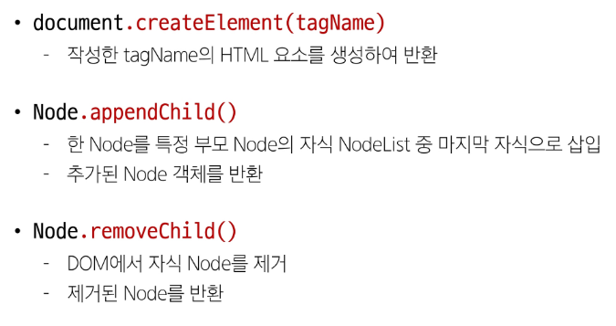

# DOM
## DOM(The Document Object Model)
웹 페이지(document)를 구조화된 객체로 제공하여 프로그래밍 언어가 페이지 구조에 접근할 수 있는 방법을 제공

-> 문서 구조, 스타일, 내용 등을 변경할 수 있도록 함

### DOM API
- 다른 프로그래밍 언어가 웹 페이지에 접근 및 조작할 수 있도록 페이지 요소들을 객체 형태로 제공하며 이에 따른 메서드 또한 제공

### DOM 핵심
문서의 요소들을 객체로 제공하여 다른 프로그래밍 언어에서 접근하고 조작할 수 있는 방법을 제공하는 API

## document 객체
### 'document' 객체
- 웹 페이지 객체
- DOM Tree의 진입점
- 페이지를 구성하는 모든 객체 요소를 포함

## DOM 선택
### DOM 조작 시 기억해야 할 것
웹 페이지를 동적으로 만들기 == 웹 페이지를 조작하기

- 조작 순서
  1. 조작하고자 하는 요소를 `선택`(또는 탐색)
  2. 선택된 요소의 콘텐츠 또는 속성을 조작

## 선택 메서드
- document.querySelector()
  - 요소 한개 선택
  - 제공한 선택자와 일치하는 element 한 개 선택
  - 제공한 CSS selector를 만족하는 첫 번째 element 객체를 반환(없다면 null반환)
- document.querySelectorAll()
  - 요소 여러 개 선택
  - 제공한 선택자와 일치하는 여러 element를 선택
  - 제공한 CSS selector를 만족하는 NodeList를 반환

# DOM 조작
속성조작, HTML콘텐츠 조작, DOM 요소 조작, 스타일 조작

## 속성 조작
### 클래스 속성 조작
'classList' property

요소의 클래스 목록을 DOMTokenList(유사 배열) 형태로 반환

### 1. classList 메서드

### 2. 일반 속성 조작 메서드

## HTML 콘텐츠 조작
'textContent' property

요소의 텍스트 콘텐츠를 표현

\
 `lorem` \

### DOM 요소 조작 메서드

## style 조작
'style' property

해당 요소의 모든 style 속성 목록을 포함하는 속성

