# Javascript
## ECMAScript
Ecma International이 정의하고 있는 표준화된 스크립트 프로그래밍 언어 명세
-> 스크립트 언어가 준수해야하는 규칙, 세부사항 등을 제공

### ECMAScript와 JavaScript
- javascript는 ECMAScript 표준을 구현한 구체적인 프로그래밍 언어
- ECMAScript의 명세를 기반으로 하여 웹 브라우저나 Node.js와 같은 환경에서 실행됨
- ECMAScript 는 javascript의 표준이며, javascript는 ECMAScript 표준을 따르는 구체적인 프로그래밍 언어
- ECAMScript는 언어의 핵심을 정의하고, Javascript는 언어의 핵심을 정의하고, javascript는 ECMAScript표준을 따라 구현된 언어로 사용됨

# 변수
## JavaScript 문법 학습
[권장 스타일 가이드](https://standradjs.com/rules-kokr.html)

## 변수 선언 키워드
### 식별자(변수명) 작성 규칙
- 반드시 문자, 달러('$') 또는 밑줄('_')로 시작
- 대소문자를 구분
- 예약어 사용 불가
  - for, if, function 등

### 식별자(변수명) Naming case
- 카멜 케이스(camelCase) : 변수, 객체, 함수를 사용
- 파스칼 케이스(PascalCase) : 클래스, 생성자에 사용
- 대문자 스네이크 케이스(SNAKE_CASE) : 상수(constancs)에 사용

## 변수 선언 키워드 3가지
### let(재할당이 필요할때 사용)
- 블록 스코프(block scopt)를 갖는 지역 변수를 선언
- 재할당 가능
- 재선언 불가능
- ES6 에서 추가

### const(사용권장)
- 블록 스코프를 갖는 지역 변수를 선언
- 재할당 불가능
- 재선언 불가능
- ES6에서 추가

### 블록 스코프(block scope)
- if, for, 함수 등의 `중괄호({}) 내부`를 가리킴
- 블록 스코프를 가지는 변수는 블록 바깥에서 접근 불가능

  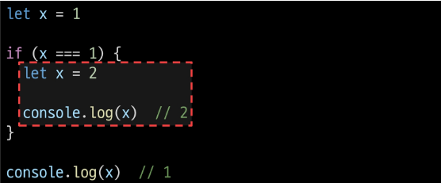

# 데이터 타입
원시 자료형 : number, String, Boolean, null, undefined

참조 자료형 : Object(Object, Array, Function)
## 원시 자료형
### Number
정수 또는 실수형 숫자를 표현하는 자료형

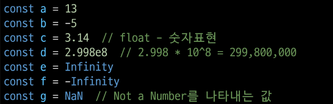

### String
- 텍스트 데이터를 표현하는 자료형
- '+' 연산자를 사용해 문자열끼리 결합
- 뺄셈, 곱셈, 나눗셈 불가능

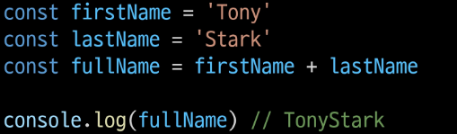

### Template literals(템플릿 리터럴)
- 내장된 표현식을 허용하는 문자열 작성 방식
- Backtick(``) 이용하며, 여러 줄에 걸쳐 문자열을 정의할 수도 있고 javascript의 변수를 문자열 안에 바로 연결할 수 있음
- 표현식은 '\$'와 중괄호(${expression})로 표시
- ES6+부터 지원

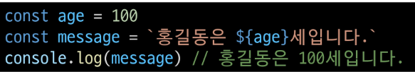

### null과 undefined
- null : 변수의 값이 없음을 의도적으로 표현할 때 사용
- undefined : 변수 선언 이후 직접 값을 할당하지 않으면 자동으로 할당됨

### Boolean
true/false

- 조건문 또는 반복문에서 Boolean이 아닌 데이터 타입은 "자동 형변환 규칙"에 따라 true 또는 false로 변환됨

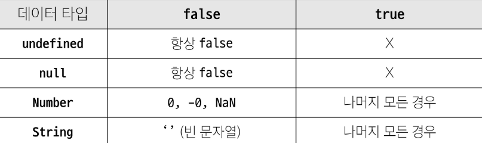

# 연산자
### 할당 연산자
- 오른쪽에 있는 피연사자의 평가 결과를 왼쪽 피연산자에 할당하는 연산자
- 단축 연산자 지원

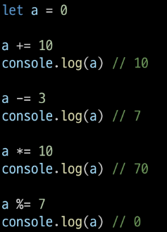

### 증가 & 감소 연산자
- 증가 연산자('++')
  - 피연산자를 증가(1을 더함)시키고 연산자의 위치에 따라 증가하기 전이나 후의 값을 반환
- 감소 연산자('--')
  - 피연산자를 감소(1을 뺌)시키고 연산자의 위치에 따라 감소하기 전이나 후의 값을 반환

### 비교 연산자
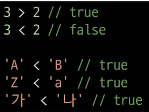

### 동등 연산자(==)
'암묵적 타입 변환' 통해 타입을 일치시킨 후 같은 값인지 비교

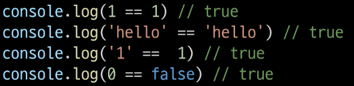

### 일치 연산자(===)
두 피연산자의 값과 타입이 모두 같은 경우 true를 반환

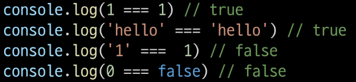

### 논리 연산자

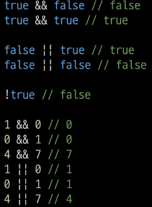

# 조건문
### if
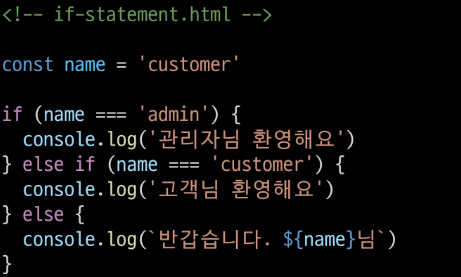

### 삼항 연산자

- condition : 평가할 조건
- expression1 : 조건이 true일 경우 반환할 값 또는 표현식
- expression2 : 조건이 false일 경우 반환할 값 또는 표현식

# 반복문
### while
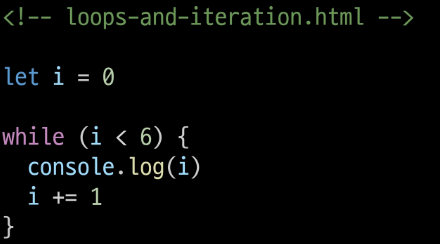

### for
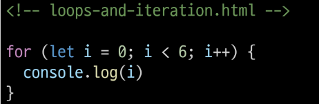

### for...in
- 객체의 열거 가능한 속성(property)에 대해 반복 

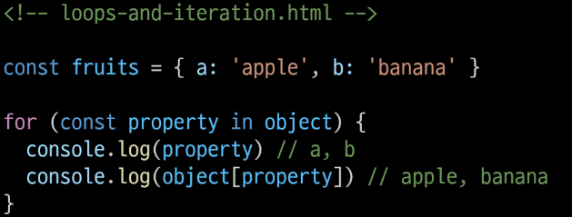

### for...of
- 반복 가능한 객체(배열, 문자열 등)에 대해 반복

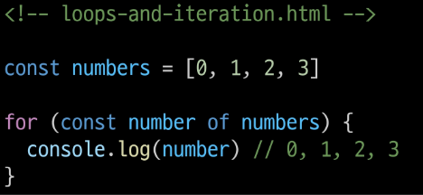

### 반복문 종합

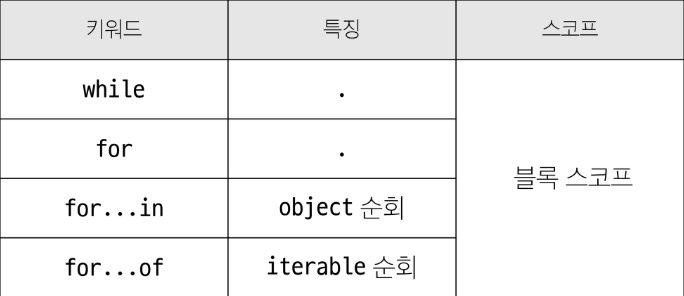

