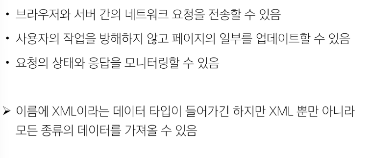
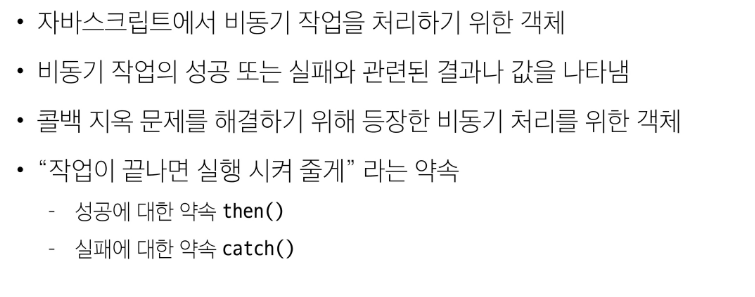

# AJAX
XMLHttpRequest 기술을 사용해 복잡하고 동적인 웹 페이지를 구성하는 프로그래밍 방식

### 목적
- 전체 페이지가 다시 로드되지 않고 HTML 페이지 일부 DOM만 업데이트
- 웹 페이지 일부가 다시 로드되는 동안에도 코드가 계속 실행되어, 비동기식으로 작업할 수 있음

### XMLHttpRequest 특징

### XML구조
- HTTP 요청을 생성하고 전송하는 기능을 제공
- AJAX 요청을 통해 서버에서 데이터를 가져와 웹 페이지에 동적으로 표시

### 비동기 처리의 단점
- 개발자 입장에서 코드의 실행 순서가 불명확하다는 단점 존재
- 이와 같은 단점은 실행 결과를 예상하면서 코드를 작성할 수 없게 함

> 콜백함수를 사용하자

### 비동기 콜백
- 비동기적으로 처리되는 작업이 완료되었을 때 실행되는 함수
- 연쇄적으로 발생하는 비동기 작업을 `순차적으로 동작`할 수 있게 함
- 작업의 순서와 동작을 제어하거나 결과를 처리하는 데 사용

### 비동기 콜백의 한계
- 비동기 콜백 함수는 보통 어떤 기능의 실행 결과를 받아서 다른 기능을 수행하기 위해많이 사용됨
- 이 과정을 작성하다 보면 비슷한 패턴이 계속 발생
  - A를 처리해서 결과가 나오면, 첫 번째 callback 함수를 실행하고,
  - 첫 번째 callback 함수가 종료되면, 두 번째 callback 함수를 실행하고,
  - 두 번째 callback 함수가 종료되면, 세 번째 함수를 실행하고...
- "콜백 지옥" 발생

> 객체로 관리하자

### 프로미스
JavaScript에서 비동기 작업의 결과를 나타내는 객체

-> 비동기 작업이 완료되었을 때 결과 값을 반환하거나, 실패 시 에러를 처리할 수 있는 기능을 제공

### then 메서드 chaining의 목적
- 비동기 작업의 "순차적인" 처리 가능
- 코드를 보다 직관적이고 가독성 좋게 작성할 수 있도록 도움

### Promise가 보장하는 것(vs 비동기 콜백)

# Axios
JavaScript에서 사용되는 HTTP 클라이언트 라이브러리
[공식문서](https://axios-http.com/kr/docs/intro)

# AJAX를 활용한 클라이언트 서버 간 동작

