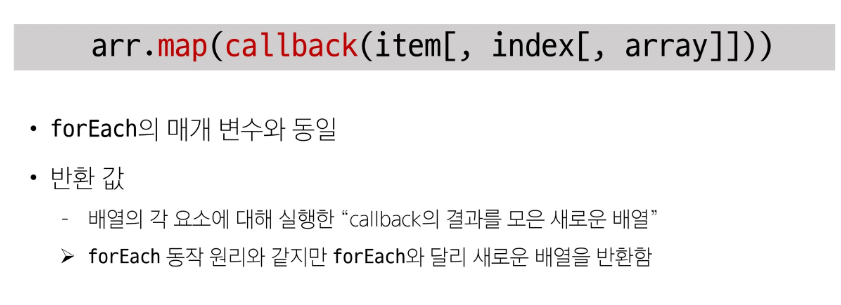

# 배열
object는 키로 구분된 데이터 집알을 저장하는 자료형

-> 순서가 있는 collection이 필요

### Array
순서가 있는 데이터 집합을 저장하는 자료구조

### 배열 구조

## 배열 메서드

## Array helper methods
배열 조작을 보다 쉽게 수행할 수 있는 특별한 메서드 모음

### Array Helper Methods
- 배열을 각 요소를 `순회`하며 각 요소에 대해 함수(`콜백함수`)를 호출
  - forEach(), map(), filter(), every(), some(), reduce() 등
- 메서드 호출 시 인자로 함수(`콜백함수`)를 받는 것이 특징

### forEach 구조
반환 값이 없음

### map
배열의 모든 요소에 대해 함수(콜백함수)를 호출하고, 반환 된 호출 결과 값을 모아 새로운 배열을 반환

### map 구조

# 비동기
## 동기
프로그램의 실행 흐름이 순차적으로 진행

> 하나의 작업이 완료된 후에 다음 작업이 실행되는 것

## 비동기
프로그램의 실행 흐름이 순차적이지 않으며, 작업이 완료되기를 기다리지 않고 다음 작업이 실행되는 방식

> 작업이 완료 여부를 신경쓰지 않고 동시에 다른 작업들을 수행할 수 있음

## 자바스크립트와 비동기
### Single Thread 언어, JavaScript
Thread란?

> 작업을 처리할 때 실제로 작업을 수행하는 주체로, multi-thread라면 업무를 수행할 수 있는 주체가 여러 개이다.

### javaScript Runtime

### 브라우저 환경에서의 JavaScript 비동기 처리 관련 요소

