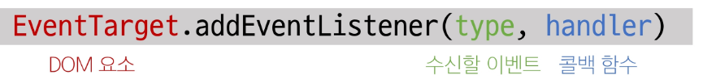
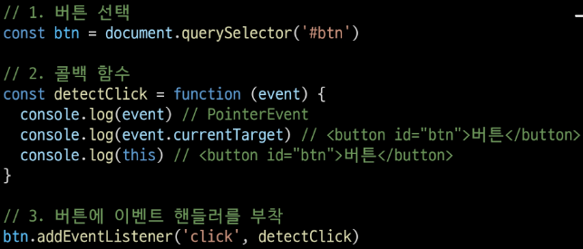
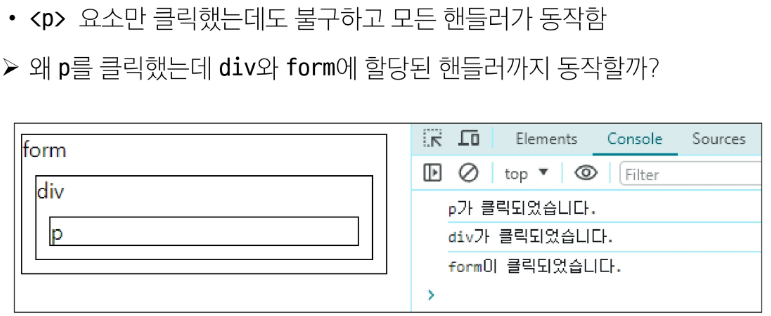
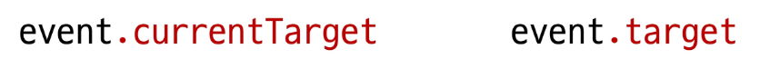
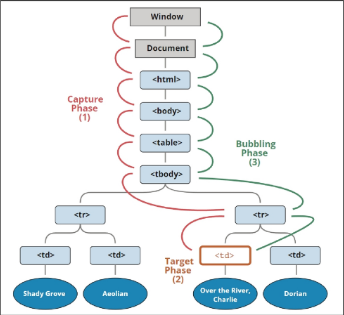

# 이벤트
## 개요
### 웹에서의 이벤트
- 화면을 스크롤하는 것
- 버튼을 클릭했을 때 팝업 창이 출력되는 것
- 마우스 커서의 위치에 따라 드래그 앤 드롭하는 것
- 사용자의 키보드 입력 값에 따라 새로운 요소를 생성하는 것
- 웹에서의 모든 동작은 이벤트 발생과 함께 한다.

## event 객체
### event
무언가 일어났다는 신호, 사건

-> 모든 DOM 요소는 이러한 event를 만들어 냄

### 'event' object
- DOM에서 이벤트가 발생했을 때 생성되는 객체
- 이벤트 종류
  - mouse, input, keyboard, touch ...
  - [이벤트 종류](https://developer.mozilla.org/en-US/docs/Web/API/Event)

DOM 요소는 event를 받고 받은 event를 '처리'할 수 있음(event handler-이벤트 처리기)

## event handler
이벤트가 발생했을 때 실행되는 함수
- 사용자의 행동에 어떻게 반응할지를 JavaScript 코드로 표현한 것

### .addEventListener()
특정 이벤트를 DOM 요소가 수신할 때마다 콜백 함수를 호출

- 대상에 특정 event가 발생하면, 지정한 이벤트를 받아 할 일을 등록한다
- type
  - 수신할 이벤트 이름
  - 문자열로 작성(ex. 'click')
- handler
  - 발생한 이벤트 객체를 수신하는 콜백함수
  - 콜백 함수는 발생한 event object를 유일한 매개변수로 받음

### addEventListener 활용

### addEventListener의 콜백 함수 특징
- 발생한 이벤트를 나타내는 event 객체를 유일한 매개변수로 받음
- 반환 값 없음

## 버블링
- 한 요소에 이벤트가 발생하면, 이 요소에 할당된 핸들러가 동작하고, 이어서 부모 요소의 핸들러가 동작하는 현상
- 가장 최상단의 조상 요소(document)를 만날 때까지 이 과정이 반복되면서 요소 각각에 할당된 핸들러가 동작
- 이벤트가 제일 깊은 곳에 있는 요소에서 시작해 부모 요소를 거슬러 올라가며 발생하는 것이 마치 물속 거품과 닮았기 때문
- 가장 안쪽의 \
 요소를 클릭하면 p-> div -> form 순서로 3개의 이벤트 핸들러가 모두 동작했던 것

### 이벤트가 정확히 어디서 발생했는지 접근할 수 있는 방법

### 'currentTarget' & 'target'속성
- currentTarget 속성
  - '현재'요소
  - 항상 이벤트 핸들러가 연결된 요소만을 참조하는 속성
  - 'this'와 같음
- 'target' 속성
  - 이벤트가 발생한 가장 안쪽의 요소(target)를 참조하는 속성
  - 실제 이벤트가 시작된 요소
  - 버블링이 진행 되어도 변하지 않음

### 캡처링(capturing)
- 이벤트가 하위 요소로 전파되는 단계(버블링과 반대)

## 이벤트 기본 동작 취소
- html의 각 요소가 기본적으로 가지고 있는 이벤트가 때로는 방해가 되는 경우가 있어 이벤트의 기본 동작을 취소할 필요가 있음
- 예시
  - form 요소의 제출 이벤트를 취소하여 페이지 새로고침을 막을 수 있음
  - a 요소를 클릭할 때 페이지 이동을 막고 추가 로직을 수행할 수 있음

### .preventDefault()
해당 이벤트에 대한 기본 동작을 실행하지 않도록 지정

