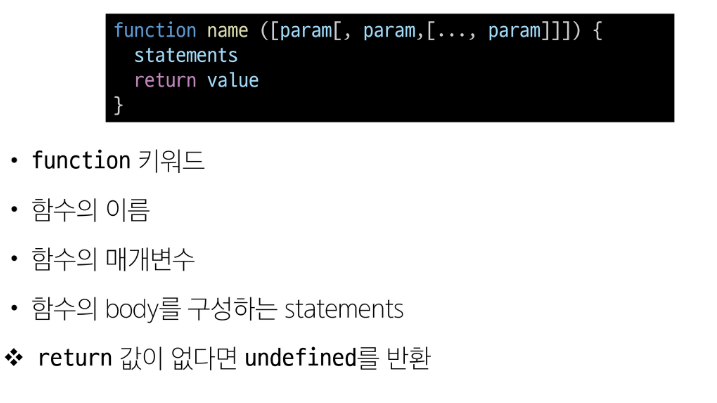
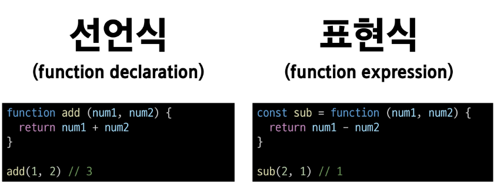
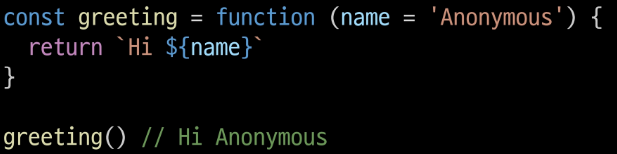
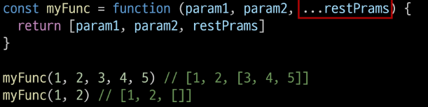
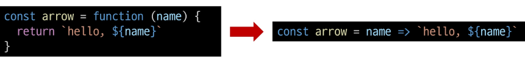

# Function
## 개요
### function
참조 자료형에 속하며 모든 함수는 Function object

### 함수 정의

### 함수 정의 2가지 방법(표현식 권장)

### 함수 표현식 특징
- 함수 이름이 없는 '익명 함수'를 사용할 수 있음
- 선언식과 달리 표현식으로 정의한 함수는 호이스팅 되지 않으므로 함수를 정의하기 전에 먼저 사용할 수 없음

## 매개변수
기본 함수 매개변수, 나머지 매개변수

### 1. 기본 함수 매개변수
- 전달하는 인자가 없거나 undefined가 전달될 경우 이름 붙은 매개변수를 기본값으로 초기화

### 2. 나머지 매개변수
- 임의의 수의 인자를 '배열'로 허용하여 가변 인자를 나타내는 방법
- 작성규칙
  - 함수 정의 시 나머지 매개변수는 하나만 작성할 수 있음
  - 나머지 매개변수는 함수 정의에서 매개변수 마지막에 위치해야함

  

## Spread syntax
### '...'(Spread syntax) 전개구문
- 배열이나 문자열과 같이 반복 가능한 항목을 펼치는 것(확장, 전개)
- 전개 대상에 따라 역할이 다름
  - 배열이나 객체의 요소를 개별적인 값으로 분리하고나 대란 배열이나 객체의 요소를 현재 배열이나 객체에 추가하는 등

## 화살표 함수
### 화살표 함수 표현식
함수 표현식의 간결한 표현법

