# 객체
키로 구분된 데이터 집합을 저장하는 자료형

### 객체 구조
- 중괄호('{}')를 이용해 작성
- 중괄호 안에는 key:value 쌍으로 구성된 속성(property)를 여러 개 작성 가능
- key는 문자형만 허용(키 값에 공백이 있는 경우 문자열 사용)
- value는 모든 자료형 허용

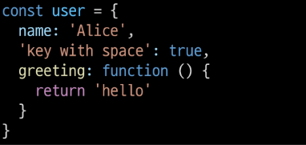

- 속성 참조 : 점('.',chaining operator) 또는 대괄호('[]')로 객체 요소 접근
- key 이름에 띄어쓰기 같은 구분자가 있으면 대괄호 접근만 가능

### 'in' 연산자
- 속성이 객체에 존재하는지 여부를 확인

  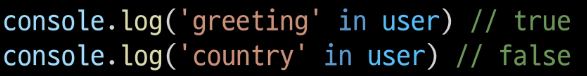

## 객체와 함수
### method
- 객체 속성에 정의된 함수
- object.method() 방식으로 호출
- 메서드는 객체를 '행동' 할 수 있게 함

## this
### method
-> 'this' 키워드를 사용해 객체에 대한 특정한 작업을 수행할 수 있음

### 'this' keyword
함수나 메서드를 호출한 객체를 가리키는 키워드

-> 함수 내에서 객체의 속성 및 메서드에 접근하기 위해 사용

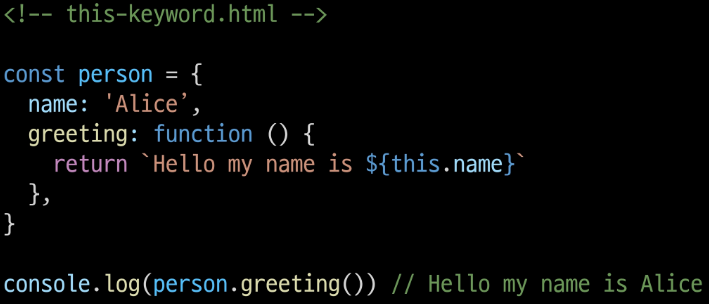

### JavaScript에서 this는 함수를 "호출하는 방법"에 따라 가리키는 대상이 다름
단순호출 : 전역 객체
메서드 호출 : 메서드를 호출한 객체

### 중첩된 함수에서의 this 문제점과 해결책
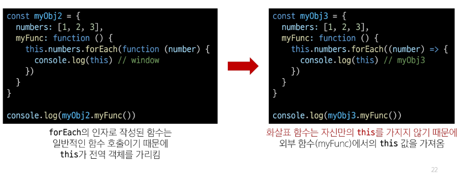
※ `화살표 함수는 자신만의 this를 가지지 않기 때문에` 외부 함수(myFunc)에서의 this 값을 가져옴

### JavaScript 'this' 정리
- JavaScript의 함수는 호출될 때 this를 암묵적으로 전달받음
- JavaScript에서 this는 함수가 "호출되는 방식"에 따라 결정되는 현재 객체를 나타냄
- python의 self와 java의 this가 선언 시 이미 값이 정해지는 것에 비해 javaScript의 this는 `함수가 호출되기 전까지 값이 할당되지 않고 호출 시 결정`됨(동적할당)
- this가 미리 정해지지 않고 호출 방식에 의해 결정되는 것은
- 장점 : 함수(메서드)를 하나만 만들어 여러 객체에서 재사용할 수 있는 것
- 단점 : 이런 유연함이 실수로 이어질 수 있다는 것

>개발자는 this의 동작 방식을 충분히 이해하고 장점을 취하면서 실수를 피하는 데에 집중

## 추가 객체 문법
### 1. 단축 속성
키 이름과 값으로 쓰이는 변수의 이름이 같은 경우 단축 구문을 사용할 수 있음

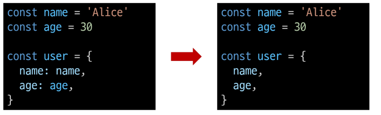

### 2. 단축 메서드
메서드 선언 시 function 키워드 생략 가능

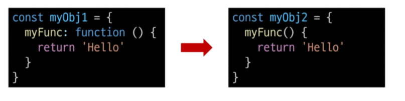

### 3. 계산된 속성
- 키가 대괄호([])로 둘러싸여 있는 속성
> 고정된 값이 아닌 변수를 값을 사용할 수 있음

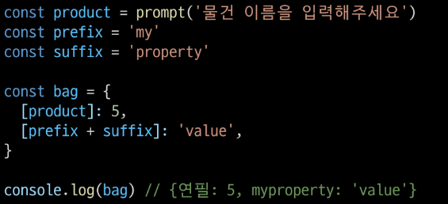

### 4. 구조 분해 할당
- 배열 또는 객체를 분해하여 객체 속성을 변수에 쉽게 할당할 수 있는 문법
- '함수의 매개변수'로 객체 구조 분해 할당 활용 가능

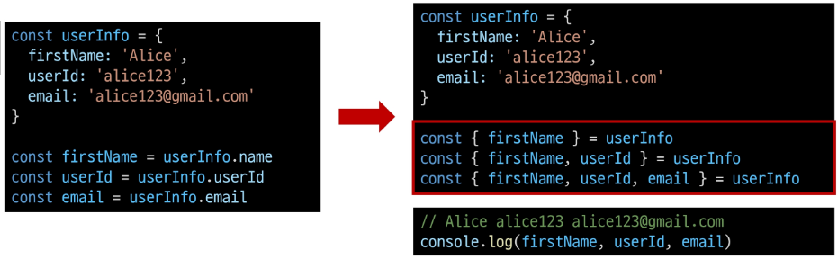

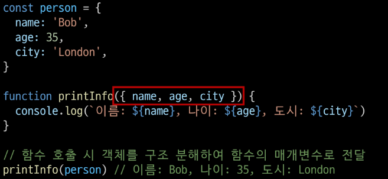

### 5. Object with '전개 구문'
- "객체 복사"
  - 객체 내부에서 객체 전개
- 얕은 복사에 활용 가능

  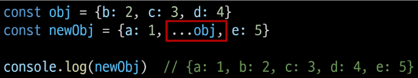

### 6. 유용한 객체 메서드
- Object.keys()
- Object.values()

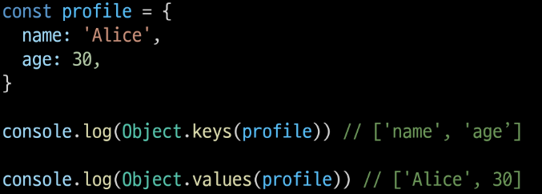

### 7. Optional chaining('?.')
- 속성이 없는 중첩 객체를 에러 없이 접근할 수 있는 방법 
- 만약 창조 대상이 null 또는 undefined라면 에러가 발생하는 것 대신 평가를 멈추고 undefined를 반환
- 만약 Optional chaining을 사용하지 않는다면 다음과 같이 '&&' 연산자를 사용해야함

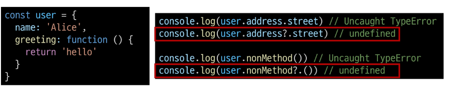

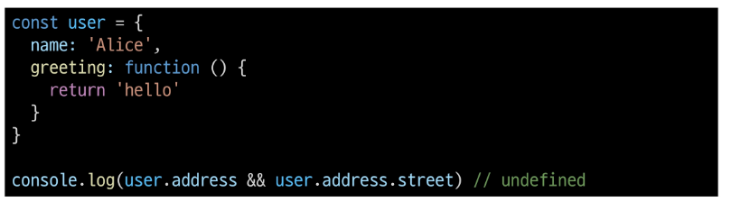

- 장점
  - 참조가 누락될 가능성이 있는 경우 연결된 속성으로 접근할 때 더 짧고 간단한 표현식을 작성할 수 있음
  - 어떤 속성이 필요한지에 대한 보증이 확실하지 않는 경우에 객체의 내용을 보다 편리하게 탐색할 수 있음
- 주의사항
  - Optional chaining은 존재하지 않아도 괜찮은 대상에만 사용해야 함(남용 x)

  

  - Optional chaining 앞의 변수는 반드시 선언되어 있어야 함
  
  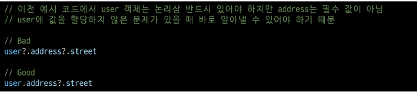