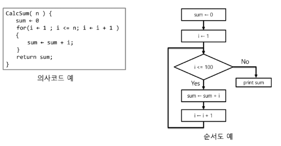
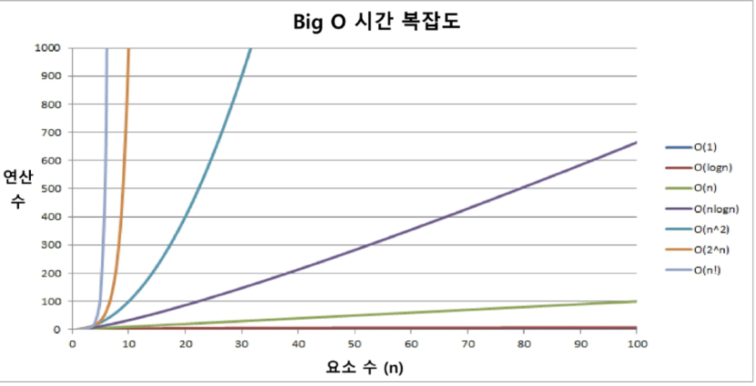

# 알고리즘 기본
## 알고리즘
- 유한한 단계를 통해 문제를 해결하기 위한 절차나 방법

### 알고리즘 표현 방법
- 컴퓨터 분야에서 알고리즘을 표현하는 방법을 크게 세 가지
    - 의사 코드와 순서도 그리고 프로그래밍 언어
        
   
### 알고리즘 성능
1. 정확성 : 얼마나 정확하게 동작하는가
2. 효율성 : 얼마나 최적화 되었는가
3. 확장성 : 입력 크기에 상관없이 항상 성능이 일정한가
4. 단순성 : 얼마나 단순한가

### 알고리즘의 성능 분석
- 주어진 문제를 해결하기 위해 여러 개의 다양한 알고리즘이 가능
    - 어떤 알고리즘을 사용해야 하는가?
- 알고리즘의 성능 분석 필요
    - 많은 문제에서 성능 분석의 기준으로 알고리즘의 작업량을 비교한다
    
## 복잡도
시간 복잡도 : 연산의 작업량, 수행 시간
- 최선의 경우(Best Case) : 알고리즘이 가장 빠르게 실행될 때의 성능(빅 오메가 표현법)
- 평균적인 경우(Average Case) : 일반적인 알고리즘의 성능 (빅 세타 표기법 사용)
- 최악의 경우(Worst Case) : 알고리즘이 가장 느리게 실행될 때의 성능(빅 오 표기법 사용)

공간 복잡도 : 메모리 사용량

## 다양한 시간 복잡도 비교
