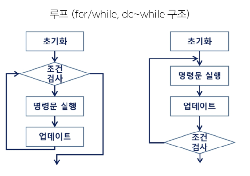
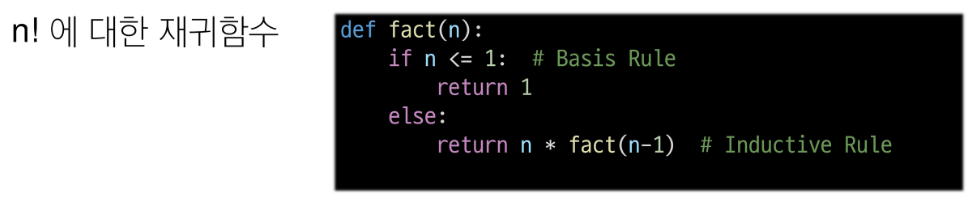
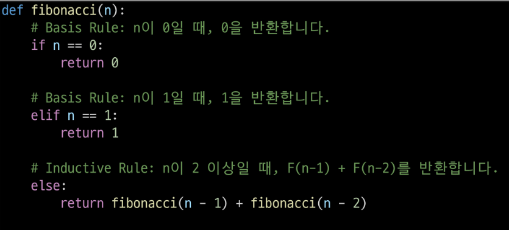

# 재귀 호출
## 재귀 함수
### 반복(iteration)과 재귀(Recursion)

- 반복은 수행하는 작어비 완료될 때 까지 반복
- 재귀는 주어진 문제의 해를 구하기 위해 동일하면서 더 작은 문제의 해를 이용하는 방법
    - 재귀 함수로 구현
    
### 재귀 함수
- 함수 내부에서 직접 혹은 간접적으로 자기 자신을 호출하는 함수
- 기본 부분(basic part)과 유도 부분(inductive part)으로 구성된다
- 함수 호출은 프로그램 메모리 구조에서 스택을 사용한다
- 따라서 재귀호출은 반복적인 스택의 사용을 의미하며 메모리 및 속도에서 성능 저하가 발생한다.

### 팩토리얼 재귀 함수

### 피보나치 수를 구하는 재귀함수

