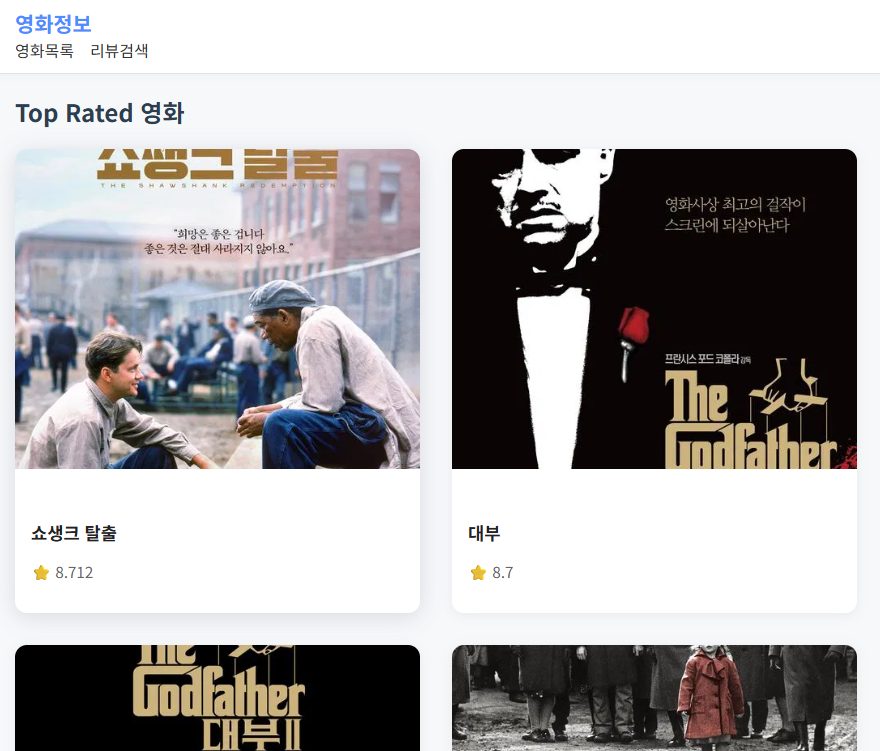
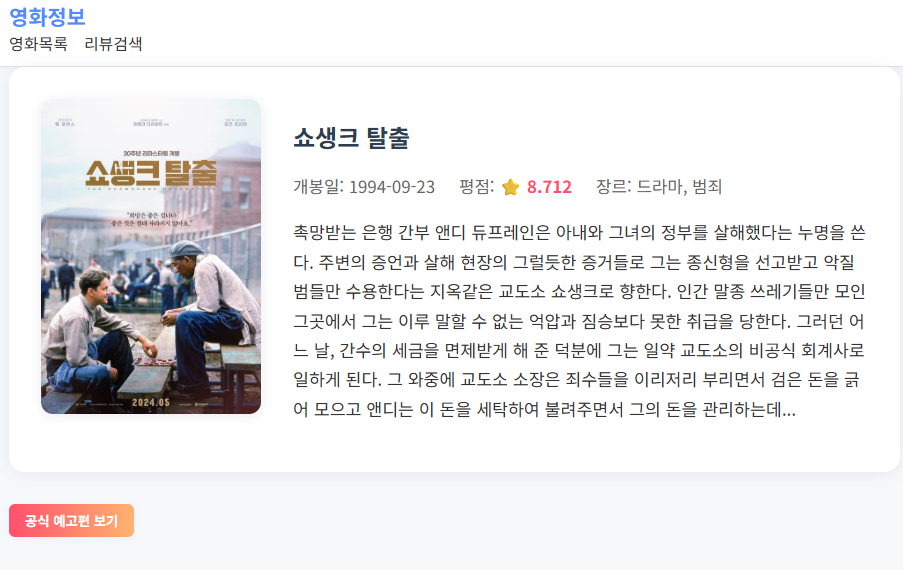

# 03-pjt 영화정보 SPA

Vue 3 + Vite 기반 영화 정보/영상 SPA. TMDB/YouTube API 연동.


## 팀원
- 이재연 : 영화 상세 정보 조회(F02)
- 소재헌 : 영화 공식 예고편 조회(F03), 영화 리뷰 영상 검색/조회(F04) 
- 문경진 : 최고 평점 영화 목록 조회(F01)

## 프로젝트 개요
- TMDB Top Rated 영화 목록/상세/예고편/리뷰 영상 검색 기능을 갖춘 SPA입니다.
- Vue 3, Vite, Vue Router, Axios를 사용하여 빠르고 모던한 UI/UX를 구현했습니다.
- 공식 예고편/리뷰 영상은 YouTube API로 검색 및 모달 재생됩니다.

## 설치 및 실행
```bash
npm install
npm run dev
```

## 환경변수
`.env.local`에 아래 키 필요:
```
VITE_TMDB_API_KEY=...
VITE_YOUTUBE_API_KEY=...
```

## 폴더구조
- src/
  - components/ (공용 컴포넌트)
  - services/ (API 함수)
  - views/ (페이지)
  - router/ (라우터)
  - assets/ (메인 CSS)

## 주요 기능
- TMDB Top Rated 영화 목록/상세
- 예고편/리뷰 영상 YouTube 모달 재생
- 반응형 카드 그리드, 접근성 고려 모달
- 모든 API 호출에 로딩/에러 처리

## 라우트
- `/` → HomeView
- `/movies` → MovieListView
- `/movies/:movieId` → MovieDetailView
- `/review-search` → ReviewSearchView

## 스크린샷
- 최고 평점 영화 목록 조회


- 영화 상세 정보 조회


- 영화 공식 예고편 조회


- 영화 리뷰 영상 검색/조회


## 느낀점
- 이재연 : Vue3을 사용하며 프론트엔드 개발 흐름을 체감하였고, 컴포넌트 단위로 구현해야 하는 기능을 분리하여 진행하는 부분에서 협업의 중요성을 알게 되었다.
- 소재헌
  - 역할별로 폴더를 나눠 프로젝트를 진행했는데, 각 파일별로 데이터 이동하는 부분이 힘들었던 것 같습니다.
  - 이번 프로젝트를 통해 폴더구조와 데이터 이동, 페이지 변환 등에 대해 알게되었습니다.
- 문경진(조퇴)

## 어려웠던 점
- 이재연 : 구현 영역을 분담하다 보니, 특정 단계에서는 팀원의 구현이 완료되어야 내 작업을 이어갈 수 있었는데, 이 과정에서 어떤 방식으로 미리 구조를 잡아둬야 할지 고민이 되었다. 
- 소재헌
  - 검색 입력을 받은 뒤 input값에 있는 값을 youtube store로 옮기는 방법이 어려웠습니다.
  - v-model 속성을 활용해 ref변수를 생성하고 input값을 받아 해결했습니다.
  - youtube api를 통해 받아온 데이터를 v-if 속성으로 데이터가 있으면 YoutubeCard vue를 불러와 v-for로 데이터를 보냈습니다.
- 문경진(조퇴)

## 회고
- API 연동, SPA 구조 설계, 컴포넌트 분리, 스타일링 등 프론트엔드 실무 역량을 종합적으로 점검할 수 있는 프로젝트였습니다.
- Vue 3와 Vite의 최신 생태계를 경험하며, 앞으로 더 복잡한 서비스에도 자신감을 갖게 되었습니다.
