# 1. Database
### 데이터 베이스
- 체계적인 데이터 모음(데이터를 모아놓은 창고)

### 데이터
- 저장이나 처리에 효율적인 형태로 변환된 정보

# Relational Database
### 데이터베이스 역할
- 데이터를 저장(`구조적 저장`)하고 저장(`CRUD`)

### 관계형 데이터베이스
- 데이터 간에 `관계`가 있는 데이터 항목들의 모음
- 테이블, 행, 열의 정보를 구조화하는 방식
- `서로 관련된 데이터 포인터`를 저장하고 이에 대한 `액세스`를 제공

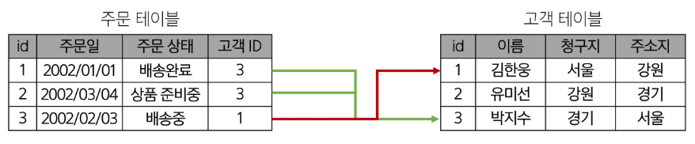

### 관계
- 여러 테이블 간의 (`논리적`) 연결
- 이 관계로 인해 두 테이블을 사용하여 데이터를 다양한 형식으로 조회할 수 있음
  - 특정 날짜에 구매한 모든 고객 조회
  - 지난 달에 배송일이 지연된 고객 조회 등

### 관계형 데이터베이스 예시
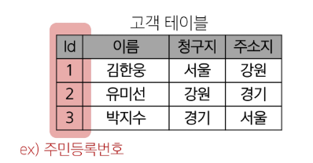

- 고객 데이터 간 비교를 위해서는 어떤 값을 활용해야할까?
  - 각 데이터에 고유한 식별 값을 부여하기 (`기본키, Primary Key`)

### 관계형 데이터베이스 관련 키워드

1. table(aka Relation)
- 데이블을 기록하는 곳

2. Field(aka Column, Attribute)
- 각 필드에는 고유한 데이터 형식(타입)이 지정됨

3. Record(aka Row, Tuple)
- 각 레코드에는 구체적인 데이터 값이 저장됨

4. Database(aka Schema)
- 테이블의 집합

5. Primary Key(기본키, pk)
- 각 레코드의 고유한 값
- 관계형 데이터베이스에서 레코드의 식별자로 활용

6. Foreign Key(외래 키, FK)
- 테이블의 필드 중 다른 테이블의 레코드를 식별할 수 있는 키
- 다른 테이블의 기본 키를 참조
- 각 레코드에서 서로 다른 테이블 간의 관계를 만드는 데 사용

# RDBMS
- 관계형 데이터베이스를 관리하는 소프트웨어 프로그램

# 2. Database Modeling
### Database Modeling
- 데이터베이스 시스템을 구축하기 위한 과정으로 데이터의 구조, 관계, 특성을 결정하는 작업
- `효율성, 일관성, 무결성`을 보장하기 위해 진행하는 중요한 단계

### 무결성 제약 조건
- 데이터베이스의 데이터 일관성을 유지하고 부적절한 데이터의 삽입, 수정, 삭제를 방지하여 데이터의 신뢰성을 보장하는 조건

1. 개체 무결성
- 기본 키의 값이 중복되지 않고, Null값이 허용되지 않는 것을 보장하는 제약 조건
  - 각 레코드는 유일한 식별자를 가져야 한다.
  - 기본 키는 Null 값을 가질 수 없다.

2. 참조 무결성
- 외래 키와 기본 키 간의 관계를 유지하고, 무효한 참조를 방지하는 제약 조건
  - 외래 키 값은 참조하는 테이블의 기본 키 값을 참조하거나 Null 값을 가질 수 있다.
  - 존재하지 않는 기본 키는 참조할 수 없다.

3. 도메인 무결성
- 각 속성의 값이 정의된 도메인에 속하는 것을 보장하는 제약조건
  - 도메인은 속성이 가질 수 있는 값의 범위, 형식, 제약 조건 등을 정의해야 한다.
  - 속성 값이 도메인에 속하지 않는 경우에는 삽입 또는 수정을 제한하거나 오류를 발생시킨다.

4. 그 외 무결성 제약 조건
- 고유성(UNIQUE) 무결성
  - 특정 컬럼의 값이 테이블 내에서 중복되지 않도록 제한함.
- NULL 무결성(NOT NULL)
  - 특정 컬럼이 NULL 값을 가질 수 없도록 강제함
- 일반 무결성(General Integrity)
  - 위의 특정 제약조건 외에도, 비즈니스 로직에 따라 추가로 정의하는 무결성 규칙.
  -예시 : 은행 계좌 잔액이 0 미만으로 내려가지 않도록 하는 규칙을 설정하는 경우.

# Proceeding with Database modeling
### 데이터베이스 모델링 진행
- 요구사항 수집 및 분석 -> 개념적 설계 -> 논리적 설계 -> 물리적 설계

1. 요구사항 수집 및 분석
- 어떤 종류의 데이터를 정리하는 지 정보 수집하고 어떤 작업을 수행해야 하는지 파악하는 단계
  - 개체(Entity)
    - 업무에 필요하고 유용한 정보를 저장하는 집합적인 것
    - ex) 고객명, 고객 전화번호, 상품명, 상품 가격
  - 속성(Attribute)
    - 관리하고자 하는 것의 의미를 더 이상 작은 단위로 분리되지 않은 데이터 단위
    - ex) 고객명, 고객 전화번호, 상품명, 상품 가격
  - 관계(Relationship)
    - 객체 사이의 논리적인 연관성을 의미하는 것
    - ex) 고객 - 상품, 부서 - 사원

2. 개념적 설계
- 요구사항을 기반으로 데이터 베이스의 개념적 모델을 설계
- 개체(Entity)와 관계(Relationship)를 식별하고, 개체 간의 관계를 정의하여 ERD을 작성

  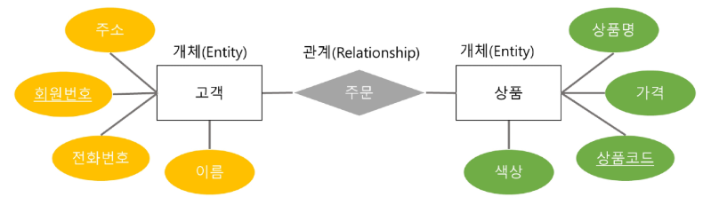

- ERD 표기 방법 (mermaid live editor_그리는 사이트)
  - 까바귀 발 모델(Crow's Foot Model) 표기법

    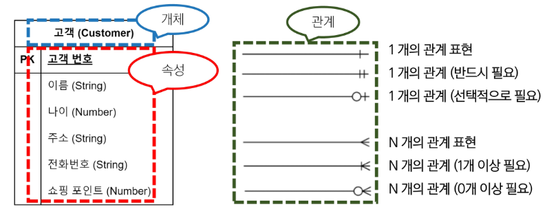
  
3. 논리적 설계
- 개념적 설계를 기반으로 데이터베이스의 `논리적 구조`를 설계
- 테이블, 칼럼(속성), 제약 조건 등과 같은 구체적인 데이터베이스 개체를 정의
- 정규화를 수행하여 데이터의 중복을 최소화하고 일관성을 유지

  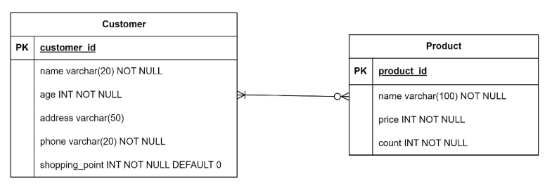

4. 물리적 설계
- 논리적 설계를 기반으로 데이터베이스를 실제 저장 및 운영할 수 있는 형태로 변환하는 단계
- 테이블의 인덱스, 파티션, 클러스터링 등 물리적인 구조와 접근 방식을 결정
- 보안, 백업 및 복구, 성능, 최적화 등을 고려하여 데이터베이스를 설정

# 3. Database Normalization
### 정규화(Nomalization)
- 중복을 최소화하고 데이터의 일관성과 효율성을 유지하기 위해 데이터를 구조화하는 과정

### 정규화의 목적
- 불필요한 데이터를 제거하여 중복을 최소화하기 위해
- 각 종 이상현상(Anomaly)을 방지하기 위해
- 데이터베이스 구조를 변경할 때 다시 구조화 해야 하는 영역을 최소화

### 이상 현상(Anomaly)
- 데이터베이스를 잘못 설계 했을 때 발생할 수 있는 불필요한 데이터 중복으로 인한 부작용

1. 삽입 이상(Insertion Anomaly)
    - 새로운 데이터를 삽입하기 위해 불필요한 데이터도 함께 삽입해야 하는 문제
2. 갱신 이상(Update Anomaly)
    - 중복된 데이터 중 일부만 변경하여 데이터가 불일치되는 문제
3. 삭제 이상(Deletion Anomaly)
    - 데이터를 삭제하는 경우, 반드시 있어야 하는 데이터까지 같이 삭제되는 문제

# 1NF ~ 3NF, BCNF
### 데이터베이스 정규화의 종류
- 1NF ~ 6NF(+BCNF)가 있지만, 일반적으로 3NF만 되면 정규화가 되었다고 표현

### 정규화 종류 및 규칙
- 제 1 정규화
  - 각 요소의 중복되는 항목은 없어야한다.
- 제 2 정규화
  - 제 1 정규화를 만족하면서 PK가 아닌 모든 속성이 PK에 완전 함수 종속되어야 한다.
- 제 3 정규화
  - 제 2 정규화를 만족하면서 모든 속성이 PK에 이행적 함수 종속이 되지 않아야 한다
- BCNF(Boyce Codd Normalization Form)
  - 제 3 정규형을 만족하면서, 모든 결정자가 후보키여야함

# 제 1 정규화
- 각 속성이 원자적(Atomic)이어야 함
  - 각 속성(컬럼) 이 원자값(Atomic Value, 하나의 값)만을 가져야함.
- 각 행이 유일한 식별자(Primary Key)를 가져야 함
  - 중복된 데이터를 허용하지 않음

  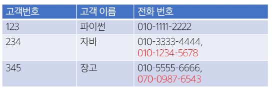

- 2개를 초과하는 전화번호를 저장할 수 없음
- 해결을 위해 column을 추가하는 경우, 불필요한 Null값을 가지게 됨

 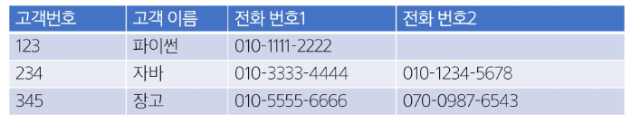

- 동일 데이터를 여러 row로 나누어서 저장하는 경우, 기본키가 중복됨

  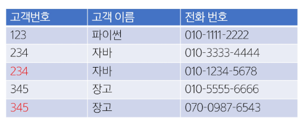

- 고객 번호를 참조하여, 전화번호를 저장하는 테이블을 분리

  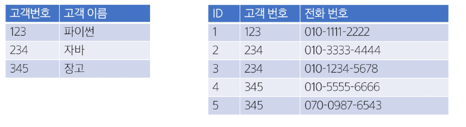

 
# 제 2 정규화
- 제 1 정규화을 만족하면서, `부분 함수 종속`이 없어야 함
  - 즉, 테이블의 모든 컬럼이 기본키에 대해 완전하게 종속되어야 함
  - 기본 키의 일부만으로 결정될 수 있는 속성 제고(새로운 테이블로 분리)

  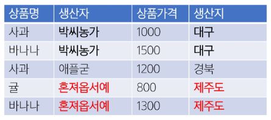

  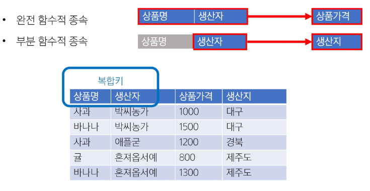

- 생산자와 생산지가 완전 함수적 종속이 되도록 테이블 분리

  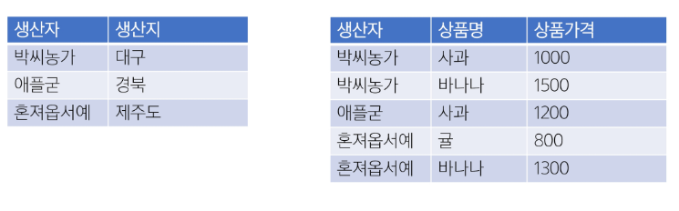

# 제 3 정규화
- 제 2 정규형을 만족하면서, 기본 키 이외의 속성이 기본 키에 `이행적 함수 종속`되지 않아야 함.

- 이행적 함수 종속이란
  - A->B, b->C가 성립할 때, A->C가 성립하는 것
  - 기본 키가 아닌 다른 속성에 종속된 경우를 의미함

- 즉, 기본키(PK)가 아닌 속성 간의 종속성을 제거해야함.
- 비(非) 기본키 컬럼이 다른 비 기본 키 컬럼을 결정하면 안됨.
  - 학생번호 -> 학과, 학과 -> 학과장
  - 학생 번호는 학과장을 직접 결정하지 않음. -> 이행적 함수 종속 발생

  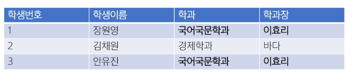

- 학생 정보와 학과 정보를 분리

  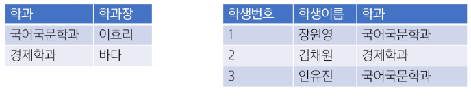

# BCNF
- 후보키란?
  - 테이블에서 각 행을 유일하게 식별할 수 있는 속성(또는 속성의 조합) 중, 최소성을 만족하는 키를 의미
- 후보키의 조건
  - 유일성 : 테이블의 각 행을 고유하게 식별할 수 있어야 함
  - 최소성 : 불필요한 속성을 포함하지 않는 최소한의 속성 조합이어야 함

- 제 3 정규형을 만족하면서, 모든 결정자가 후보키여야 함
  - 제 3 정규형(3NF)을 적용한 후에도 일부 이상현성이 남아 있을 수 있음
  - 3NF는 모든 비(非) 기본 키 속성이 기본 키에 이행적 종속되지 않아야 함을 요구하지만, 후보 키가 아닌 속성이 결정자가 되는 문제를 해결하지 못할 수 있음

- 모든 결정자가 후보키가 되도록 강제함으로써 보다 엄격한 정규화
  - 기본키가 아닌 속성이 다른 속성을 결정할 수 없어야 함

- 담당 교수가 하나의 과목만 맡고 있다고 가정했을 때
- 김교수가 '국문학의 이해' 과목을 '고전 문학의 이해'로 명칭을 변경할 수 있음

  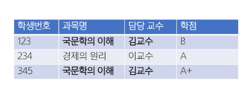

- 담당 교수가 과목의 결정자가 됨
  
  

- 과목은 담당 교수를 따라갈 수 밖에 없어 갱신 이상 발생 가능

  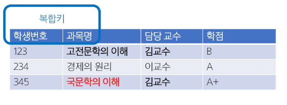

- 학점 테이블과 과목 테이블을 분리

  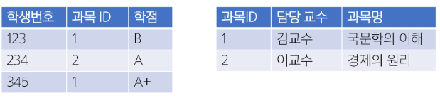

# 4. SQL 기본
### SQL
- 데이터베이스에 정보를 저장하고 처리하기 위한 프로그래밍 언어
- 테이블의 형태로 구조화된 관계형 데이터베이스에게 요청을 질의(요청)
- 관계형 데이터베이스와의 대화를 위해 사용하는 프로그래밍 언어

### SQL Syntax
- SQL 키워드는 대소문자를 구분하지 않음
  - 하지만 대문자로 작성하는 것을 권장(명시적 구분)
- 각 SQL Statements의 끝에는 세미클론(';')이 필요
  - 세미콜론은 각 SQL Statements을 구분하는 방법(명령어의 마침표)

# SQL Statements
### SQL Statements
- SQL을 구성하는 가장 기본적인 코드 블록

### 수행 목적에 따른 SQL Statements 4가지 유형
1. DDL - 데이터 정의
2. DQL - 데이터 검색
3. DML - 데이터 조작
4. DCL - 데이터 제어

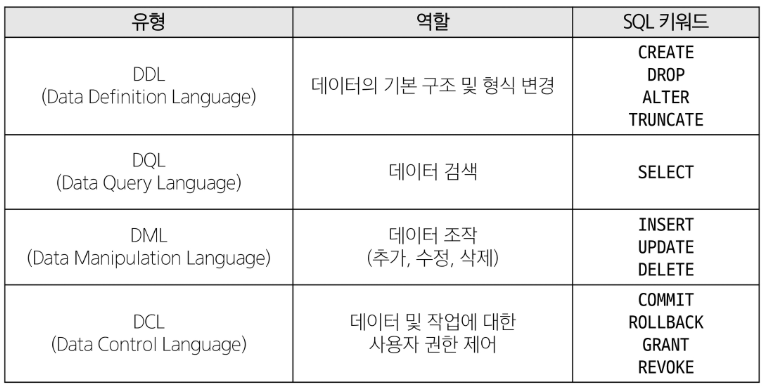

# 5. DDL
### Dta Definition Language
- 테이블을 정의하고 수정하고 삭제를 위한 SQL

### CREATE DATABASE
- 데이터베이스 생성

- 연결된 RDBMS 서버에 데이터 베이스 생성
- 텍스트를 저장하고 처리할 때 사용되는 문자 인코딩 방식을 CHARATTER SET으로 지정
  - 일반적으로 'utf8mb4'를 사용

### USE database_name
- 작업을 진행할 데이터베이스 선택
  - 단, USE 명령문은 타 RDBMS에서는 지원 형태가 다를 수 있음에 유의

# CREATE TABLE
### CREATE TABLE statement
- 테이블 생성

### CREATE TABLE syntax

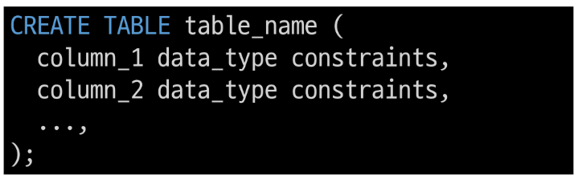

- 각 필드에 적용할 데이터 타입 작성
- 테이블 및 필드에 대한 제약조건(constraints) 작성

### MySQL 데이터 타입
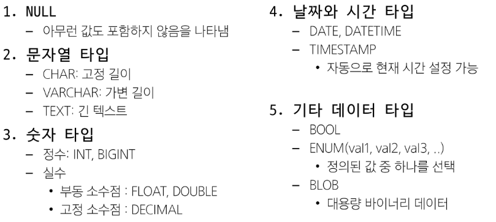

### 제약 조건
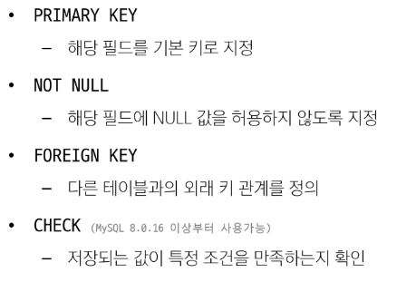

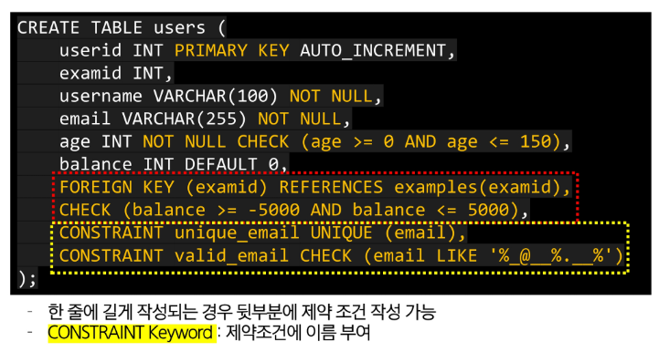

# ALTER TABLE statement
- 테이블 및 필드 조작

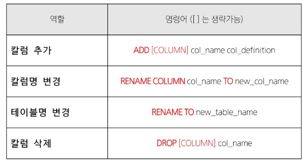

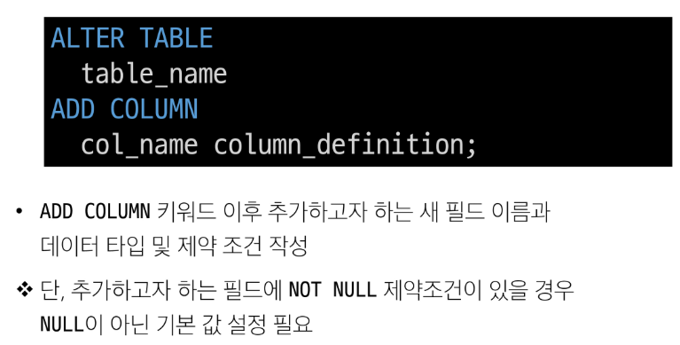

# DROP TABLE
- 테이블 삭제

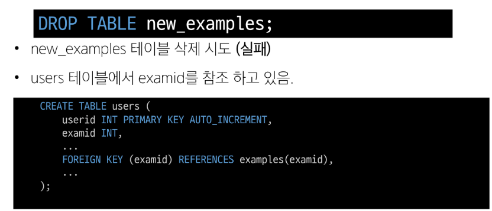

- users 테이블을 먼저 삭제한 후,
- new_examples 테이블 삭제

# TRUNCATE TABLE
- 테이블의 모든 데이터 비우는 작업
- DELETE와 유사하지만 TRUNCATE동작은 Table을 DROP 후 재생성하기 때문에 ID(PK) 값이 초기화 됨

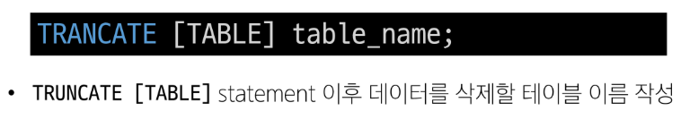