# Basic SQL

# 1. DML
### Data Manipulation Language
- 테이블 내의 데이터를 추가, 수정, 삭제, 조회를 위한 언어
- 데이터 조회는 기능이 많아 Data Query Language로 구분하기도 함

### INSERT

- 테이블 레코드 삽입
- INSERT INTO 절 다음에 테이블 이름과 괄호 안에 필드 목록 작성
- VALUES 키워드 다음 괄호 안에 해당 필드에 삽입할 값 목록 작성

### UPDATE
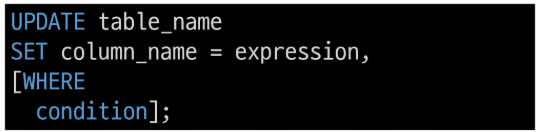
- 테이블 레코드 수정
- SET 절 다음에 수정할 필드와 새 값을 지정
- WHERE 절에서 수정할 레코드를 지정하는 조건 작성
- WHERE 절을 작성하지 않으면 모든 레코드를 작성

### DELETE
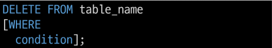
- 테이블 레코드 삭제
- DELETE FROM 절 다음에 테이블 이름 작성
- WHERE 절에서 삭제할 레코드를 지정하는 조건 작성
- WHERE 절을 작성하지 않으면 모든 레코드를 삭제

### DDL의 TRUNCATE와 DML의 DELETE 비교
- TRUNCATE와 DELETE 모두 테이블의 모든 데이터 삭제 가능
- DELETE는 데이터를 삭제하기 때문에 PK값이 초기화되지 않음
- TRUNCATE은 TABLE을 DROP 후 재생성하기 때문에 PK도 초기화됨

# 2. DQL
### SELECT
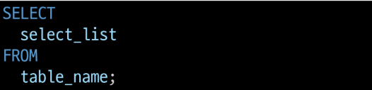
- 테이블에서 데이터를 조회
- SELECT 키워드 이후 데이터를 선택하려는 필드를 하나 이상 지정
- FROM 키워드 이후 데이터를 선택하려는 테이블의 이름 지정

### SELECT 정리
- 테이블의 데이터를 조회 및 반환
- '*'(ASTERISK)를 사용하여 모든 필드 선택
- 'AS' 키워드를 통해 컬럼명 임시 네이밍 가능

# 3. Filtering Data
### Filtering data 관련 Keywords
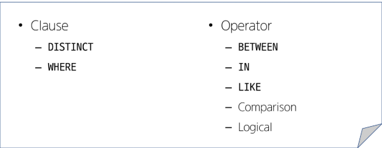

### DISTINCT
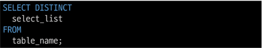
- 조회 결과에서 중복된 레코드를 제거
- SELECT 키워드 바로 뒤에 작성해야함
- SELECT DISTINCT 키워드 다음에 고유한 값을 선택하려는 하나 이상의 필드를 지정

### WHERE
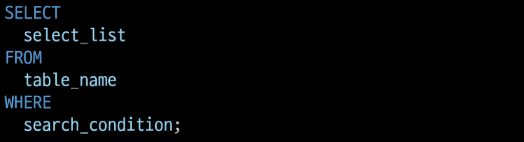
- 조회 시 특정 검색 조건을 지정
- FROM clause 뒤에 위치
- search_condition은 비교 연산자 및 논리연산자(AND, OR, NOT 등)를 사용하는 구문이 사용됨

### Database Operator
- 논리 연산자 : AND(&&), OR(||), NOT(!)

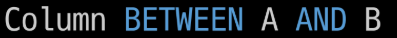

- 비교 연산자 : =,>=,<=,!=, BETWEEN...AND, IN, LIKE, IS

### IN Operator
- 값이 특정 목록 안에 있는지 확인

### LIKE Operator
- 값이 특정 패턴에 일치하는지 확인
- (wildcards와 함께 사용)

### Wildcard Characters
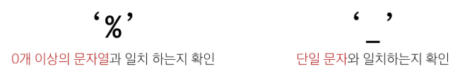

### IS Operator
- NULL 값은 = 연산자를 활용하여 비교 불가
- IS 연산자를 통해 NULL 인지 확인

### 연산자 우선순위
- 괄호 > NOT연산자 > 비교연산자 > AND > OR
- 우선 순위를 고려하지 않고 작성하면 의도치 않은 동작 발생

# 4. MySQL Built-in Function
### MySQL 내장 함수
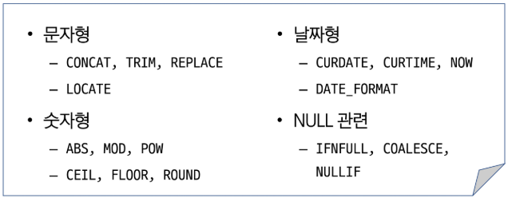

# 5. Sorting data
### ORDER BY
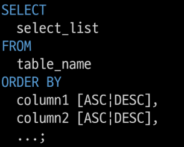
- 조회 결과의 레코드를 정렬
- FROM clause 뒤에 위치
- 하나 이상의 컬럼을 기준으로 결과를 오름차순(ASC, 기본값), 내림차순(DESC)으로 정렬
- NULL 값이 존재할 경우 오름차순 정렬 시 결과에 NULL이 먼저 출력

### LIMIT clause
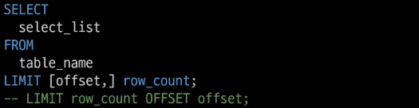
- 조회하는 레코드 수를 제한

### SELECT statement 실행순서
1. 테이블에서(FROM)
2. 조회하여(SELECT)
3. 정렬(ORDER BY)

# 6. Grouping data
### Aggregate Function(집계함수)
- 값에 대한 계산을 수행하고 단일한 값을 반환하는 함수 GROUP BY절과 많이 사용

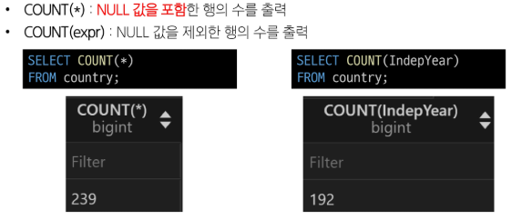

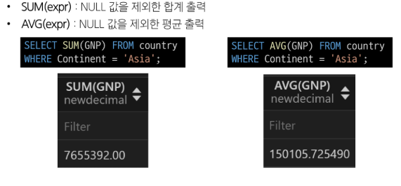

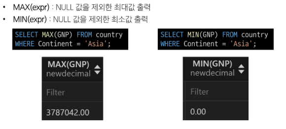

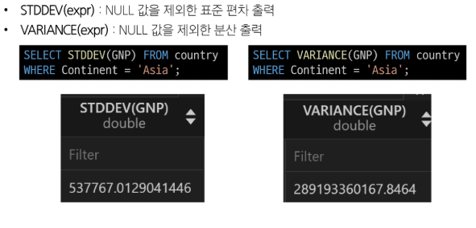

### GROUP BY clause
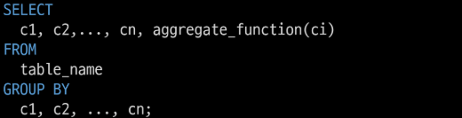
- 레코드를 그룹화하여 요약본 생성('집계 함수'와 함께 사용)
- FROM 및 WHERE 절 뒤에 배치
- GROUP BY 절 뒤에 그룹화 할 필드 목록을 작성

### HAVING clause
- 집계 항목에 대한 세부 조건을 지정
- 주로 GROUP BY와 함께 사용되며 GROUP BY가 없다면 WHERE처럼 동작

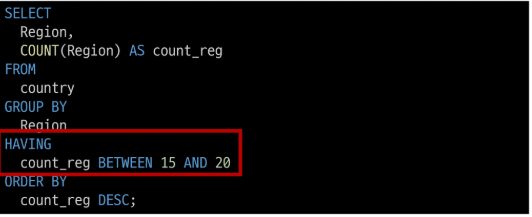

### SELECT statement 실행 순서
1. 테이블에서(FROM)
2. 특정 조건에 맞추어(WHERE)
3. 그룹화하고(GROUP BY)
4. 만약 그룹 중에서 조건이 있다면 맞추고(HAVING)
5. 조회하여(SELECT)
6. 정렬하고(ORDER BY)
7. 특정 위치의 값을 가져옴(LIMIT)