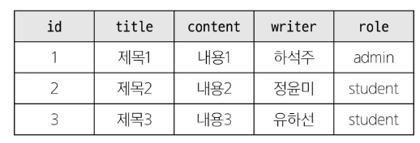
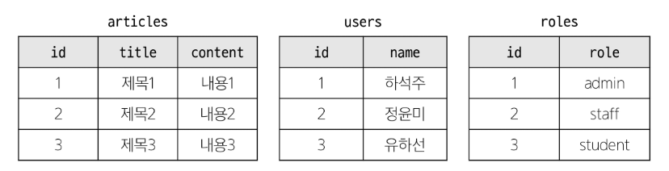
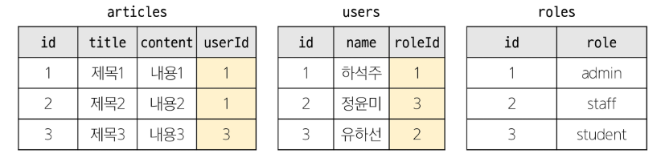
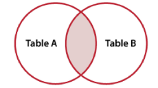
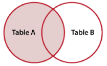
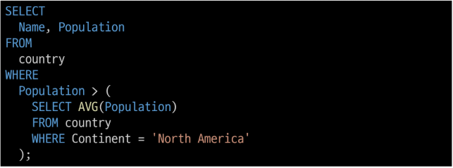

# 1. Join
### 관계
- 여러 테이블 간의 (논리적 연결)

### 관계의 필요성

- '하석주'가 작성한 모든 게시글을 조회하기
- 어떤 문제점이 있을까?
  >동명이인이 있다면 혹은 특정 데이터가 수정된다면?

- 테이블을 분류하자
- 각 게시글은 누가 작성했는지 알 수 있을까?
- 작성자들의 역할은 무엇일까?

- articles와 users 테이블에 각각 userId, roleId 외래키 필드 작성

### JOIN이 필요한 순간
- 테이블을 분리하면 데이터 관리는 용이해질 수 있으나 출력시에는 문제가 있음
- 테이블 한 개만을 출력할 수 밖에 없어 다른 테이블과 결합하여 출력해야함
- 이때 사용하는 것이 `JOIN`

### JOIN clause
- 둘 이상의 테이블에서 데이터를 검색하는 방법

### JOIN 종류
- INNER JOIN
- LEFT JOIN
- RIGHT JOIN
- SELF JOIN

### INNER JOIN

- 두 테이블에서 값이 일치하는 레코드에 대해서만 결과를 반환

### INNER JOIN syntax

- FROM 절 이후 메인 테이블 지정(table_a)
- INNER JOIN 절 이후 메인 테이블과 조인할 테이블을 지정(table_b)
- ON 키워드 이후 조인 조건을 작성
- 조인 조건은 table_a와 table_b 간의 레코드를 일치시키는 규칙을 지정

### LEFT JOIN

- 오른쪽 테이블의 일치하는 레코드와 함께 왼쪽 테이블의 모든 레코드 반환

### LEFT JOIN syntax
- FROM 절 이후 왼족 테이블 지정(table_a)
- LEFT JOIN 절 이후 오른쪽 테이블 지정(table_b)
- ON 키워드 이후 조인 조건을 작성
  - 왼쪽 테이블의 각 레코드를 오른쪽 테이블의 모든 레코드와 일치시킴

### RIGHT JOIN

- FROM 절 이후 왼쪽 테이블 지정(table_a)
- LEFT JOIN 절 이후 오른쪽 테이블 
- ON 키워드 이후 조인 조건 작성
  - 오른쪽 테이블의 각 레코드를 왼쪽 테이블의 모든 레코드와 일치시킴

### SELF JOIN
- 동일한 테이블의 컬럼을 비교하여 일치하는 데이터를 추가로 붙여 반환
- 주로 계층적 데이터 구조를 표현하거나 동일 테이블 내엥서 특정 관계를 찾을 때 사용

### SELF JOIN syntax

- FROM 절 이후 본 테이블 지정(table_a)
- JOIN 절 이후 본 테이블 제정(table_a)
- ON 키워드 이후 조인 조건을 작성
  - 본 테이블의 컬럼과 별칭 테이블의 컬럼을 이용하여 비교

# 2. Subquery
### 서브 쿼리란?
- 하나의 SQL 문 안에 포함되어 있는 또 다른 SQL 문
- 복잡한 데이터를 이용하여 검색하거나 값을 비교할 때 사용

### Subquery 사용 방법
- 서브 쿼리는 괄호를 감싸서 사용
- 서브 쿼리 사용이 가능한 곳
  - SELECT 절
    - 일반적으로 계산된 값을 하나 이상의 컬럼으로 반환해야 할 때 사용
  - FROM 절
    - 중간 집계나 계산, 결과 재사용, 조인 조건 단순화 할 때 사용
  - WHERE 절
    - 특정 조건을 만족하는 데이터를 필터링하거나 검색할 때 사용
  - 그 외 HAVING 절, INSERT 문의 VALUES 절, UPDATE 문의 SET 절에서 사용 가능

### Subquery 종류
- 단일 행 서브쿼리
- 다중 행 서브쿼리
- 다중 열 서브쿼리

### 단일 행 서브쿼리

- 실행 결과가 항상 1건 이하인 서브쿼리
- 비교 연산자(=,<,>,<>)와 함께 사용
- 단일 행 서브쿼리는 항상 단일 값을 반환
  - WHERE 절이나 SELECT 절에 사용하는 것이 일반적
- 비교 연산자(=,<=,>=,<,>) 사용시 단일 행 서브 쿼리 사용
  - 비교 대상인 서브 쿼리의 값이 여러 개가 나올 시 에러 발생

### 다중 행 서브쿼리

- 실행 결과가 여러 개의 결과 행을 반환할 수 있는 서브쿼리
- IN, ANY, ALL 연산자와 함께 사용
- 다중 행 서브쿼리는 2개 이상의 값을 반환
  - 단순 비교 연산자를 사용할 수 없음
- IN, ANY, ALL 연산자와 함께 사용
  - WHERE과 HAVING 절에서 주로 사용됨

### 다중 컬럼 서브쿼리

- 실행 결과가 하나 이상의 컬럼을 반환하는 서브쿼리
- 주로 비교 연산자나 EXISTS, IN 연산자와 함께 사용
- 다중 컬럼 서브쿼리의 결과로 여러 개의 컬럼이 반환
  - 주로 메인 쿼리의 조건과 동시에 비교됨

# 3. Database Index
### INDEX 
- 데이터베이스에서 데이터를 보다 빠르게 찾기 위해 사용되는 자료구조
- 책에서 원하는 부분을 처음부터 찾는 것이 아닌 목차를 보고 빠르게 찾을 수 있는 방식과 유사

### INDEX 사용의 장점
- 조회하는 속도가 전반적으로 빠름
- 시스템의 부하가 적음

### INDEX 사용의 단점
- 인덱스 정보를 추가로 저장하기 위한 저장 공간이 필요
- 삽입, 수정, 삭제가 빈번한 테이블인 경우 성능이 오히려 떨어짐

### INDEX 종류
- 기본 인덱스
- 유니크 인덱스

### 기본 인덱스
- 일반적으로 선언했을 때의 인덱스
- 인덱스로 설정된 컬럼의 데이터에 NULL값이 존재할 수 있음
- 인덱스가 설정된 컬럼의 데이터에 중복이 있을 수 있음
- Ex) city 테이블의 CountryCode 컬럼을 index로 설정했을 때 'KOR'데이터가 중복될 수 있음

### 유니크 인덱스
- UNIQUE 키워드와 함께 선언했을 때의 인덱스
- 인덱스를 설정할 컬럼의 데이터들은 각각 고유한 값이어야 함
  - 중복된 데이터가 존재할 시 'Duplicate entry'에러 발생
  - 컬럼을 추가로 구성하여 고유한 값으로 구성하면 해결

# index 생성/추가하기
### index 생성하기

- 자주 검색되는 컬럼
- 중복되는 데이터가 적은 컬럼

### INDEX 추가하기

### INDEX 생성과 INDEX 추가의 차이점
- 둘 다 INDEX를 설정하는 것은 동일
- 테이블 생성 시 인덱스를 정의하는 것이 좀 더 효율적
- 데이터가 없기 때문에 INDEX를 설정하는 시간이 적음
- 이미 테이블에 많은 데이터가 존재하는 상태에서 INDEX를 추가한다면, 추가된 INDEX 설정을 위해 일시적으로 데이터베이스 시스템에 영향이 있을 수 있음

### INDEX 삭제하기

- ALTER TABLE을 이용하여 INDEX 삭제 가능
- 다른 데이터베이스 객체(열 추가, 삭제)와 일관된 구문을 유지할 수 있어 일반적으로 사용되어짐

- DROP INDEX를 이용하여 INDEX 삭제 가능
- 작업의 명확성을 높이고 싶을 때 사용

### 인덱스 정리
- 데이터를 주로 탐색, 정렬을 할 때 매우 효율적
  - 단, 데이터 양이 적은 경우는 이점이 크지 않을 수 있음
- 인덱스는 주로 유일한 값을 가진 컬럼을 사용할 수록 유리
- 과도한 인덱스 사용은 데이터의 추가, 수정, 삭제가 일어날 때마다 성능 저하가 발생할 수 있음
- 추가 공간을 필요로 하기 때문에 비용적인 측면도 같이 고려해야 함

# 4. 참고
# VIEW
### VIEW
- 데이터베이스 내에서 저장된 쿼리의 결과를 가상으로 나타내는 객체로 가상 테이블이라고도 함
- 실제 데이터를 가지고 있지 않고, 실행 시점에 쿼리를 실행하여 결과를 생성하여 보여줌

### VIEW의 장점
- 편리성
  - 복잡한 쿼리를 미리 정의된 뷰로 만들어 단순화 가능
- 보안성
  - 사용자가 데이터베이스 일부만 볼 수 있도록 제한 가능
- 재사용성
  - 동일한 뷰를 여러 쿼리에서 사용 가능

### VIEW 생성하기

- CREATE VIEW 이후 뷰 이름 설정
  - 뷰 이름은 v_ 와 같은 접두사를 이용하여 일반 테이블과 구분
- AS 키워드 이후 데이터는 SELECT 구문을 이용
- view 사용 방법은 설정한 view_name을 이용

### VIEW 삭제하기

- DROP VIEW 이후 삭제할 뷰 작성

