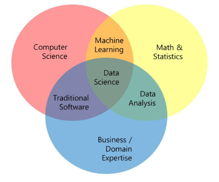
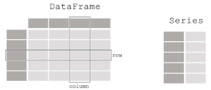
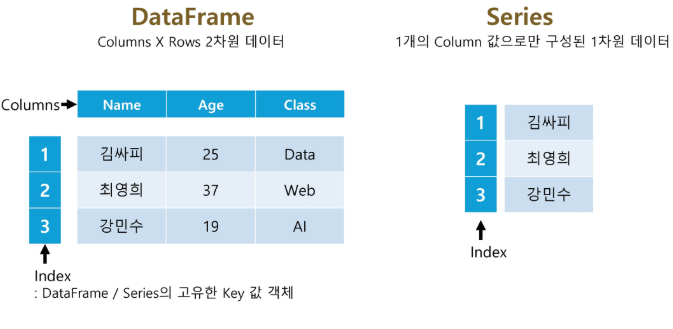
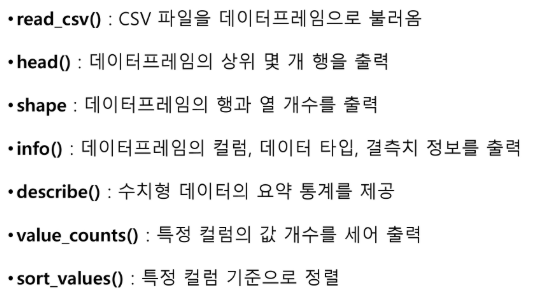

# 1. 데이터 분석 개론
### 데이터 분석의 중요성 및 역할
- 합리적인 의사 결정을 위해 갖고있는 자원에서 최적의 선택

## 데이터 분석 프로세스의 이해
- 가설을 설정하고 데이터 만들기( 인터뷰, 리서치, 데이터 설계 후 수집)
- 쌓인 데이터에서 필요한 데이터를 선별 및 조회(쿼리 조회, 데이터 가공, 인프라 구축)
- 데이터 기반 가설 검증(통계 분석, 수학적 모델링)
- 결과 공유 (데이터 시각화, PPT 작성, PT)

### 데이터 분석의 절차
step 1. 문제 정의
  - 도서지역의 헬기를 통한 응급환자 이송 중단율이 너무 높아! 대책이 필요해!
  - 노인 치매환자들에 대한 지자체 차원의 선제적 관리가 필요해!효율적으로 할 수 없을까?

step 2. 데이터 기획
  - 전입, 전출 현황, 동별인구 현황, 초중학교수, 연령대별 인구, 인근 병원 수,...

step 3. 데이터 수집

step 4. 데이터 전처리

step 5. 데이터 시각화

step 6. 분석 및 인사이트 도출

## 데이터 분석의 역할
- 서비스들의 현황을 수치로 표현하고 인사이트를 도출
- 어느 서비스가 더 좋은 지 가설 검증을 위한 A/B 테스트 진행
- 고객에 대한 데이터에서 의미 있는 결과를 뽑아내기 위해 보고서 작성

현업의 사례 : 마케팅 분석/고객 인사이트/비즈니스 성과

### 데이터 계열 직무의 필요 역량

### 파이썬 머신러닝 생태계

# 2. Pandas의 개념 및 활용
### Pandas Overview
- 관계형 혹은 레이블된 데이터를 효율적으로 다루기 위해 설계된 python 기반의 데이터 분석 라이브러리
  - 빠르고 유연하며 표현력이 풍부한 데이터 구조를 제공
  - 다양한 데이터 분석 작업을 손쉽게 처리할 수 있도록 고수준의 빌딩 블록 제공
  - 오픈 소스 라이브러리이기 때문에 누구나 자유롭게 사용
  - Numpy를 기반으로 개발되었기 때문에, 과학 계산 및 머신러닝 라이브러리들과의 호환성과 통합성을 갖춤

- Pandas에서 다룰 수 있는 데이터의 타입
  - SQL table, Excel spreadsheet 같이 유형이 다른 열들을 포함할 수 있는 표 형식의 데이터
  - 순서가 있거나 (Ordered) 없는 (Unordered)데이터
  - 시계열 (Time series) 데이터
  - 행 및 열이 있는 임의의 행렬 데이터(행렬의 각 구성요소가 다른 유형의 데이터들도 가능)
  - 다른 유형의 관찰/통계 데이터 셋(명시적인 레이블이 없어도 유연하게 처리 가능)

### Pandas에서 제공하는 Data structure

- 1차원을 다루는 Series
  - 한 줄 짜리 데이터 목록으로 모든 값이 같은 타입
- 2차원을 다루는 DataFrame
  - 각 열(column)의 데이터 타입이 다를 수 있으며 크기를 자유롭게 조절할 수 있는 형태

### Pandas의 장점
- 결측치 처리 용이 : NaN으로 결측값 표현, dropna, fillna 등 제공
- 행/열 추가,삭제 간편 : append,drop 등으로 손쉽게 조작
- 정렬 기능 : 자동 또는 sort_values, sort_index로 명시적 정렬 가능
- GroupBy 제공 : SQL처럼 그룹 단위 집계 가능
- 다양한 객체 변환 : 리스트, 딕셔너리, Numpy 등에서 DataFrame 생성 가능
- Merge/Join 지원 : merge, join, concate 등으로 데이터 결합
- 파일 입출력 지원 : CSV, Excel, DB,JSON 등 다양한 포맷 읽기/쓰기 가능

### Pandas의 주요 구성 요소

# 3. 데이터 프레임 생성 및 조작
### Pandas의 주요 메서드

# 4. 데이터 정제 및 전처리
### 데이터의 처리
- 데이터 수집이 완료되면 데이터를 모델에 넣기 전에 알맞게 가공하는 과정
- 분석 결과의 질을 높이기 위해 데이터를 변형하는 과정
- 어떤 전처리를 적용하느냐에 따라 원본 데이터가 다르게 변형되므로, 결과도 달라질 수 있음

### 데이터의 처리 방법
- 데이터의 형식 맞추기
- 빈 칸 채우기
- 데이터 열 추가(연관 데이터 추가)
- 데이터 열 추가(이상치 제거)

### missing 데이터 처리
- isna() : 데이터프레임 또는 배열에서 결측값(NaN)이 있는지 여부를 True/False로 반환
- fillna() : 결측값(NaN)을 지정한 값으로 대체(채움)
- dropna() : 결측값(NaN)이 포함된 행 또는 열을 제거

# 5. 데이터 인덱싱과 필터링
1. []
- 컬럼 단일 선택 : df['col1'] -> Series 반환
- 컬럼 여러 개 선택 : df[['col1','col2']] -> DataFrame 반환
- Boolean Indexing과 함께 사용 가능 : df[df['col1']>10] -> 조건에 맞는 행 필터링

2. loc[] / iloc[]
- loc : 행/열 이름으로 접근
- iloc : 정수 위치 기반 인덱싱(숫자 인덱스 사용)

3. Boolean indexing
- 조건식에 따른 필터링

### 명칭 기반 인덱싱 loc[]
- 컬럼(열)을 추출하는 경우 : '컬럼명' 같이 이름(label)으로 열 지정
- 행을 추출하는 경우 : 행의 인덱스 이름(label)을 사용해 지정
- 행과 열을 함께 지정하는 경우 -> df.loc[행이름,열이름]형식 사용

### 위치 기반 인덱싱 iloc[]
- 레이블(이름)이 아닌 정수 위치로 데이터 지정
- 가로축(행), 세로축(열)의 좌표를 기반으로 행과 열 추출
- 행, 열 위치값을 정수로 입력하여 선택(0부터 시작) 예 : df.iloc[0,1]->첫 번째 행, 두 번째 열