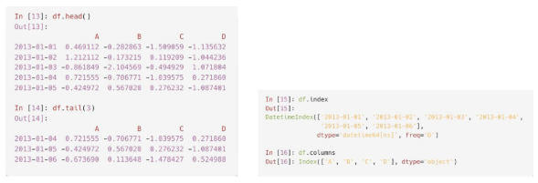
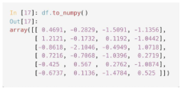
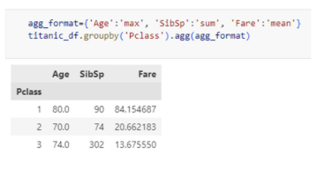

# 1. Pandas와 Numpy
- Pandas는 주로 2차원 데이터(표 형태, DataFrame)를 다룰 때 유용
  - 데이터 분석, 전처리, 조작이 편리함
  - 엑셀, CSV, SQL 결과 같은 표 형식의 데이터 처리에 최적화 되어 있음
- NumPy는 다차원 배열(1D, 2D, 3D 이상)을 다루는 데 특화됨
  - 특히 딥러닝과 고성능 연산을 위해 주로 사용됨
  - 3차원 이상 데이터(이미지, 시계열 텐서 연산 등) 처리에 적합

### Numpy의 ndarray
- ndarray : N차원(Dimension) 배열(Array) 객체

  

- ndarray 생성 : array()
  - 인자를 주로 파이썬 list 또는 ndarry 입력

  

- ndarray 생성 : arange()
  - 0부터 9까지의 숫자를 순차적으로 생성
  
  

- ndarray 생성 : zeros() / ones()
  - (3,2) shape을 가지는 모든 원소가 0, dtype은 int32인 ndarry 생성

  

- 데이터 타입 : ndarray.dtype
  -ndarray 내 데이터 타입은 같은 데이터 타입만 가능 -> ndarry.dtype 속성
  - 즉, 한 개의 ndarray 객체에 int와 float 함께 불가능 -> astype() 활용하여 형변환

  

  

### ndarry의 형태(shape)와 차원(ndim)
- 형태 : ndarray.shape 속성
- 차원 : ndarray.ndim 속성

- reshape() 차원과 크기를 변경
- reshape(-1,N) : 차원과 크기를 변경
  - -1에 해당하는 axis의 크기는 가변적
  - -1이 아닌 인자 값에 해당하는 axis 크기는 인자 값으로 고정하여 shape 변환

### ndarray의 axis(축)
- 행, 열, 높이 단위(X)
- axis0, axis1, axis2와 같이 axis 단위로 부여

### Pandas에서 제공하는 Data structure
- 1차원을 다루는 Series
  - 한 줄짜리 데이터 목록으로 모든 값이 같은 타입
- 2차원을 다루는 DataFrame
  - 각 열(column)의 데이터 타입이 다를 수 있으며 크기를 자유롭게 조절할 수 있는 형태

### DataFrame과 Numpy/List/딕셔너리 상호 변환

# 2. 데이터 처리와 집계
### 데이터 처리
- 객체 생성
  - Default index인 RangeIndex을 사용한 객체 생성

    

  - datetime index를 사용한 객체 생성

    

  - 딕셔너리를 사용한 객체 생성

    

- 데이터 확인

  

  - DataFrame을 numpy로 변환

    
  
  - 통계정보 확인

    

  - transpose 연산

    

  - label을 활용한 데이터의 선택
    - DataFrame에서 Series 데이터 추출(label slice)

      

      
    
    - 특정 행과 열에 있는 scalar 값 추출

      

    
- position을 활용한 데이터의 선택

  

  

- boolean을 활용한 indexing

  

  

### 데이터 정렬
- sort_values()
  - 오름차순이 기본 (ascending = True)
  - 내림차순 정렬 시 ascending = False 설정

  

- unique()
  - 컬럼내 몇 건의 고유값이 있는지 파악

    

- sum()/max()/min()/count()
  - DataFrame, Series에서 집계(Aggregation) 수행

    

- groupby()
  - 데이터를 특정 컬럼을 기준으로 묶은 후, 해당 그룹에 대해 집계연산 수행

    

  - 동일한 컬럼에 대해 서로 다른 집계함수를 적용하고 싶은 경우 agg() 활용

    

    

  - 여러 컬럼에 여러 집계함수 적용시 agg()내에 딕셔너리 형태로 전달

    

### 데이터 가공
- lambda식 이해

  

- apply()
  - lambda식을 결합하여 데이터를 일괄적으로 가공

    

  - lambda 식을 결합하여 데이터를 일괄적으로 가공

    

# 3. 데이터 병합 및 변환
## 데이터의 병합
- concat
  
  

- inner Merge

  

- Outer Merge

  

- Left Merge

  

- Right Merge

  

- join

  

  

- 열 이름 변경

  

- 불필요한 열 제거

  

- 여러 열 기준 병합

  

- 원본 값을 특정 값으로 대채 : replace()

  

  - 결측값 처리시에도 사용됨

