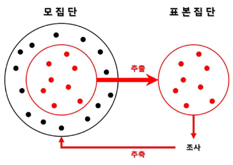
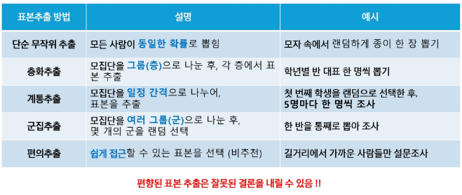
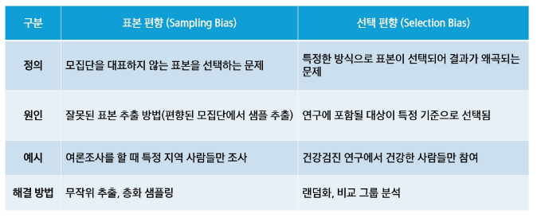
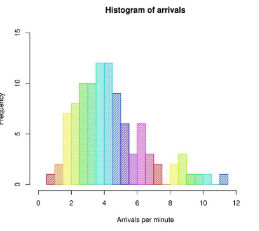
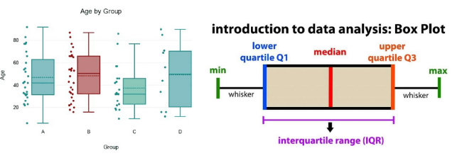
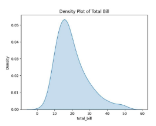
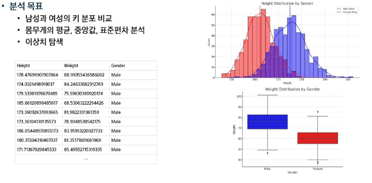
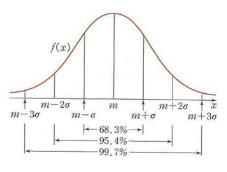
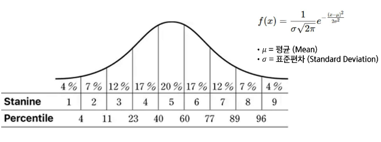
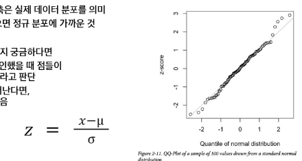

# 1. 임의표본 추출과 표본 편향, 선택편향
### 모집단과 표본의 개념
- 모집단 : 연구 대상이 되는 전체 집단
- 표본 : 모집단에서 일부를 선택한 것

> `모든 사람`(모집단)을 조사할 수 없으므로,
> 일부를 뽑아서(표본) 조사한 후 이를 바탕으로 모집단의 특성을 추정

### 표본 조사의 필요성
- 인구 조사 vs 표본 조사

> 인구조사(Census) -> 모집단 조사
    
    - 전체 국민을 조사하는 방법
    - 가장 정확하지만, 시간과 비용이 많이 소모

    예시)
    - 대한민국의 인구 총 조사(모든 국민 조사)

> 여론 조사(Survey) -> 표본 조사

    - 모든 사람을 조사하는 것이 어렵기 때문에 일부만 조사
    - 정확한 결과를 위한 표본을 신중히 선택

    예시)
    - 대선 후보 지지율 조사
    유권자가 4,000만 명이라면, 약 1,000 ~ 2,000명을 표본으로 선정해 조사

    주의점)
    - 만약 표본이 특정 지역이나 연령대에 편향된다면, 전체 국민의 의견을 제대로 반영하지 못함(표본 편향 발생)

### 표본 추출의 개념
- 표본 추출 : 모집단에서 일부를 선택(추출)하는 과정

### 표본 추출의 방법

### 임의 추출(무작위 추출)의 개념
- 임의 추출(무작위 추출) : 모집단에서 특정한 규칙 없이 무작위로 표본을 선택하는 방법
- 표본추출의 종류
    - 비복원 추출
    - 복원 추출

> 임의 추출이 필요한 이유
    
    1. 공정성 유지 : 모든 대상이 동일한 확률로 선택될 기회 제공
    2. 대효성 확보 : 특정 그룹에 치우치지 않고 모집단 전체를 반영
    3. 편향 방지 : 의도적인 선택(예: 특정 지역, 특정 연령대만 조사)을 막아 객관적인 데이터 확보
    4. 통계 분석의 신뢰도 증가 : 모집단을 잘 반영한 표본이면, 정확한 결론을 도출할 가능성이 높아진다.

### 표본 편향의 개념
- 표본 편향 : 모집단을 대표하지 못하는 잘못된 표본을 선택하여 조사 결과가 왜곡된 현상
    - 대표성을 담보하는 방법은 여러가지 있지만, 핵심은 임의 표본 추출

### 표본 편향을 줄이는 방법1
- 임의 추출 강화
    - 무작위로 표본을 선택하여 공정성을 높이는 방법
    - 모든 개체가 동일한 확률로 선택될 기회를 가져야함
- 예시) 대통령 지지율 조사
    - 전국에서 유권자를 무작위로 선택
    - 특정 나이대, 지역을 대상으로만 조사하면 편향 발생
- 장/단점
    - 장점 : 모집단을 공정하게 대표할 가능성 증가
    - 단점 : 모집단이 크면 랜덤으로 뽑기 어려움
- 방법
    - 제비 뽑기
    - 난수 생성기 활용

### 표본 편향을 줄이는 방법2
- 층화 추출 활용
    - 모집단을 그룹(층)으로 나눈 후, 각 층에서 무작위로 표본을 추출
    - 모집단 내 특정 특성(성별, 연령, 지역, 직업 등)에 따라 그룹을 나눈 후, 각 그룹에서 무작위로 표본을 추출
- 예시) 선거 여론 조사
    - 유권자를 성별, 나이대, 지역별로 나눈 후, 각 그룹에서 비율에 맞게 표본을 추출
- 장/단점
    - 장점 : 모집단의 다양한 특성을 고려 가능하며, 과소/과대 대표되는 문제를 방지
    - 단점 : 모집단을 층화하는 과정이 시간과 비용이 소요
- 방법
    - 모집단을 비슷한 특성으로 가진 그룹으로 나눔
    - 각 그룹에서 비율에 맞게 표본 추출

### 표본 편향을 줄이는 방법 3
- 계통 추출 적용
    - 일정한 가격으로 표본을 추출하는 방법
- 예시) 공장 품질 검사
    - 생산된 1,000개의 제품 중 처음 제품을 무작위로 선택한 후, 이후 매 100번째 제품마다 품질 검사를 진행
- 장/단점
    - 장점 : 쉽고 빠르게 표본 추출이 가능하다.
    - 단점 : 모집단의 특정 패턴이 있다면, 편향 발생 가능
- 방법
    - 모집단 크기 : N, 표본 크기 : n, k(간격) = N/n
    - 첫 번째 표본을 무작위 선택
    - 이후 k 간격 표본 선택

### 표본 편향을 줄이는 방법 4
- 표본 크기 확대
    - 표본 크기를 늘려 모집단을 더 정확히 반영
    - 예시) 대선 여론 조사
        - 표본 500명 일때보다 5,000명일 때 더 정확한 결과 예측 가능
    - 장/단점
        - 장점 : 표본이 클수록 결과의 신뢰도 증가
        - 단점 : 표본이 너무 크면, 비용과 시간이 많이 소요
    - 방법
        - 가능하면 더 많은 표본을 확보
        - 비용과 시간을 고려하여 적절한 표본 크기 선정

### 표본 편향을 줄이는 방법 5
- 편향을 보정하는 가중치 적용
    - 특정 그룹이 과소/과대 대표된 경우, 보정하는 방법
- 예시 ) 대선 여론 조사
    - 만약 여론 조사에서 20대 남성의 표본이 부족하다면, 결과 해석 시, 20대 남성의 응답 비율을 더 높게 반영
- 장/단점
    - 장점 : 모집단을 더 정확하게 반영 가능
    - 단점 : 가중치가 잘못 설정되면 오히려 결과 왜곡될 가능성 발생
- 방법
    - 부족한 그룹의 응답을 보정하기 위해 가중치를 적용해 결과 반영

### 선택편향의 개념
- 선택 편향 : 관측 데이터를 선택하는 방식 때문에 생기는 편향
- 즉, 특정한 선택으로 표본이 모집단을 대표하지 못해 연구 결과가 왜곡되는 문제
- 중요한 이유
    - 선택 편향이 있으며, 연구 결과를 모집단 전체를 적용하기 어려움
    - 특정 그룹의 과소/과대 평가될 위험이 있음
    - 특히, 의학 연구, 사회과학 연구, 정책 결정 등에서는 큰 영향을 미침
- 사례
    - 사례 1 : 신약 임상 시험에서 선택 편향
        - 어떤 신약을 건강한 사람들만 임상 시험을 진행했다면,
        - 실제로 약이 필요한 고령자, 만성질환 환자에게 효과가 다를 수 있음

### 선택 편향이 발생하는 이유
- 특정 그룹만 포함되는 경우
    - 연구 설계 과정에서 특정 특성을 갖은 사람들만 표본으로 포함
- 자발적 참여
    - 연구에 참여하는 사람이 스스로 결정하면, 연구에 적극적으로 참여하는 사람만 포함될 가능성이 높음
- 예시) 건강 검진
    - 건강검진 연구에서 건강에 관심 있는 사람만 참여한다면 편향 발생

### 선택 편향 vs 표준 편향의 차이점

# 2. 분포에 대한 이해
### 분포(Distribution)
- 분포 : 데이터가 어떤 값 주변에 어떻게 퍼져 있는지(흩어져 있는지)를 나타내는 것이다.
- 예시) 키 조사
    - 모든 친구의 키가 170cm라면?
        - 데이터가 한 곳에 집중되어 있음(변동이 적음)
    - 친구들의 키가 150cm ~ 190cm로 다양하다면?
        - 데이터가 넓게 퍼져 있음(변동이 큼)
- 즉, 분포를 보면 데이터가 어떻게 생겼는지(좁게 모여 있는지, 넓게 퍼져 있는지)를 알 수 있음

### 분포(Distribution)의 필요성
- 데이터의 패턴 파악
    - 데이터가 대체로 어디에 몰려 있는지(중심경향) 확인
- 이상치 발견
    - 데이터를 분석할 때 극단적으로 크거나 작은 값(이상치)을 찾는 것이 중요
    - 예 : 평균 몸무게가 60kg인데, 120kg이 포함되어 있다면 이상치 가능성
- 비교와 예측 가능
    - 두 개 이상의 그룹을 비교할 때 어떤 차이가 있는지 시각적으로 확인 가능
    - 예 : 남학생과 여학생의 키 분포 비교
- 적절한 분석 방법 선택
    - 데이터의 분포 형태에 따라 평균, 중앙값 등을 선택하여 분석 가능
    - 예 : 정규분포(대칭형)라면 평균을 사용, 왜곡된 분포라면 중앙값이 더 적절

### 분포(Distribution) 시각화 방법 1

- 히스토그램
    - 히스토그램은 데이터를 막대 그래프로 나타낸 것
    - 데이터의 전체적인 분포를 쉽게 확인 가능

- 박스 플롯(Box Plot)
    - 박수플롯(Box Plot)은 데이터의 범위, 중앙값, 이상치를 한눈에 볼 수 있는 그래프
    - 데이터의 최소값, 최대값, 중앙값(50%), 1사분위(25%), 3사분위(75%)를 표현
    - 데이터의 퍼짐 정도(분산)와 이상치를 확인하는 데 유용

- 밀도 곡선(Density Plot)
    - 밀도곡선은 데이터를 연속적인 곡선 형태로 나타내어 데이터의 분포를 부드럽게 표현한 그래프
    - 히스토그램처럼 데이터를 나누지 않고 연속적인 곡선으로 표현
    - 데이터의 중심과 분포의 형태를 더 부드럽게 볼 수 있음

### 기술 통계량의 개념
- 기술 통계량 : 데이터의 특징을 요약한 것
    - 중앙값 : 데이터를 크기 순으로 정렬했을 때 중앙에 있는 값
    - 평균값 : 데이터 값들의 평균 값
    - 분산 : 데이터 평균을 기준으로 얼마나 퍼져 있는지를 나타내는 값
    - 표준 편차 : 분산의 제곱급, 데이터의 필요성을 나타냄
- 이상치 발견
    - 데이터를 분석할 때 극단적으로 크거나 작은 값(이상치)을 찾는 것이 중요
    - 예 : 평균 몸무게가 60kg인데, 120kg이 포함되어 있다면 이상치 가능성
- 비교와 예측 가능
    - 두 개 이상의 그룹을 비교할 때 어떤 차이가 있는지 시각적으로 확인 가능
    - 예 : 남학생과 여학생의 키 분포 비교
- 적절한 분석 방법 선택
    - 데이터의 분포 형태에 따라 평균, 중앙값 등을 선택하여 분석 가능
    - 예: 정규분포(대칭형)라면 평균을 사용, 왜곡된 분포라면 중앙값이 더 적절

### 실제 데이터로 본 분포의 사례 : 키와 몸무게 분석

### 확률분포(Probability Distribution)
- 데이터가 특정 값 주위에 어떻게 분포하는지를 설명하는 개념
- 데이터의 패턴을 분석하고 예측 모델을 선택하는 데 유용

### 표본분포
- 같은 모집단에서 동일한 크기 n의 표본을 많이 추출 했을 때, 어떤 통계량이 만들어내는 확률 분포
- 특징)
    - 단일 표본 하나만 봤을 때는 샘플 평균이 모집단의 평균에 가까울 수도 아닐 수도 있음
    - 많은 표본 평균을 모으면 특정한 패턴을 띠게 됨
- 예시) 전국 고등학생의 평균 키
    - 전국 고등학생의 평균 키를 알고 싶다면, 모든 학생의 키를 조사해야 함
    - 시간과 비용이 많이 소모 됨
    - 랜덤하게 100명씩 뽑아서 평균을 구하는 것을 여러 번 반복하여 평균값들이 따르는 분포가 만들어지게 함.

### 정규 분포
- 정규분포는 종 모양의 분포
- 특징
    - 평균(u)과 표준편차로 정확히 모양이 결정됨
    - 가운데 값이 가장 많고 양옆으로 갈수록 빈도가 적어짐
    - 현실에서 가장 흔히 나타나는 분포
    - 많은 자연 현상과 금융 데이터가 이 분포를 따르는 경우가 많음

    

- 정규분포 : 데이터가 평균을 중심으로 대칭적인 종 모양을 띠는 분포

    

### 정규분포의 주요 특성
- 대칭성
    - 평균을 중심으로 좌우 대칭
    - 평균 = 중앙값 = 최빈값

- 68-95-99.7법칙
    - 데이터의 68%가 +-1 표준편차 내에 존재
    - 데이터의 68%가 +-2 표준편차 내에 존재
    - 데이터의 99.7%가 +-3 표준편차 내에 존재

- 즉, 정규분포는 많은 자연적/사회적 현상에서 발견되며, 데이터 분석에서 필수적인 개념

### 정규분포 예시
- 인구통계학
    - 인구 통계학에서는 사람들의 키나 체중과 같은 데이터를 분석하는데 정규분포를 활용
    - 예를 들어, 한국 성인 남성의 평균 키는 약 172cm
    - 이 값이 정규분포의 '평균' 값에 해당
    - 키의 분포는 평균 주변에서 가장 높은 빈도를 보임
    - 평균에서 멀어질수록 사람 수가 줄어들며 이는 정규분포의 특징을 따른다는 것을 알 수 있음

- 공학분야(머신러닝)
    - 머신 러닝 알고리즘은 일반적으로 데이터의 분포를 학습
    - 많은 알고리즘에서는 정규분포를 기본적인 가정으로 활용
    - 예를 들어, 분류 문제에서는 각 클래스에 속할 확률을 계산하여 가장 높은 확률을 가진 클래스를 예측 결과로 선택
    - 회귀 문제에서는 확률 분포를 사용하여 예측값의 불확실성을 표현하고, 이를 통해 모델의 신뢰도를 평가
    - -> 학률 분포를 통해 데이터의 복잡성과 불확실성을 효과적으로 관리하고, 보다 정확한 예측을 수행할 수 있음.

### QQ-plot
- 데이터의 실제 분포가 정규분포와 얼마나 가까운지 그래프상으로 확인하는 방법
- QQ-plot 보는 방법
    - x축은 이론적인 정규분포, y축은 실제 데이터 분포를 의미
    - 점들이 직선 위에 가까이 있으면 정규 분포에 가까운 것
- 예시) 반 학생들의 키
    - 반 학생들의 키가 정규분포인지 궁금하다면
    - 키 데이터를 QQ-plot으로 확인했을 때 점들이 직선을 잘 따라가면 정규분포라고 판단
    - 만약 특정 구간에서 크게 벗어난다면, 정규 분포가 아닐 가능성이 높음

    

### 중심극한 정리(CLT)
- 표본의 크기 n이 충분히 크다면, 모집단의 분포 형태와 관계 없이 표본평균의 분포는 정규분포를 따르는 원리
- 특징
    - 모집단이 어떤 모양(정규분포가 아니어도)이라도 상관없음
    - 표본 크기 n이 커질수록 표본평균의 분포가 정규분포에 가까워짐
    - 다양한 모집단에서도 정규 분포를 활용한 분석이 가능함
    