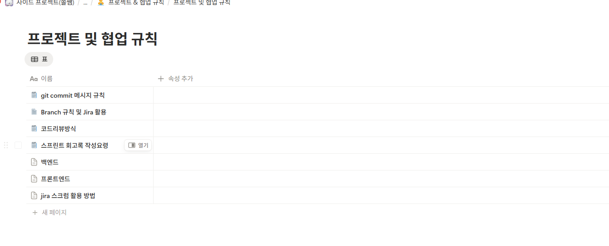
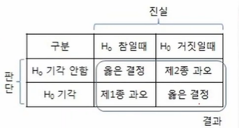
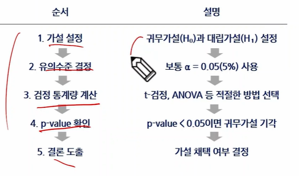

# 긴꼬리 분포
### 정규 분포 한계점
- 금융 데이터에서 정규 분포 가정의 한계점
  - 현실 금융 데이터(주식, 환율 등)는 완벽히 전규분포를 따르지 안흥ㅁ
  - 특히 금융 시장에서는 극단적인 상황(급등/급락)이 발생할 확률이 정규분포가 예측하는 것보다 더 높음.
  - 이를 `긴 꼬리 현상`이라고 함

### 긴 꼬리 분포
- 데이터 분포가 특정 방향으로 길게 늘어져 있는 것을 의미
  - 데이터는 일반적으로 정규분포를 따르지 않고, 긴 꼬리 분포를 따르는 경우가 많음
- 꼬리(tail)
  - 적은 수의 극단값이 주로 존재하는, 도수분포의 길고 좁은 부분
- 왜도(skewness)
  - 분포의 한쪽 꼬리가 반대쪽 다른 꼬리보다 긴 정도

### 긴 꼬리 분포 예시
- 유튜브 조회수
  - 영상이 대부분 낮은 조회수지만, 가끔씩 매우 높은 조회수가 나타내는 것과 비슷함
- 주식 시장의 붕괴
  - Black Swan Theory : 주식 시장의 붕괴와 같은 이례적인 사건이, 정규분포로 예측되는 것보다 훨씬 더 자주 일어날 수 있다고 예측

### 긴 꼬리 분포 사례
- 금융 시장에서의 긴 꼬리 현상 사례
  - 주식 시장 급락(예: 2008년 금융위기, 코로나19 충격)
  - 암호화폐 가격 폭등 및 폭락
  - 갑작스러운 환율 급등

## 스튜던트의 t분포
### 스튜던트의 t분포
- t분포는 정규분포와 유사하지만 꼬리 부분이 더 두꺼운 확률분포
- 특징
  - 표본의 개수(표본의 크기)가 작거나 모집단의 표준 편차를 정확히 모를 때 자주 사용
  - 꼬리가 두꺼움
    - 정규분포보다 극단값이 나타날 가능성을 더 현실적으로 반영함
  - 자유도 개념
    - 자유도란, 간단히 말해 데이터를 가지고 얼마나 자유롭게 움직일 수 있는지를 나타내는 수
    - 자유도가 작을수록 꼬리가 두꺼워지고, 자유도가 커질수록 정규분포와 비슷해짐

- 금융 분석에서 t분포의 중요성
  - 표본 크기가 작은 경우가 많음
    - ex) 최근 한 달 간의 수익률 데이터 등
  - 극단적인 수익률(큰 폭락, 폭등 등)이 빈번하게 나타남

- T 분포의 금융적 활용
  - 작은 표본에서의 신뢰구간
    - 데이터를 적게 가지고 있을 때, 정규분포를 가정하면 신뢰구간이 정확하지 않음
    - 그래서, t분포를 이용하면 현실적인 신뢰구간을 구할 수 있음
  - 가설 검정
    - "최근 시장 변동성이 과거에 비해 유의하게 증가했나?"같은 금융시장 분석에서도 t분포를 이용하면 정확한 판단 가능
  - 리스크 관리
    - 시장이 급등락하는 상황에서 t분포를 이용하면 리스크를 더 현실적으로 평가 가능

# 가설 검정과 신뢰구간
### 통계적 실험의 중요성
- 데이터를 분석하지 않고 의사 결정을 내릴 경우 발생하는 문제
  - 많은 사람들이 직관이나 경험을 기반으로 결정
  - 이로 인해 잘못된 결론을 내릴 위험이 큼

### 유의성 검정의 중요성
- 유의성 검정은 "우리가 관측한 차이가 우연히 발생했을 확률"을 계산하는 과정
- 예제) 신약 개발
  - "신약이 효과가 좋다"는 주장을 하기 위해서 단순 평균 비교로는 차이가 크지 않아 보임.
  - 이 차이가 우연이 아닐 확률을 계산해야함
  - 유의성 검정을 수행해서 p-value가 0.05보다 작다면, "우연이 아닐 확률이 높음". 즉, 신약이 효과가 있다고 판단

### 가설 설정 개념
- 가설이란, 특정한 주장을 검증하기 위한 가정
  - 통계적 검정의 핵심은 "이 가설이 맞는지 아닌지 검증하는 과정"
  - 관측한 데이터에서 "차이가 유의미한가?"를 검정하는 과정에서 가설을 설정해야 함
- 가설의 종류
  - 귀무가설 : 귀무 가설은 "차이가 없다" 또는 "효과가 없다"는 기본 가설
  - 대립가설 : 대립가설은 "차이가 있다" 또는 "효과가 있다"는 가설

### 신뢰구간
- 신뢰구간은 모집단의 참된 평균(모수)를 포함할 것으로 예상되는 값의 범위
  - 표본에서 얻은 평균을 기반으로, 모집단의 평균이 어느 범위 안에 있으지를 추정하는 방법
- 예제(95% 신뢰구간)
  - "새로운 마케팅 전략이 고객 구매율을 평균 2~5% 증가시킬 것이다.
  - "즉, 95% 확신을 가지고" 구매율 증가 범위는 2~5% 사이"라고 말할 수 있음
- 신뢰 구간과 가설 검정 관계
  - 만약 신뢰구간이 0을 포함하지 않으면, 차이가 유의미하다고 판단

### 유의수준(a)의 개념

- 유의 수준 : 우리가 허용할 "우연한 결과"의 최대 확률을 의미
  - 보통 0.05(5%) 또는 0.01(1%)를 사용
  - 즉, "5%의 확률로 우연한 결과를 허용하겠다"라는 의미
- 유의수준(a=0.05)의 해석
  - 검정 결과가 귀무가설이 맞더라도, 5% 확률로 틀린 결론을 내릴 수 있음
  - 즉, 1종 오류를 5% 이내로 제한하겠다는 의미
  - 유의수준을 낮출수록(a=0.01), 더 엄격한 검정을 수행하지만, 2종 오류위험 증가

### p-value의 개념
- p-value : 귀무가설이 참이라고 가정했을 때, 현재 관측된 결과보다 극단적인 결과가 나올 확률
  - "이 차이가 단순한 우연일 가능성이 얼마나 되는지"를 나타냄
  - p-value가 작을수록 우리가 관츠간 차이가 우연일 가능성이 낮아짐
- 해석 기준(유의 수준 a=0.05일 때)
  - p-value <= 0.05 -> 귀무가설 기각 -> "차이가 유의미하다"
  - p-value > 0.05 -> 귀무가설 유지 -> "차이가 우연일 가능성이 크다"
  - 즉, p-value가 작으면, "이건 우연히 아니다. 실제 차이가 있는 것이다."라고 결론을 내림

### 가설 검정의 개념
- 가설 검정은 데이터를 기반으로 특정 가설이 맞는지 판단하는 과정
- 즉, 표본 데이터를 이용해 모집단의 특성을 추론하는 방법

### 가설 검정의 흐름
- 데이터를 기반으로 통계적 결론을 도출하는 과정
- 데이터 수집 -> 데이터 전처리 -> 정규성 검정 -> 가설 검정 -> 결과해석

### 가설 검정 프로세스

### 유의성 검정의 유형

### 정규성 검정의 개념
- 정규성 검정은 데이터가 정규분포를 따르는지 확인하는 과정
  - 통계적 검정(t-검정, ANOVA)을 수행하기 전에 정규성 가정을 만족하는지 확인하기 위한 작업
- 정규성을 검정하는 대표적인 방법
  - Shapiro-Wilk Test -> 소규모 표본(50개 이하)에 적합
  - Kolmogorov-Smirnov Test -> 정규성과 다른 분포 간 차이를 검정
  - Anderson-Darling Test -> 정규성을 검정할 때 민감도가 높음
  - QQ-Plot -> 정규성을 시각적으로 확인
  - 가장 널리 사용되는 Shapiro-Wilk Test를 중심으로 실습 진행

### t-검정(t-test)의 개념
- t-검정은 두 집단의 평균 차이가 통계적으로 유의미한지를 검정하는 방법
- 특징
  - 모집단의 평균을 비교하는 검정 방법
  - 데이터가 정규성을 만족해야 함
  - 표본 수가 적더라도 비교적 정확한 결과를 제공

### 독립 표본 t-검정 개념
- t-검정 종류의 일종으로 서로 독립적인 두 집단의 평균 비교
- 사용목적
  - 서로 다른 집단의 평균 차이를 비교하고 싶을 때
  - 두 집단이 서로 독립적이며, 관측 값이 중복되지 않을 때
  - 데이터가 정규성을 만족할 때
- 예시
  - A구와 B구 주민들의 승용차 이용률이 차이가 있는지 검정
  - 새로운 교육 프로그램이 남학생과 여학생의 성적에 차이를 미치는지 검정
  - 두 개의 브랜드에서 제공하는 고객 서비스 만족도가 차이가 있는지 검정

### 대응 표본(Paired) t-검정 개념
- t-검정 종류의 일종으로 같은 집단에서 두 시점 또는 두 조건에서의 평균 차이를 비교
- 특징
  - 같은 개체(그룹)에서 두 번 측정된 데이터를 비교할 때 사용
  - 이전 상태와 이후 상태 사이의 평균 차이가 유의미한지 검정
  - 집단 간 비교가 아니라, 같은 개체에서 변화가 있는지 분석

### Welch's t-test 개념
- 독립 t-검정 변형의 일종으로 두 집단의 분산이 다를 때(이분산) 사용
- 특징
  - 일반적인 독립표본 t-검정은 등분산 가정이 필요함
  - Welch's t-test는 등분산을 가정하지 않고, 각 집단의 표준편차를 따로 고려하여 계산
- 필요한 상황
  - 두 집단의 표본 크기가 다를 때
  - 두 집단의 분산이 다를 때(Levenes's test p-value < 0.05인 경우>)
