# 1. 데이터의 시대와 엔지니어링
### 데이터?
- 정보 vs 데이터
  - 과거와 다르게 현재는 원시적인 자료인 '데이터'의 중요성이 강조됨

### 데이터의 중요성
- 빅데이터 : 데이터의 양, 다양성, 증가속도 향상
- 데이터를 수집, 가공, 활용할 수 있는 기술의 대두 => 데이터 파이프라인
- 비즈니스 리더의 의사결정, 데이터를 통한 서비스/제품 강화에 사용됨

### 데이터 엔지니어의 주요 활동
- 주요 역할
  - 데이터를 안정적으로 수집하고 가공하여 전달
  - 분석과 모델링이 가능하도록 데이터 흐름을 자동화
  - 신뢰성 있고 재사용 가능한 파이프라인 구축
- 주로 하는 일
  - 다양한 시스템에서 데이터 수집
  - 정제 및 변환(ETL/ELT 설계)

# 2. 데이터 파이프라인
### 데이터 파이프라인
- 데이터를 추출하고 정제하고 저장, 분석, 시각화하는 일련의 자동화 과정

### OLAP와 OLTP
- OLTP(Online Transaction Processing)
  - 운영 데이터 처리 시스템
  - 실시간 트랜잭션(주문, 결제, 예약 등) 처리
  - 행(Row) 단위 저장 구조
  - 빠른 입력, 수정, 삭제에 최적화

- OLAP(Online Analytical Processing)
  - 분석 데이터 처리 시스템
  - OLTP 등에서 수집된 데이터를 기반으로 통계,리포트 분석
  - 열(Column) 단위 저장 구조
  - 집계, 요약, 예측 분석에 최적화

### ETL의 구조
- ETL란?
  - 데이터를 가공한 후 저장. 전통적인 방식
  - 추출 -> 가공 -> 저장
- ELT란?
  - 데이터를 저장한 후 가공. 클라우드 시대의 방식
  - 추출 -> 저장-> 가공

  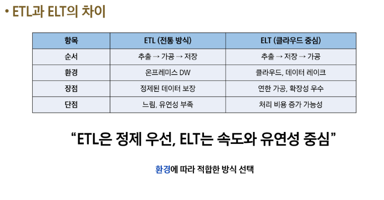

- 데이터 처리 방식 - 배치와 스트리밍
  - 배치 처리 방식(Batch Processing)
    - 데이터를 모아서 한 번에 처리하는 방식
    - 주로 하루 1회, 또는 시간 단위로 이뤄진다
    - 정확성과 대량 처리에 적합함
    
    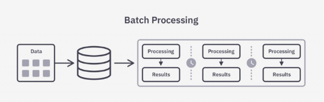
    
  - 데이터 스트리밍 처리 방식(Data Stream Processing)
    - 데이터가 들어오는 즉시 실시간 처리하는 방식
    - 빠르게 변화하는 데이터에 즉시 반응 가능
    - 실시간 분석과 대응이 가능
    
    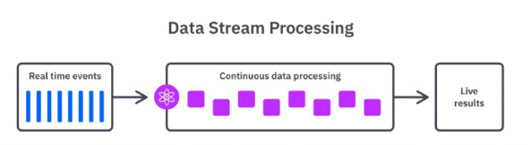

  

### 데이터 파이프라인의 기본 구조
- 자동화된 데이터 흐름
  - 데이터 소스 -> 수집 -> 가공 -> 저장 -> 분석/제공

### 데이터 저장소의 중요성
- 저장소는 분석을 위한 인프라
  - 데이터를 단순히 저장하는 것이 아니라 분석,활용을 위한 설계가 필요
  - 저장소에 따라 처리 방식과 유연성이 달라짐
  - 파이프라인에서 중요한 핵심 축

### 데이터 저장소
- 데이터 저장소의 종류
  - 데이터 웨어하우스 : 정형 데이터를 저장하는 구조. 기본 저장구조
  - 데이터 레이크 : 원본 데이터를 저장하는 구조, 수집 후 재가공하여 활용
  - 데이터 마트 : 특정한 목적을 위해 데이터 웨어하우스의 내용을 다시 추출하여 저장
  
  

### 데이터 웨어하우스의 구성
- 데이터 웨어하우스
  - 정형 데이터 중싱
  - 스키마 사전 정의
  - ETL 기반의 처리 방식
  - OLAP(Online Analytical Processing) 중심의 구조
  
  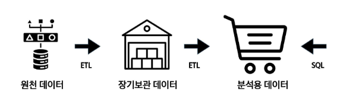

### 데이터 레이크의 구성
- 데이터 레이크
  - DW의 구조적 질서에 유연성을 결합
  - 분석, 모델링, BI 모두 대응하는 형태
  - OLAP(Online Analytical Processing) 확장 구조 (정형 + 비정형 데이터 모두 대응)

  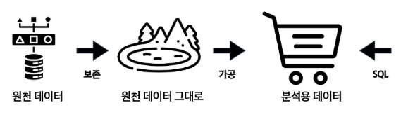

  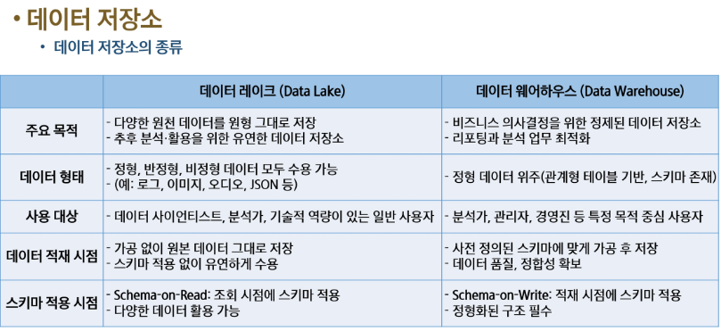

  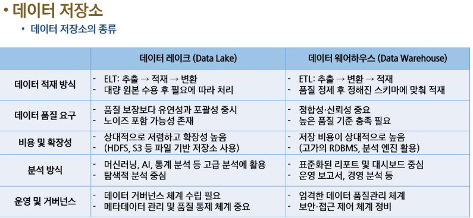

- 데이터 웨어하우스와의 차이
  - 데이터 웨어하우스는 최종 사용자가 보고싶은 관점별 데이터 구성을 위해 원천 DB로부터 데이터를 수집
  - 스키마 관리와 품질 관리를 통해 리포트를 제공하는 시스템
  - DW는 데이터 구조가 이미 결정되어 엄격한 스키마 관리가 필요하고 한 번 구축 시 변경이 어려움

### 데이터 수집 도구
- Kafka
  - 분산 메시지 큐 시스템
  - 대용량 데이터를 빠르고 안정적으로 전달
  - 실시간 스트리밍 수집에 강점
- Spark
  - 대규모 배치 처리 프레임워크
  - ETL/머신러닝 통합 가능
  - DAG 기반 처리로 안정성과 확장성 확보
- Flink
  - 스트리밍 처리 전문 프레임워크
  - 이벤트 기반 실시간 분석에 최적화
  - 상태 기반 연산 및 복잡한 처리 가능

### 데이터 저장 도구
- RDBMS(PostgreSQL, Oracle 등)
  - 고급 기능을 지원하는 오픈소스 관계형 데이터베이스
  - 정형 데이터 저장에 적합
- Elasticsearch
  - 실시간 검색과 분석에 강력한 NoSQL DB
  - 로그, 텍스트 분석, 모니터링 등 다양한 사용처
- Hadoop(Data Lake)
  - 대용량 비정형 데이터 저장용 HDFS 기반 저장소
  - 정형, 비정형 데이터 통합저장 기능

### 데이터 모니터링 및 워크플로우 관리 도구
- Airflow
  - 워크플로우 스케줄러(DAG 기반)
  - 파이프라인의 각 단계를 자동화 및 모니터링
- Grafana
  - 실시간 시각화 대시보드
  - 다양한 데이터 소스와 연결 가능( Prometheus, Elasticsearch 등)
- Prometheus
  - 시계열 기반 모니터링 도구
  - 지표 수집, 알림, 시각화 연동 기능 제공

### 데이터 레이크 분석 도구
- BI(Business Intelligence) / OLAP(Online Analytical Processing)
  - 데이터를 시각적으로 분석하거나 리포트를 만들기 위한 도구
  - 엑셀의 Pivot 기능 또는 시각화 기능과 같은 기능을 좀 더 전문적으로 다루는 도구
  - 원래 데이터 웨어하우스의 등장과 함께 같이 쓰이는 도구였으나, 데이터 레이크도 연결 가능
  - 라이선스 비용이 높은 편

### 데이터 레이크하우스
- 데이터 레이크하우스의 구성
  - 정형 + 비정형 데이터 모두 저장
  - 스키마는 나중에 적용(schema-on-read)
  - 대용량 로그/센서 데이터 수용 가능

  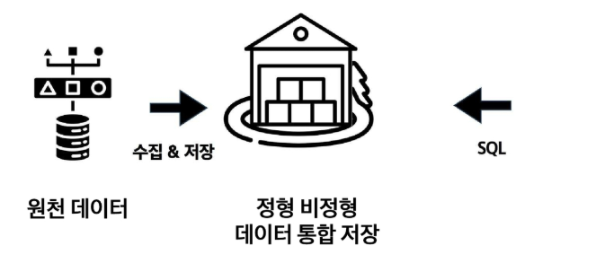

### 아키텍처 설계
- 데이터 엔지니어 관점에서 데이터 아키텍처 주 관심사는 파이프라인 설계
- 데이터 수집부터 분석/시각화 환경까지 데이터를 견고하게 전달할 수 있는 아키텍처 설계를 목표로 함

### 파이프라인 설계
- 파이프라인 설계는 환경마다 다르기에 정답은 없다.
- (온프레미스 vs 클라우드)
- 요구사항에 따라 각양각색으로 구현 가능하나, 실시간 수집이 필요한지 여부에 따라 파이프라인 설계 구분 가능

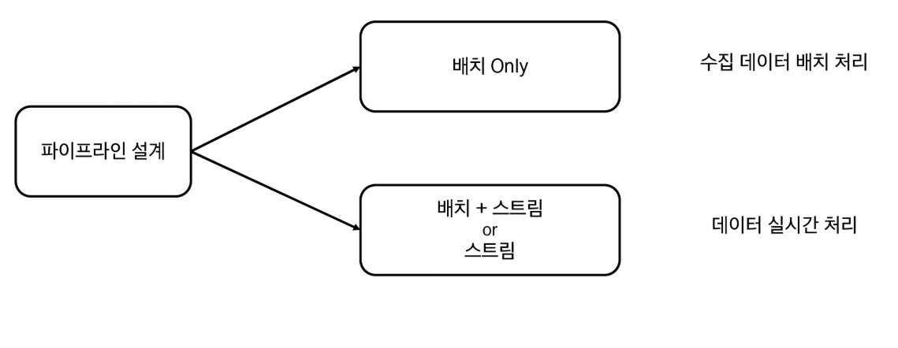

- 람다 아키텍처 & 카파 아키텍처
  - 실시간 수집이 필요한 경우 참조할 수 있는 아키텍처가 존재한다
  - 대표적으로 람다(Lambda) 아키텍처와 카파(Kappa) 아키텍처가 존재

  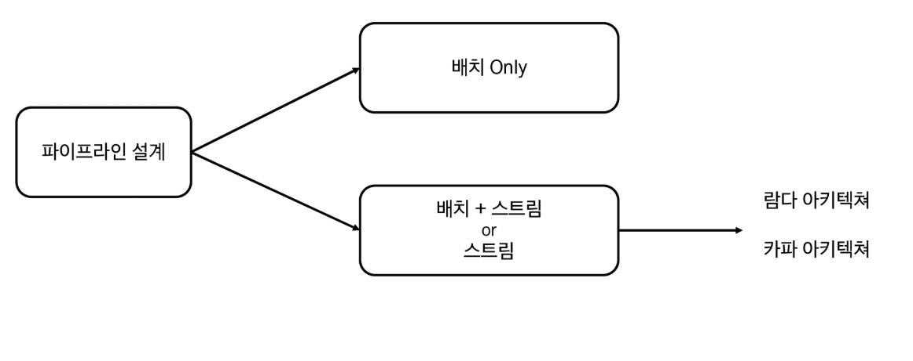

- 람다 아키텍처
  - 2011년에 제시된 아키텍처
  - 실시간 수집이 필요한 경우 배치 처리와 스트림 처리를 모두 이용 가능

  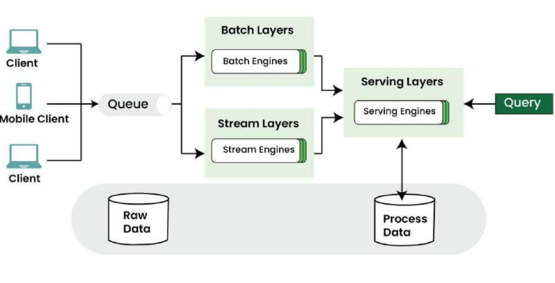

- Serving Layer
  - 배치 Layer에 저장된 데이터를 빠르게 보여주기 위한 서비스 계층
  - 사용자가 쿼리할 수 있도록 함
  - 필요에 따라 스피드 Layer에 있는 데이터를 결합하기도 함

  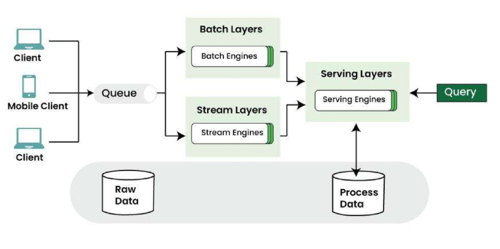

- 배치 Layer & 스트림 Layer
  - 배치 Layer에 저장된 데이터가 특정 기준 데이터라면 스피드 Layer에는 당일 데이터가 저장/정제하여 저장하는 공간
  - 배치 Layer에서 테이블 갱신이 완료되면 스트림 Layer는 그 이후 데이터부터 저장 및 정제
  - 람다 아키텍처는 컨셉만 제공

  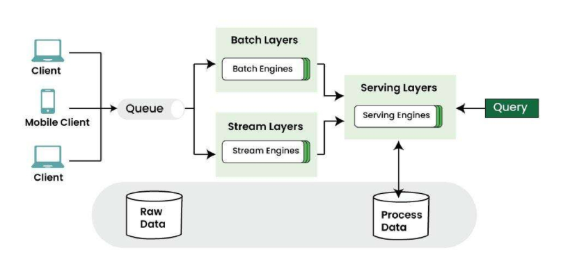

- 카파 아키텍처
  - 배치 Layer를 제거하되 배치 Layer에서 하던 일을 모두 스피드 Layer에서 수행하는 구조(전처리 후 필요한 테이블 재구성)
  - 데이터 소스는 주로 메시지 큐를 의미
  - 메시지 큐에는 여러 솔루션이 존재하지만 Kafka를 개발한 Jay Kreps가 만든 카파 아키텍처에서 데이터 소스는 사실상 Kafka의 Cluster를 의미
  - 카파 아키텍처에서 모든 데이터는 Kafka로 수집함을 의미
  - 그러나 일반적으로 배치 파이프라인도 많이 활용

  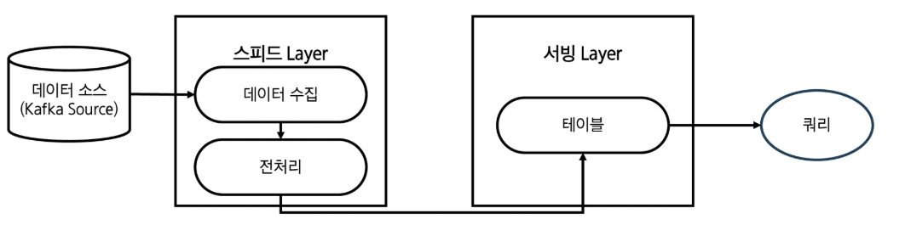

- 람다 아키텍처나 카파 아키텍처만 가능한가
  - 구조화된 아키텍처는 참고를 위한 아키텍처일 뿐 모든 데이터를 해당 아키텍처 기반의 파이프라인으로 만들 필요는
  - 아키텍처 수용 여부는 파이프라인마다 데이터의 활용 요건으로 결정
  - 데이터 활용 요건을 분석 후 아키텍처를 따를지 어떤 데이터 뷰를 활용할 지 결정

### 데이터 파이프라인 전체 구조
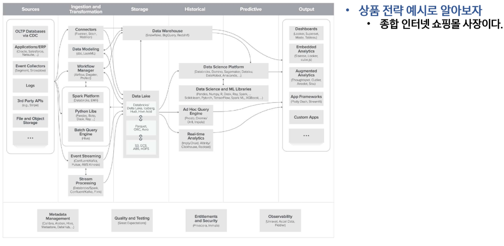

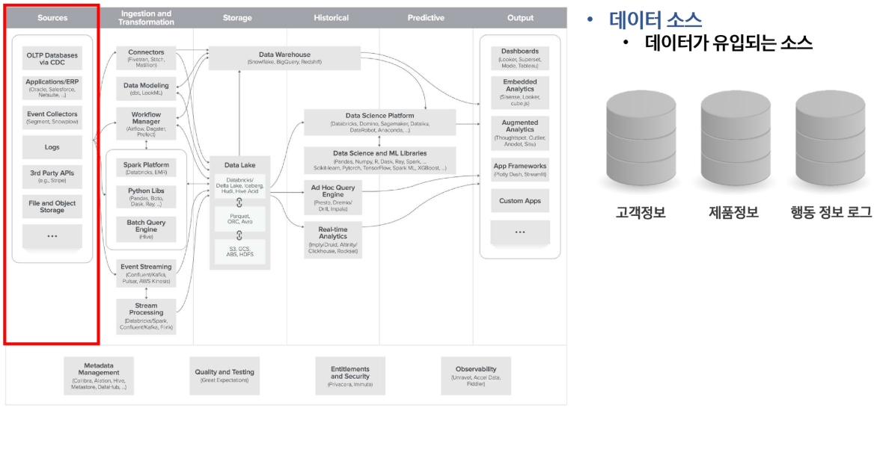

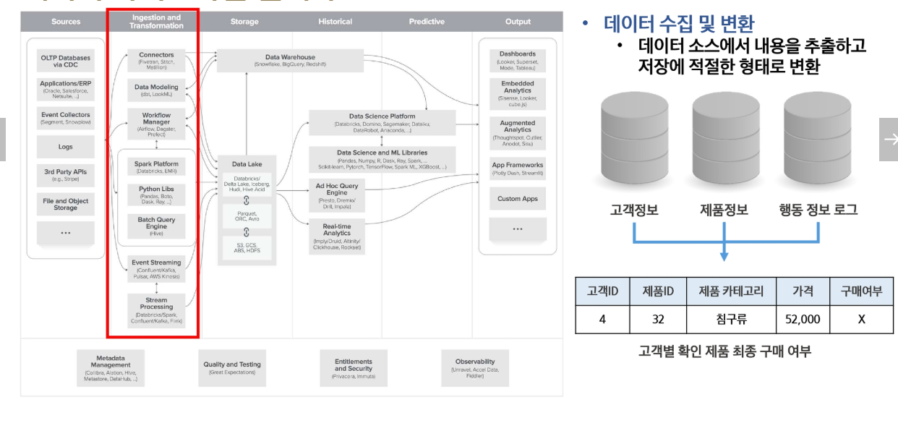

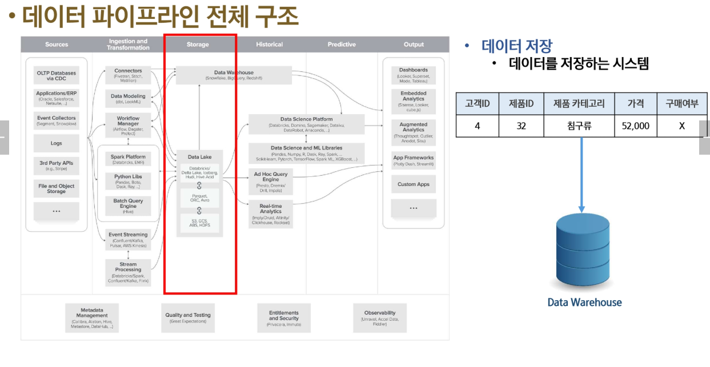

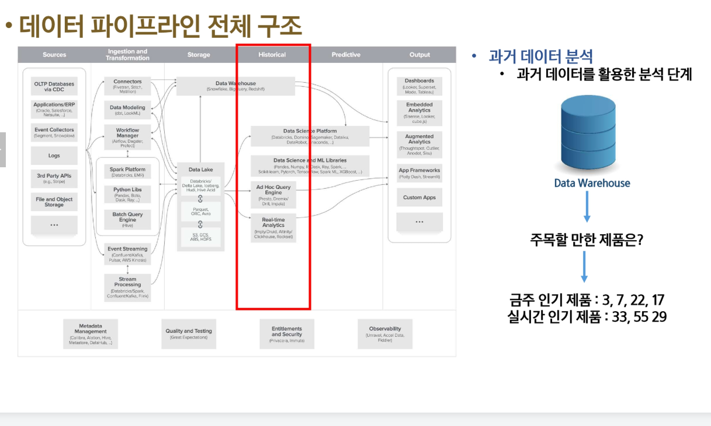

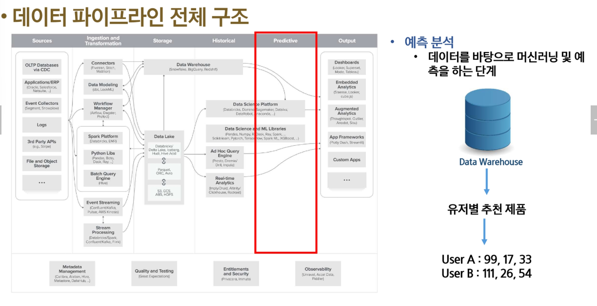

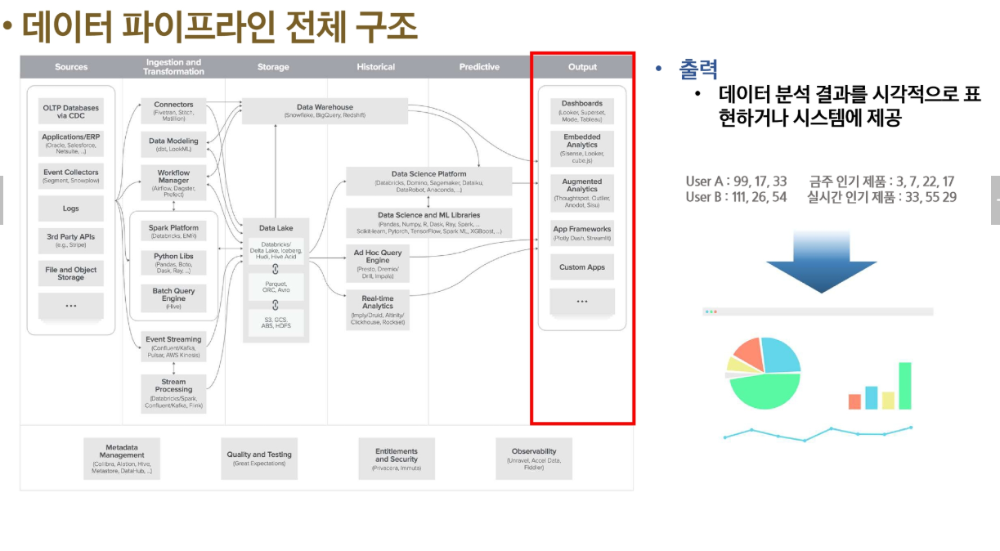

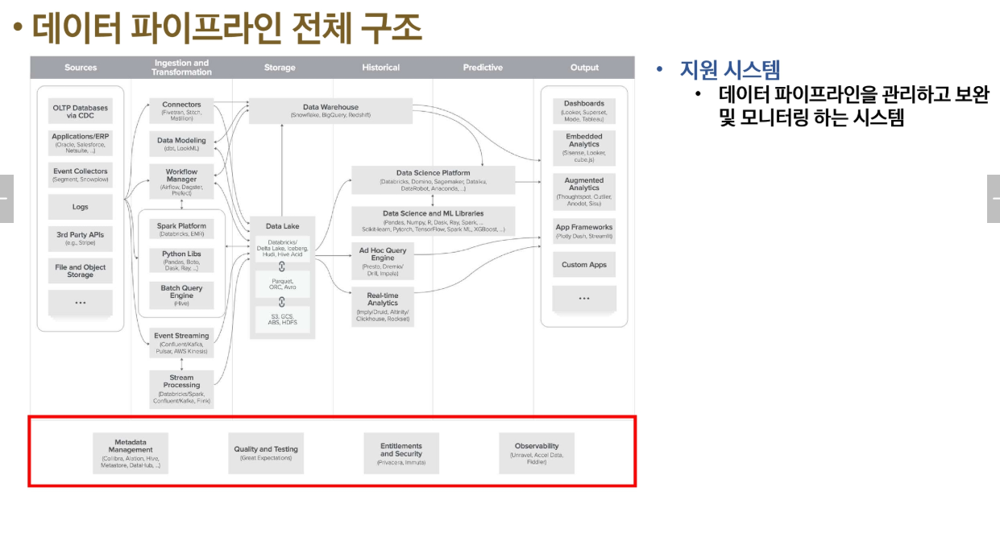

# 3. 리눅스의 개념
- 유닉스(UNIX)
  - 리눅스가 탄생하기 이전 운영체제(OS)
  - 지금도 많이 사용되는 운영체제 중 하나이지만 높은 비용 지불 필요
  - IBM의 AIX, HP의 HP/UX, 오라클의 Solaris, DEC의 Digital Unix, SCO의 SCO
  - Unix 등

- 리눅스
  - 무료 유닉스 개념
  - 유닉스와 거의 동일한 운영체제이면서 무료, 어떤 면에서는 유닉스보다 뛰어남

- 커널
  - 운영체제의 핵심 구성 요소로, 하드웨어와 응용 프로그램 사이를 중재하는 역할을 한다.
- 리눅스 커널의 역사
  - 리누스 토르발스가 1991년, 리눅스 커널 0.01 버전을 개발
  - 1992년, 0.02 버전 소스를 공개하며 오픈소스 운동 본격화 -> 리눅스의 시작
  - 리눅스 배포판은 토르발스가 만든 커널 + 다양한 오픈소스 프로그램으로 구성

  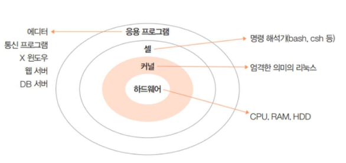

- 리눅스의 장점
  - 무료 & 오픈소스
  - 가볍고 빠른 성능
  - 서버로서의 점유율
  - 개발 환경
    - git, Docker, Python, Node.js 등 대부분 리눅스 친화적
    - 패키지 설치, 자동화, 백엔드에 최적

- 우분투 리눅스
  - 데비안 기반 배포판, 다양한 플래버
  - 릴리스 주기 : 일반버전 (6개월), LTS버전(2년)

# 4. WSL(Windows Sbusystem for Linux)
### WSL이란 무엇일까?
- WSL
  - Windows 환경에서 리눅스를 실행할 수 있도록 도와주는 도구
  - 윈도우에서 리눅스를 가상 머신 없이 실행
  - 명령어, 파일 시스템, 리눅스 도구 사용 가능
- WSL의 장점
  - 별도 리눅스 컴퓨터가 없어도 Windows에서 바로 리눅스 사용 가능
  - Docker, Python, Git 등 리눅스 친화 도구 활용이 쉬움
  - VM 대비 가볍고 빠르며, 설치가 간편함(재부팅 없이 가능)

### WSL 버전 별 차이점
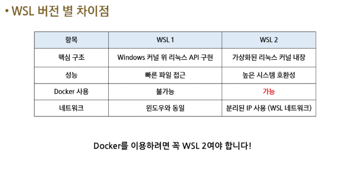

# 5. 리눅스 기본 명령어
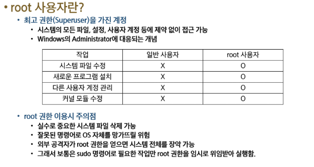

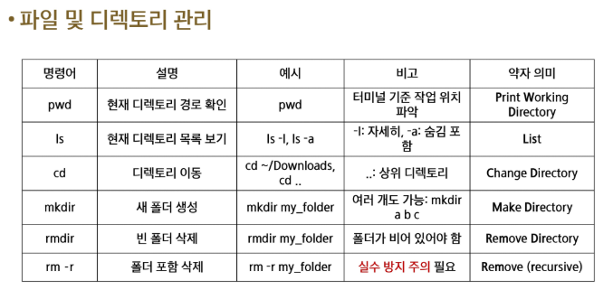

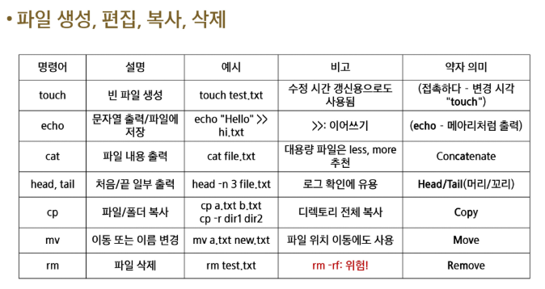

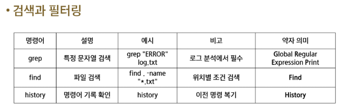

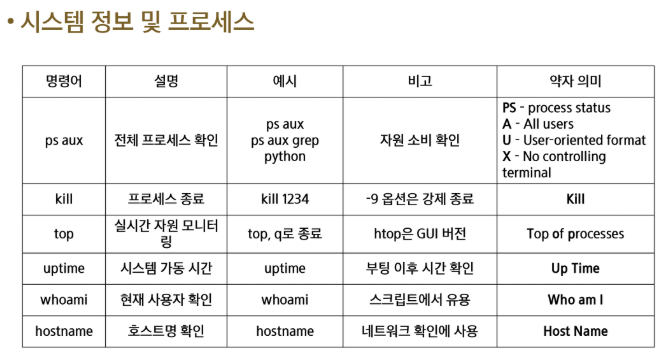

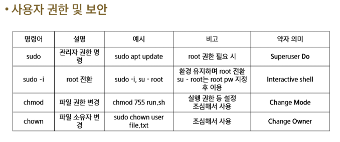

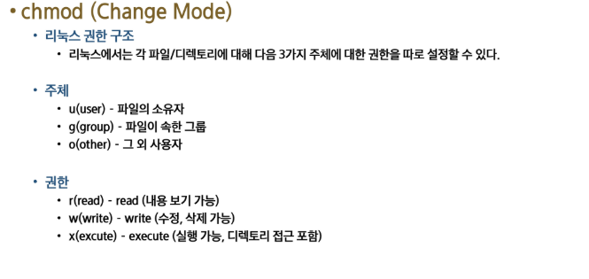

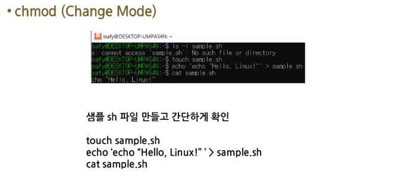

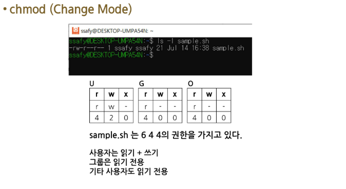

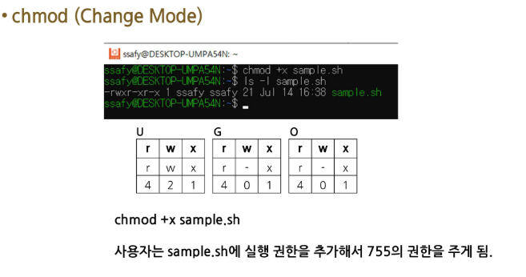

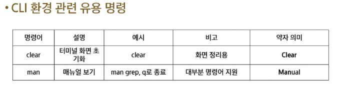

# 6. 리눅스 명령어 사용 실습
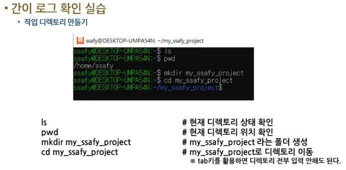

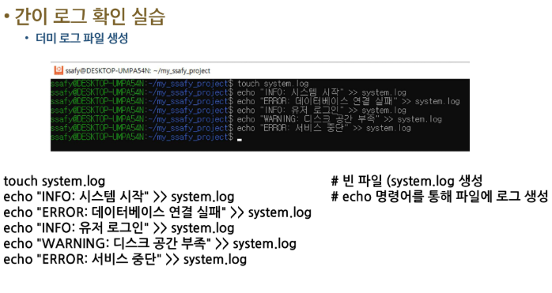

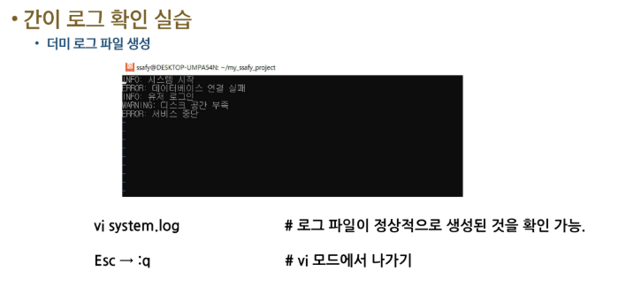

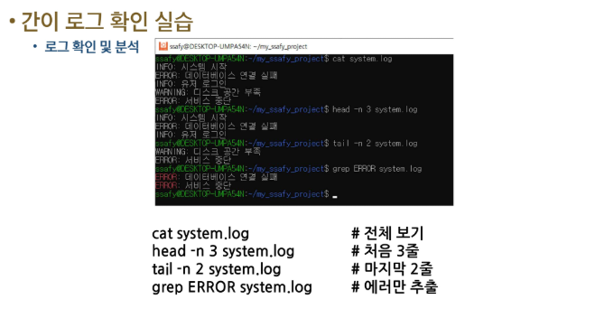

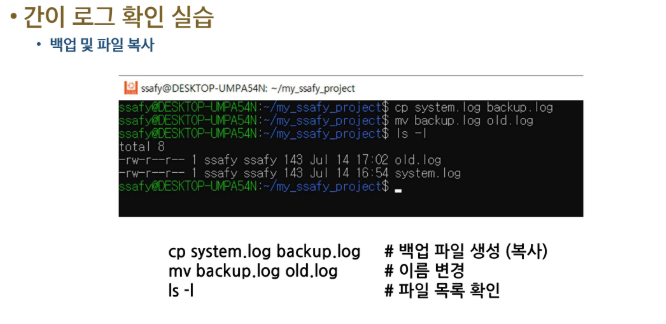

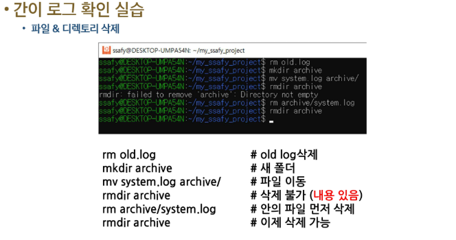

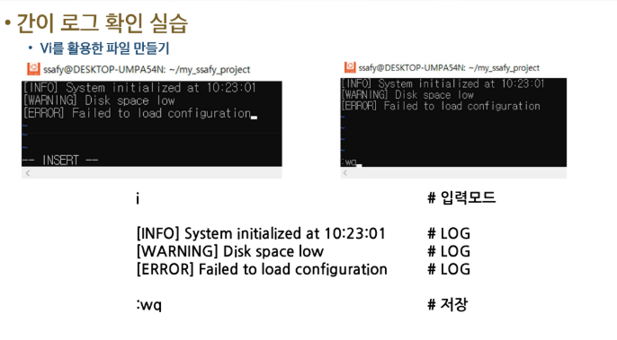

