# 1. 컨테이너와 도커
### 도커
- 애플리케이션을 컨테이너라는 가볍고 독립적인 환경에서 실행할 수 있도록 도와주는 오픈소스 가상화 플랫폼
- 외부 환경과 격리된 상태에서 애플리케이션이 환경에 영향 받지 않고 실행도리 수 있도록 하는 소프트웨어
- 컨테이너를 생성하고, 관리하는 데 필요한 엔진과 명령줄 도구(CLI)로 구성

### 컨테이너의 의미
- 컨테이너는 어떤 물체나 데이터를 외부와 분리된 공간에 담아두는 것
- 물체를 격리하는 공간과 비슷한 의미

  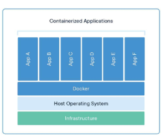

### 컨테이너의 필요성
- 환경 차이 없이 어디서든 실행 가능
  - EX) 개발 PC, 테스트 서버, 클라우드에서도 동일하게 동작
- 설치/설정 충돌 방지
  - 여러 앱이 공존할 수 있는 안전한 격리 공간 제공
- 빠른 실행과 이식성
  - 가상머신보다 훨씬 빠르게 실행되고 리소스도 적게 사용

### 컨테이너의 개념

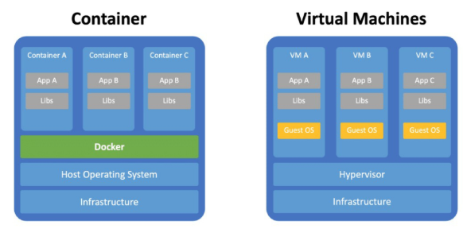

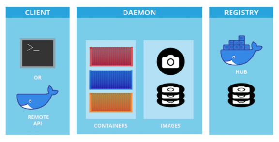

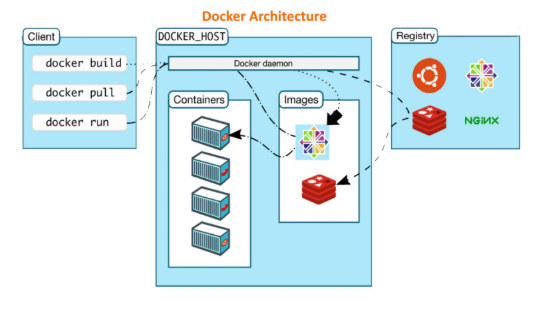

### 도커의 핵심 구성 요소
- 도커 엔진(Docker Engine)
  - Docker의 중심이 되는 실행 시스템
  - 컨테이너를 실제로 생성하고 실행하는 역할을 맡음
  - dockerd라는 데몬(서버)이 Docker API 요청을 받아 처리
  - 예를 들어, "컨테이너를 하나 만들어줘", "이 이미지를 실행해줘" 같은 명령이 여기에 전달되어 실행

- 도커 클라이언트(Docker Client)
  - 우리가 터미널에서 입력하는 docker 명령어가 여기에 해당
  - 사용자가 입력한 명령은 내부적으로 Docker Engine에 전달
  - 실제로 작업을 수행하는 것은 엔진이고, 클라이언트는 이를 요천하는 창구 역할을 함
  - 예 : docker run, docker ps, docker build 등

### 도커의 핵심 구성 요소
- 도커 객체(Docker Objects)
  - Docker에서 다루는 주요 구성 단위
  - Image(이미지) : 컨테이너를 만들기 위한 설계도 역할
  - Container(컨테이너) : 미지를 실제로 실행한 실체
  - Service(서비스) : 여러 개의 컨테이너를 묶어 하나의 서비스처럼 운영하는 단위
  - 이러한 객체들을 조합해 하나의 시스템을 구성

- 도커 레지스트리(Docker Registry)
  - 이미지를 저장하고 공유할 수 있는 중앙 저장소
  - 가장 대표적인 예는 Docker Hub
  - 사용자는 docker pull로 이미지를 내려받고, docker push로 자신이 만든 이미지를 업로드할 수 있음

### Dockerfile, Docker Image, Docker Container의 관계
- 도커파일(Dockerfile)
  - Dockerfile은 이미지를 만들기 위한 설계도
  - 우리가 원하는 환경과 명령들을 스크립트 형식으로 작성한다
  - ex) 어떤 OS를 쓸지, 어떤 파일을 복사할 지, 어떤 명령어를 실행할지를 기록

- 도커 이미지(Docker Image)
  - 이미지는 하나의 정적인 파일로, 실행할 준비가 된 상태의 환경
  - docker build 명령을 통해 Dockerfile로부터 이미지를 생성
  - 내부에는 다음과 같은 정보가 포함
    - OS(기반 계층, ex:Ubuntu)
    - 소스코드, 의존성, 환경변수, 실행 명령어 등

- 도커 컨테이너(Docker Container)
  - 컨테이너는 이미지의 복사본이 메모리에서 실행 중인 상태
  - 이미지를 docker run하면 컨테이너가 생성
  - 내부에서는 실제 애플리케이션이 돌아감
  - 각 컨테이너는 자신만의 파일 시스템과 프로세스를 가짐(다른 컨테이너와 격리)

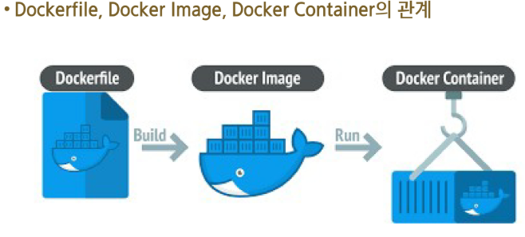

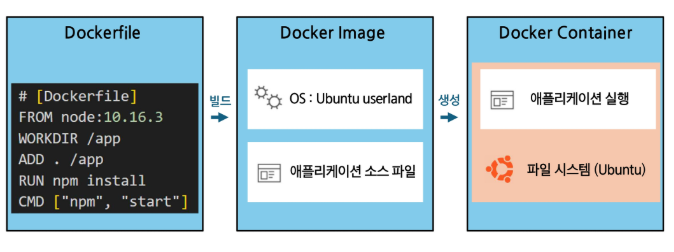

### 도커 관련 주요 도구
- 도커 컴포즈(Docker Compose)
  - 여러 개의 컨테이너를 한 번에 실행하고 관리할 수 있는 도구
  - docker-compose.yml 파일에 컨테이너 구성과 관계를 정의
  - 다른 여러 종류의 서버를 하나의 시스템처럼 묶어서 실행

  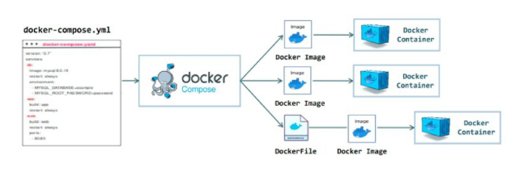

# 2. Docker Desktop과 설치

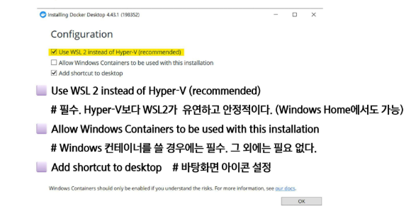

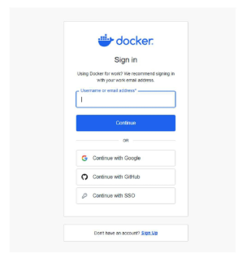

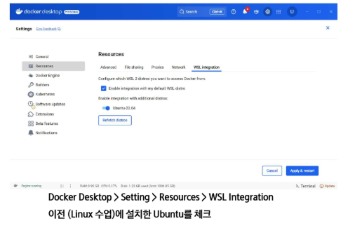

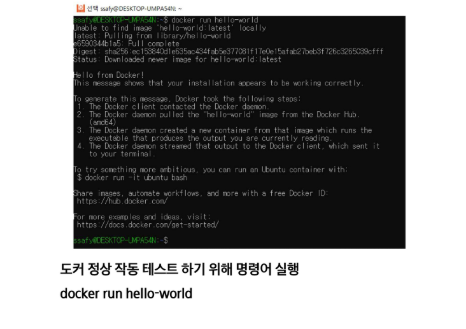

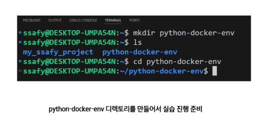

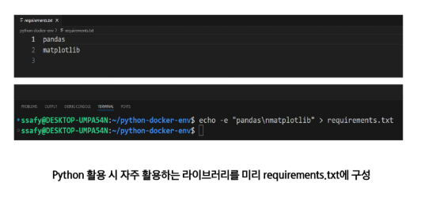

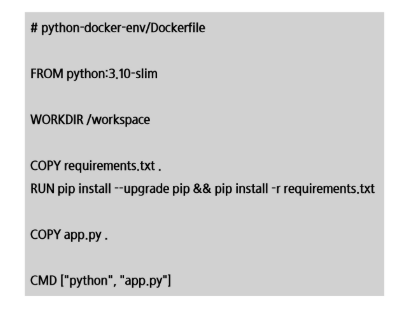

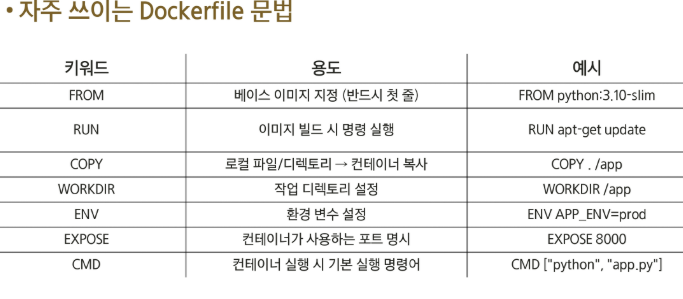

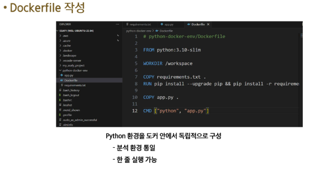

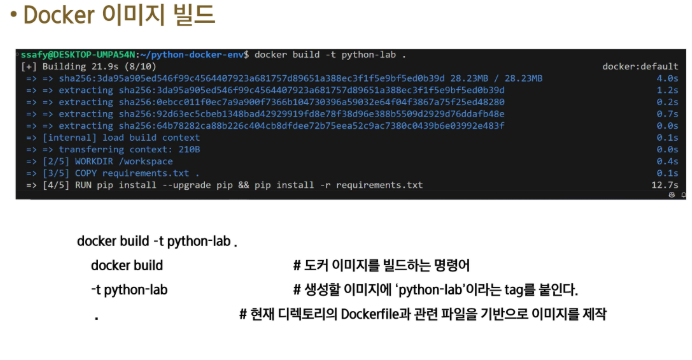

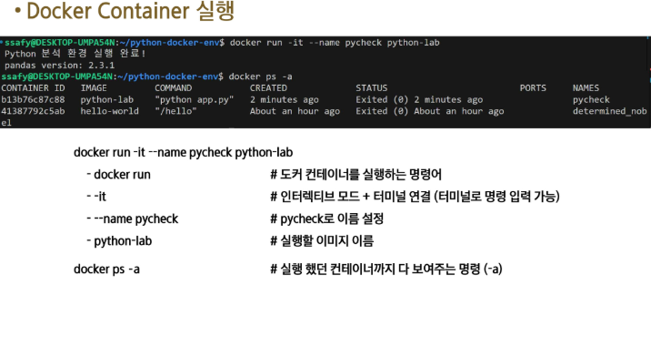

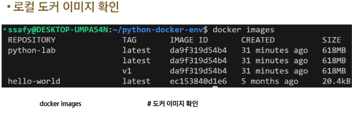

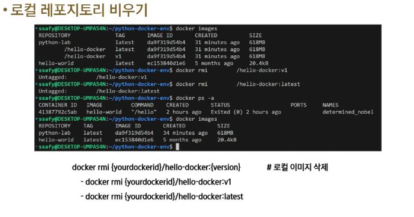

# 3. Docker 기본 명령어

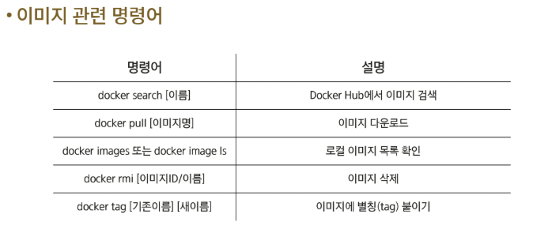

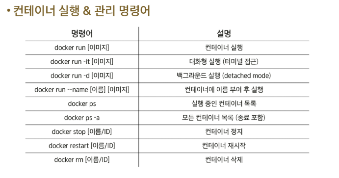

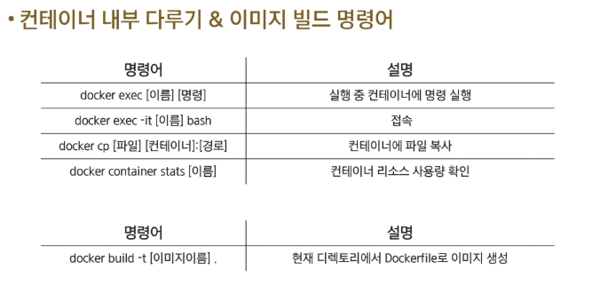

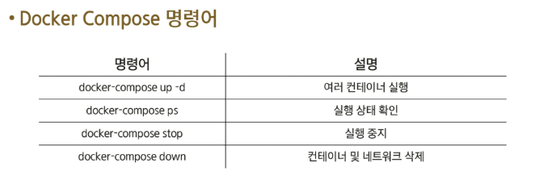

# 4. Docker Compose 실습
### Docker Compose 개요
- Docker Compose란?
  - Docker Compose는 여러 컨테이너를 하나의 프로젝트처럼 관리할 수 있게 해주는 도구
  - docker-compose.yml 파일에 정의된 내용을 바탕으로 한번에 컨테이너들을 실행

- docker-compose.yml 구조
  - services : 컨테이너 목록
  - image : 사용할 도커 이미지
  - ports : 호스트와 컨테이너의 포트 매핑
- Docker compose 명령ㅇ
  - docker compose up -d : 백그라운드 실행
  - docker compose ps : 실행 중인 서비스 확인
  - docker compose down : 컨테이너, 네트워크 정리

### Docker Compose 실습
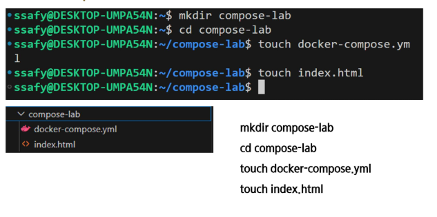

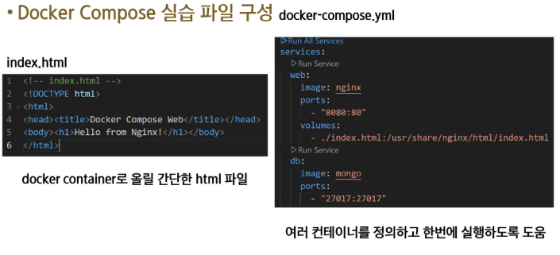

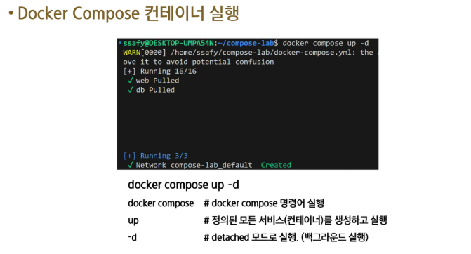

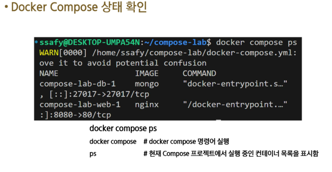

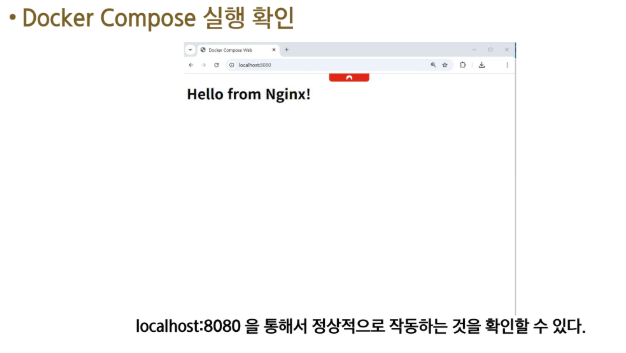

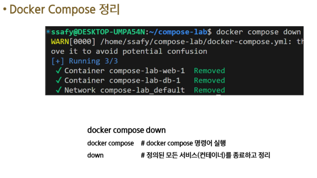

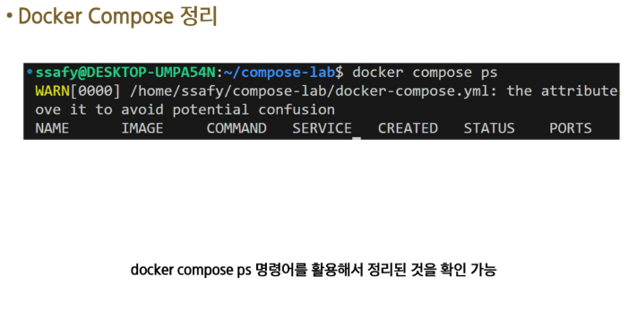

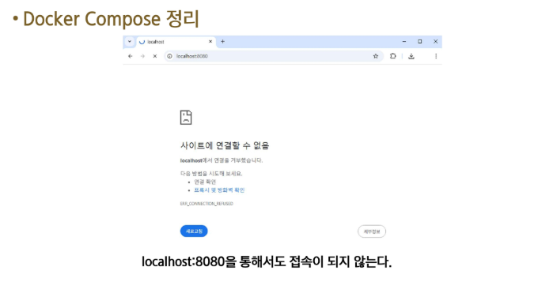

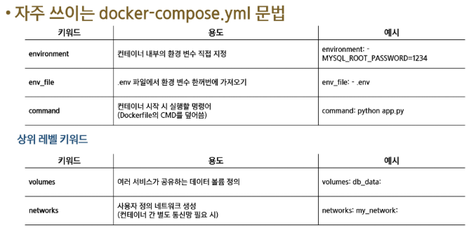

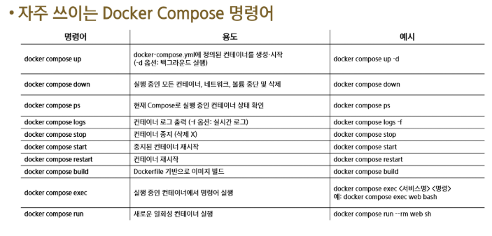

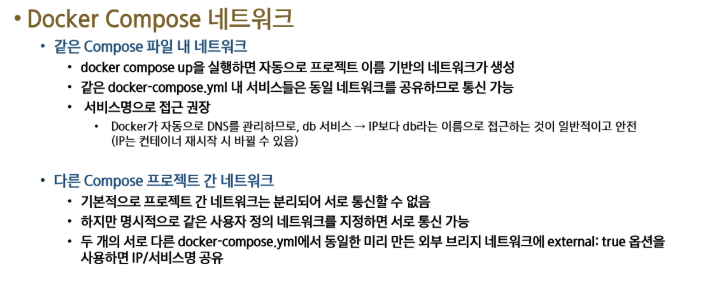

