# 1. Kafka Producer
### Kafka의 핵심 개념
- 주요 개념 요약
  - 생산자(Producer): 메시지를 브로커에 전송
  - 소비자(Consumer) : 브로커에서 메시지를 소비

    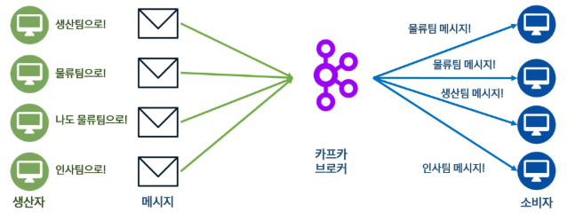

- 주요 개념 요약
  - 토픽(Topic) : 메시지를 저장하는 논리적 단위, 택배를 찾을 때 주소 같은 느낌
  - 파티션(Partition) : 메시지를 병렬로 처리하기 위한 단위, 큐와 유사함, 택배 창고 같은 느낌
  - 브로커(Broker) :  메시지를 관리하는 Kafka의 서버
  - 클러스터(Cluster) : 함께 동작하는 Kafka 서버 집단

     : 메시지를 저장하는 논리적 단위, 택배를 찾을 때 주소 같은 느낌
  - 파티션(Partition) : 메시지를 병렬로 처리하기 위한 단위, 택배 창고 같은 느낌
  - 오프셋(Offset) : 파티션 내의 메시지 순서
  - 세그먼트 : 파티션이 실제로 저장되는 물리적 단위, 파일 형태.

    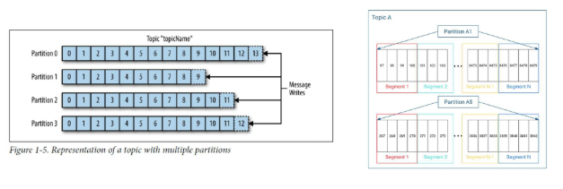

### 클러스터 구조
- Kafka의 클러스터
  - 컨트롤러(Controller) : 클러스터 관리 및 장애 처리 역할 수행
  - 주키퍼(Zookeeper) : 클러스터 관리에 필요한 데이터 관리 및 헬스체크, 컨트롤러 선정 수행
  - 레플리카(Replica) : 파티션의 복제본을 여러 브로커에 저장하는 방식, 리더와 팔로워로 나뉨

### Kafka Producer의 기본 개념
- Kafka Producer란?
  - 프로듀서(Producer) : Kafka의 토픽으로 데이터를 전송하는 클라이언트
  - 다양한 데이터 소스(로그, 사용자 이벤트, 센서 데이터)에서 메시지 생성

  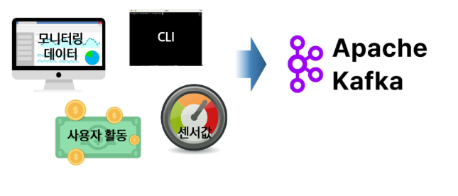

### Kafka Producer의 기본 개념
- Kafka Producer의 메시지 전송 과정
  - 메시지는 직렬화, 파티션 결정, 압축의 과정을 거쳐 완선됨
  - 그 후 파티션 별 버퍼에 저장되어 있다 일정 조건(시간, 용량)을 만족하면 전송 스레드에 의해 브로커로 보내짐

    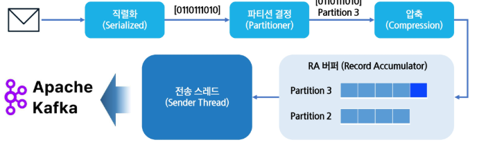

### Kafka Producer의 메시지 구조
- Kafka Producer Record
  - 레코드(Record) : 프로듀서가 데이터를 전송하는 기본 단위
  - Topic, Value는 필수, 나머지는 선택

    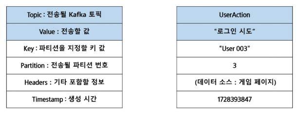

### Kafka Producer의 직렬화
- Kafka 직렬화 과정
  - 직렬화(Serialized) : 문자열같은 데이터를 단순한 Byte 형태로 바꾸는 작업
  - 역직렬화(Deserialized) : Byte형태의 데이터를 다시 고수준의 원본 형태로 바꾸는 작업

    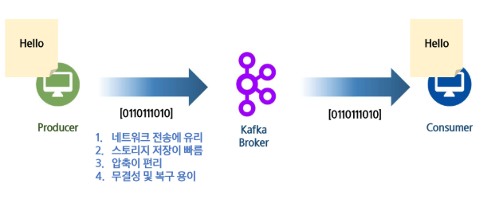
  
### Kafka Producer의 파티션 선택
- Kafka 파티션 선정 알고리즘
  - RR(Round Robin) : 기본 파티셔너'였'음. 파티션 지정이 없을 경우 파티션 별로 돌아가면서 저장

    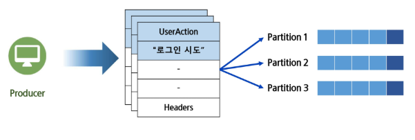
  
  - Key Base : 키가 결정되어 있으면 같은 키의 데이터끼리 묶어서 처리, `사용시 파티션 수 변경 금지`

    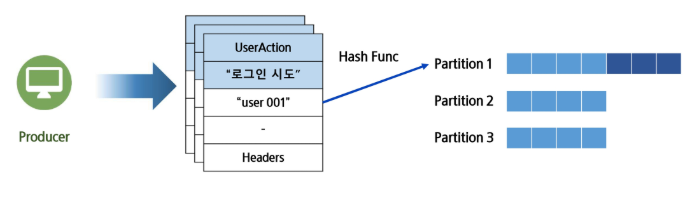

    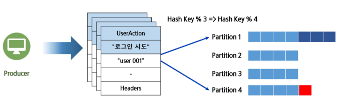

  - 파티션 지정 : 저장될 파티션을 지정하는 방식

    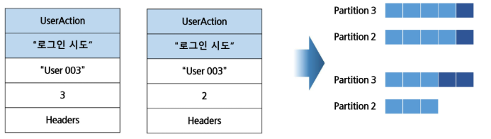

    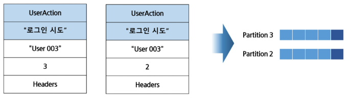

  - Sticky : 기본 파티셔너. 하나의 목표 파티션을 빠르게 채우고 목표 파티션을 바꿈

    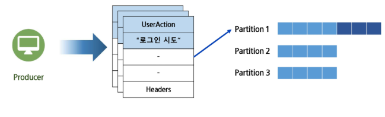

    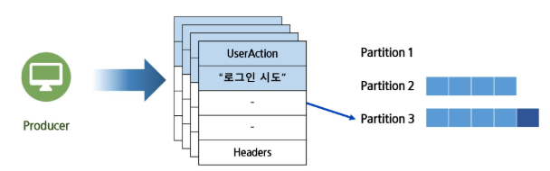
  
### Kafka Producer의 압축
- Kafka 압축
  - 효율적인 데이터 전송 가능
  - 브로커에서 데이터 복사가 쉬움

    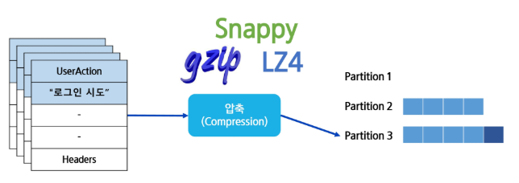

### Kafka Producer의 버퍼
- Kafka RA와 버퍼
  - RA(Record Accumulator) : 전송될 레코드를 모아두는 메모리 공간, 전송 효율을 높이는 버퍼의 역할
  - 배치(Batch) : 한번에 전송되는 레코드의 단위

    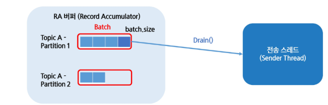

    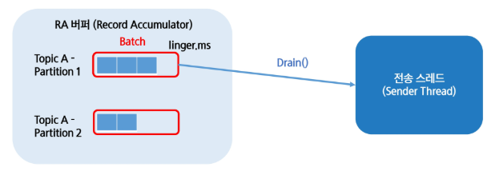

    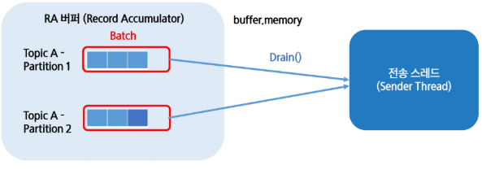

  - PlggyBack : 조건을 만족하지 않은 배치가 만족한 배치와 같은 브로커를 향할때 함께 보내는 최적화 기법

    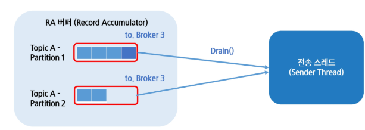

### Kafka Producer의 전송 스레드
- Kafka Sender Thread
  - 동기(Sync) 전송 : 메시지(레코드)가 확실히 브로커에 전송될 때까지 메인 스레드가 대기
  - 비동기(Async) 전송 : 메시지(레코드)가 전송될 때까지 기다리지 않고 작업을 넘어감

    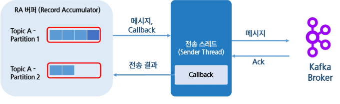

    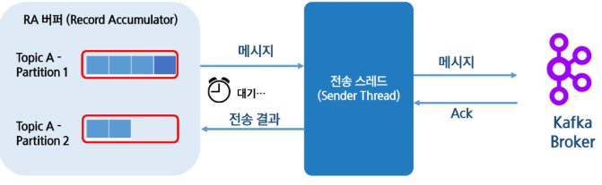

- Kafka Sender의 Acknowledge 옵션
  - Ack == 0 : 브로커가 정상적으로 받았는지 확인하지 않음
  - Ack == 1 : 리더가 받았으면 다음 메시지로 넘어감. 못받았으면 재전송
  - Ack == -1(all) : 리더가 받은 후 팔로워까지 모두 복제 완료되면 넘어감

    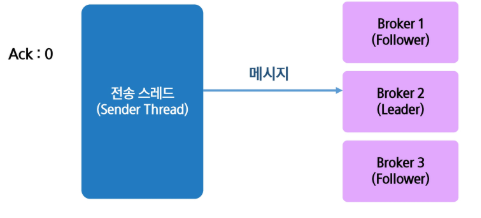
  
    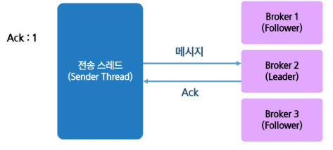

    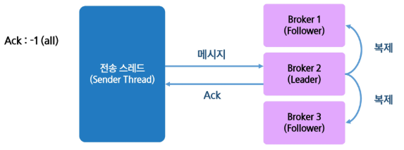

- Kafka Sender의 Acknowledge 옵션
  - min.insync.replica : 2
  - Ack == -1인 상태로 위 옵션을 적용하면 원하는 ISR 정확히 할 수 있음

- 멱등성 프로듀서(Idempotence Producer)
  - 멱등성 프로듀서 : 데이터가 중복해서 전송되지 않게 하는 프로듀서 설정, 현재는 활성화가 기본
  - 기존 프로듀서는 At-Least-Once 규칙에 따라 전달, 즉 브로커에 데이터가 중복저장 될 수 있음

    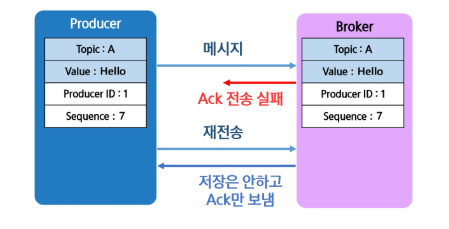

# 2. Kafka Consumer
### Kafka Consumer
- Kafka Consumer란?
  - 컨슈머(Consumer) : Kafka Topic의 데이터를 읽는 역할을 수행, 이를 구독(Subscribe)라고도 칭함
  - 배치하게 ETL 과정을 통해 적재, 혹은 실시간으로 데이터를 가져와 처리

    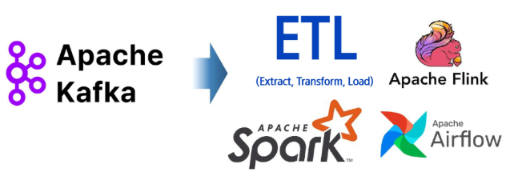
  
### Kafka Consumer 기본 용어
- Kafka Consumer 기본 용어
  - 컨슈머 랙(Consumer Lag) : 프로듀서가 넣은 최신 메시지의 Offset과 컨슈머가 읽고 있는 Offset의 차이
  - record-lag-max : 가장 높은 파티션의 랙

    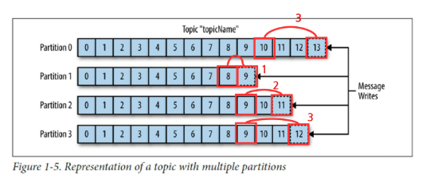

- Kafka Consumer 특징
  - Polling : 데이터를 브로커가 보내는 것이 아닌 컨슈머가 먼저 요청하는 구조
  - 멀티 컨슈밍 : 하나의 토픽을 여러 컨슈머가 같이 소비할 수 있음
  - 컨슈머 그룹(Consumer Group) : 특정 토픽에 대해 접근 권한을 가진 컨슈머의 집단

    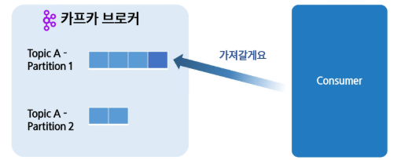

    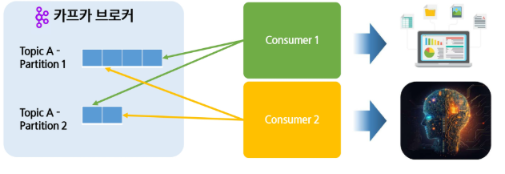

    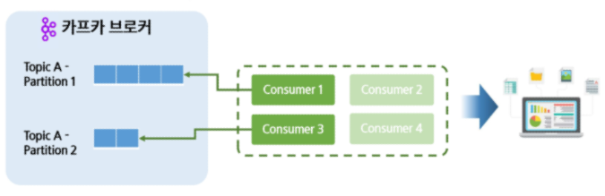

- Kafka Consumer 용어
  - 패치(fatch) : 컨슈머가 브로커로부터 레코드를 읽어오는 행위
  - 커밋(Commit) : 특정 offset까지 처리했다고 선언하는 행위

    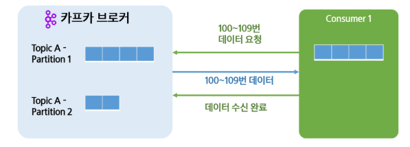

    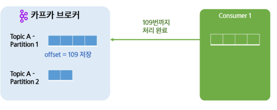

### Kafka Consumer의 Group Coordinator
- Kafka Consumer의 Group Coordinator
  - 코디네이터(Coordiantor) : Consumer 그룹을 관리하는 브로커, 컨슈머 그룹별로 지정됨
  - Heatbeat : 컨슈머 그룹들이 정상적으로 동작중인지 확인(Polling, Commit 때 마다)
  - 리밸런싱(Rebalancing) : 컨슈머 그룹의 변경이 있어 파티션을 다시 배정하는 것

    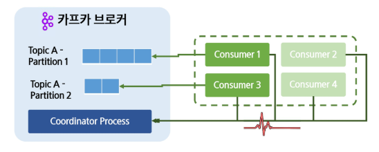

    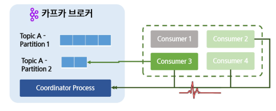

### Consumer Rebalance란?
- Consumer Rebalance 종류
  - 1. 새로운 Consumer 추가 -> 기존 파티션을 일부 재할당
  - 2. Consumer 제거 -> 남은 Consumer가 기존 Consumer의 파티션을 담당
  - 3. 파티션 개수 변경 -> 전체 Consumer에 대한 Rebalace 발생

- Consumer Rebalance의 과정
  - 1. 그룹 코디네이터가 모든 컨슈머들의 소유건을 박탈하고 일시정지 시킴
  - 2. JoinGroup 요청을 기다리고 가장 빠르게 답이 온 컨슈머를 리더로 선정
  - 3. 리더는 재조정한 결과를 코디네이터에게 알리고 컨슈머들에게 전달

    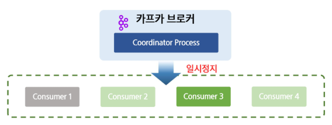

    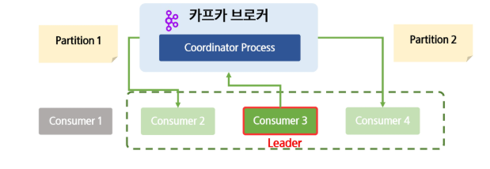

- Consumer Partitioning
  - 1. RangeAssignor : 토픽별로 순서대로 나누어줌(과거 기본값)
  - 2. RoundRobinAssignor: 모든 파티션을 보고 하나씩 고르게 나누어줌
  - 3. StickyAssignor : 이전 할당 정보를 활용하여 최대한 비슷하게(현재 기본값)

    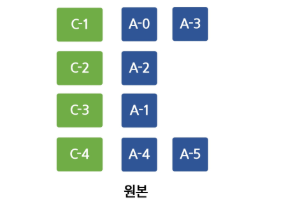

    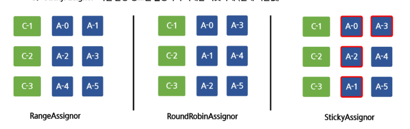

### Kafka Transaction
- 트랜잭션 프로듀서(Transaction Producer)
  - 프로듀서과 컨슈머가 연계해서 처리 EOS(Exactly Once Semantics)를 지키는 방법
  - 일정 단위의 메시지를 '커밋'으로 묶어 하나의 트랜잭션으로 설정
  - 일정 시간안에 트랜잭션이 커밋이 오지 않으면 트랜잭션 실패로 처음부터 다시 메시지를 받음

    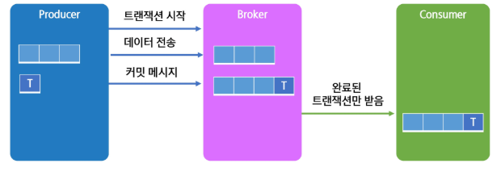

### Kafka에 메시지 전송하기
- 메시지 전송 기본 예제
  - kafka-python : 간단하게 카프카를 조작할 수 있는 python 프레임워크

    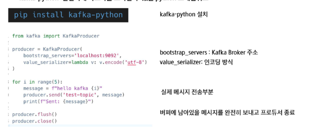

    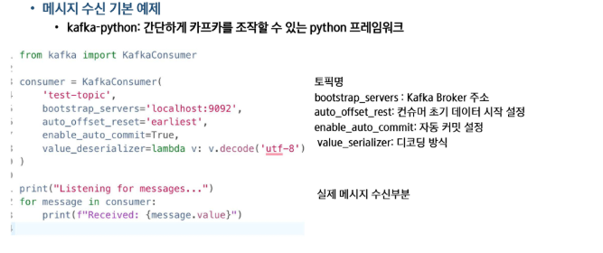

    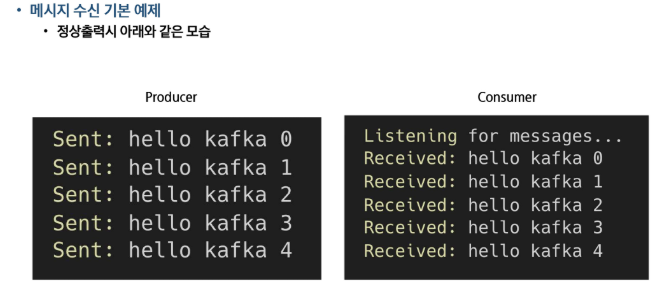

    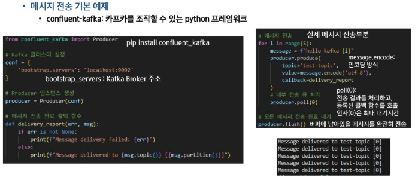

    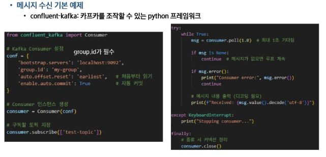

    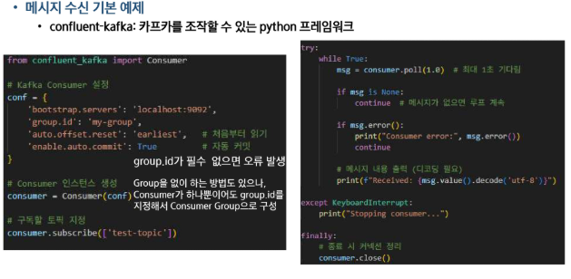

    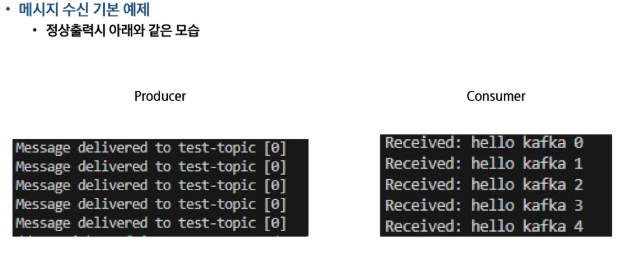