# 1. Kafka 성능 최적화
### Kafka의 성능 최적화가 필요한 이유
- Kafka의 성능 최적화가 필요한 이유
  - 대규모 트래픽 처리 : 데이터의 처리량(Throughput) 및 지연(Latency) 최적화
  - 안정성 개선 : 데이터 손실에 대한 안정성(Durability)를 높임
  - 리소스의 효율적 사용 : 제한된 리소스를 최대한 활용

    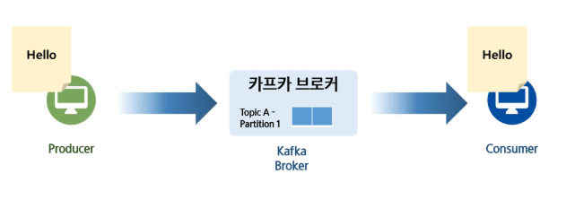

    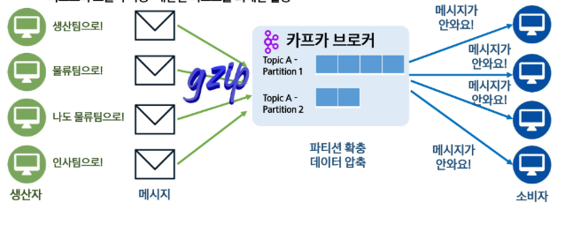

    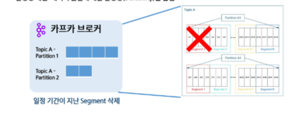

    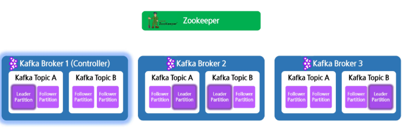

### Kafka 성능 최적화 주요 지표
- 성능 최적화 주요 지표
  - 프로듀서 컨슈머의 처리 속도
  - 브로커 및 주키퍼 설정
  - 스토리지, 네트워크 등 자원 최적화

    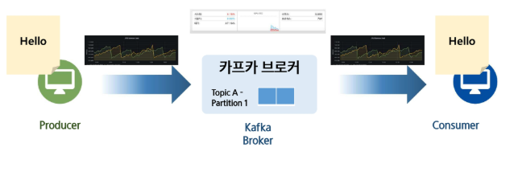

# 2. 프로듀서 및 컨슈머의 성능 튜닝
### Producer 성능 최적화
- 직렬화 방식 선정
  - 1. StringSerializer : 단순한 문자열 직렬화, 문자열을 UTF-8로 인코딩, 압축 효율 낮음

    

    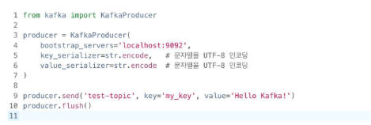

  - 2. ByteArraySerializer : 데이터를 그대로 바이트 배열로 직렬화, 다양한 형식 처리 가능, 빠른 변환 / 부족한 사용성

    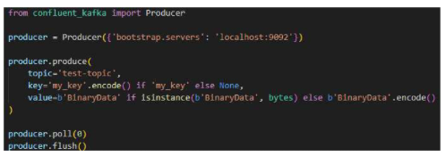

    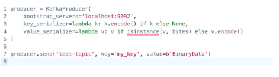

  - 3. JsonSerializer : JSON 형식으로 직렬화, 가독성 높지만 압축 효율 낮음

    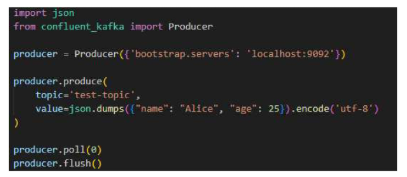

    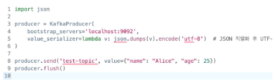

  - 4. AvroSerializer : Avro 포맷을 사용한 직렬화, 스키마 기반, 압축 효율이 좋고 빠름(Kafka 권장 방식)

    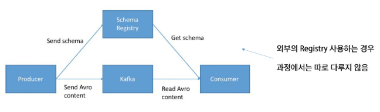

    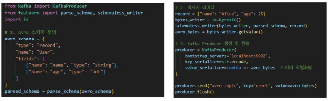

    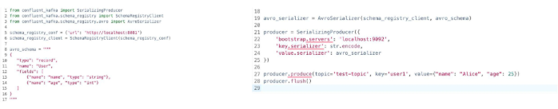
    
    
- 파티셔닝 방식 선정
  - 1. Key 기반 파티셔닝 : 해시기반, 같은 key를 가진 값들끼리 같은 파티션 배치

    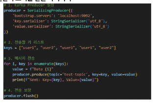

    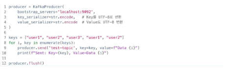

  - 2. 특정 파티션 지정 : 바이트 배열 그대로 전송

    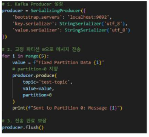

    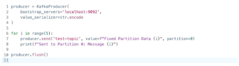

  - 3. StickyPartitioner : 정수 값을 바이너리 데이터로 변환, Batch를 최대한 활용하여 RoundRobin보다 효율적

    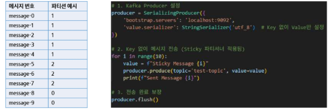

    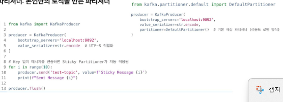

  - 4. 커스텀 파티셔너 : 본인만의 로직을 만든 파티셔너(confluent-kafka-python은 내부적으로 c라이브러리인 librdkafka를 감싸서 구현되어 있기 때문에 불가능)

    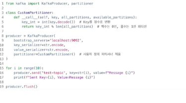

- Batching 설정 최적화
  - 1. buffer.memeory : 프로듀서 내부에서 저장할 수 있는 RA 버퍼의 최대 크기, 기본값 32 MB(Confluent-kafka에 없음)
  - 2. batch.size : 한 batch의 크기, 해당 크기가 다 차면 전송 준비, 기본값 16KB
  - 3. linger.ms : batch가 만들어지는 최대 대기 시간, 해당 시간이 지나면 다 안차도 전송 준비, 기본값 없음

    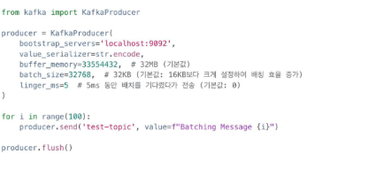

    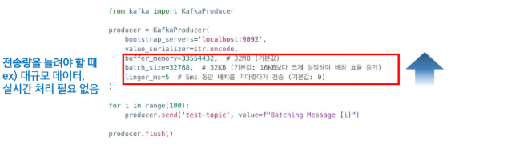

    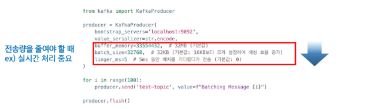

- Compression 방식 결정
  - 1. Gzip : 높은 압축률, 느린 처리속도, 높은 CPU 사용량 => 확실한 압축
  - 2. LZ4 : 적당한 압축률, 준수한 처리 속도, 중간 정도의 CPU 사용량 => 균형잡힌 압축과 CPU 사용
  - 3.  Snappy : 낮은 압축률, 빠른 처리속도, 낮은 CPU 사용량 => 빠른 압축과 CPU 절약

    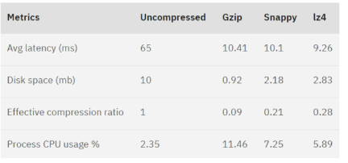

    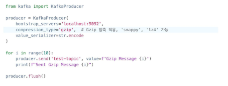

- Acknowledge 방식 결정
  - 1. acks = 0 : 프로듀서가 메시지를 보내고 확인하지 않음
  - 2. acks = 1 : 리더 브로커만 받으면 성공
  - 3. acks = all(-1) : 모든 복제본이 메시지를 수신할 때 까지 대기, 기본값

    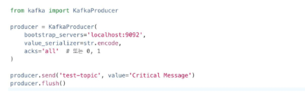
    
  - 4. min.insync.replicas : 복제본 중 실제로 응답해야하는 최소 개수, 기본값 1, 2 이상 설정 권장

    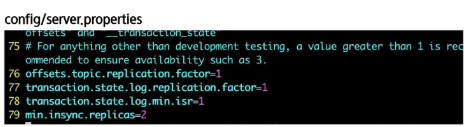
    
- Transaction
  - 1. kafka-python은 transaction 관리 기능이 없음, confluent_kafka는 존재
  - 2. Transaction이 너무 길지 않도록 관리 필요

    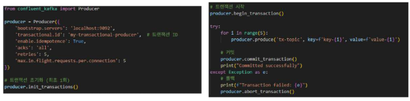

- Retry 관련 옵션 결정
  - 1. retries : 몇 번까지 재시도 할 것인지 설정, 기본값 INT_MAX
  - 2. max.in.flight.requests.per.connection : Ack을 받지 않고 보낼 수 있는 동시 요청 가능 수, 기본값 5
  - 3. enable.idempotence : 멱등성 프로듀서 설정, 즉 중복 전송에 대한 설정, 기본값 true

    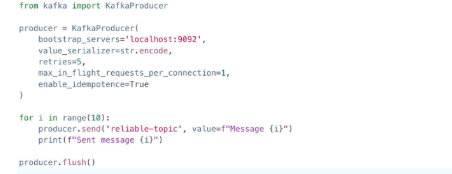

- Coordinator 설정 최적화
  - 1. heartbeat.interval.ms : hearbeat 간격, session.time.out의 1/3 수준이 적당, 기본값 3초
  - 2. session.time.out : heartbeat를 기다리는 시간, 이 이상이면 해당 컨슈머 제거 후 rebalancing, 기본값 10초
  - 3. max.poll.records : 컨슈머가  한번에 가져갈 수 있는 최대 데이터 수, 기본값 500
  - 4. max.poll.interval.ms : polling 호출 간격, 이 이상이면 컨슈머 제거 후 rebalancing, 기본값 5분

    

- Fetching 방식 선정
  - 1. fetch.min.byte : 가져올 최소 데이터 사이즈의 크기, 기본값 1 => Throughtput과 비례, Latency 반비례
  - 2. fetch.max.byte : 한 번에 받을 수 있는 최대 데이터 크기, 기본값 50MB => 클수록 대량 처리 가능
  - 3. fetch.max.wait.ms : 데이터가 모일 때까지 기다리는 최대 시간, 기본값 500ms
  - 4. amx.partition.fetch.bytes : 파티션 하나당 가져올 수 있는 최대 데이터, 기본값 1MB

    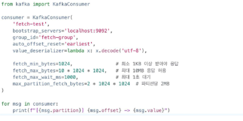

- Partitioning 관련 설정
  - 1. RangeAssignor : 토픽당 N개씩 연속된 파티션 분배(기본값)
  - 2. RoundRobinAssignor : 컨슈머 수에 맞게 순차 배분 => 균등 분배
  - 3. StickyPartitionAssignor : 기존 할당을 유지하면서 변경 최소화 => 리밸런싱이 잦을 때 파티션 유지 우선
  - 4. CooperativeSticyAssignor : Sticky를 기본으로 하지만 일부 컨슈머 변경시에도 나머지 작동 => zero-Downtime 리밸런신

    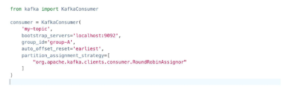

    

- Commit 관련 설정
  - 1. enable.auto.commit : 주기적으로 offset을 커밋, 기본값 true
  - 2. auto.commit.interval.ms : 주기적으로 offset을 커밋하는 간격, 기본값 5초

    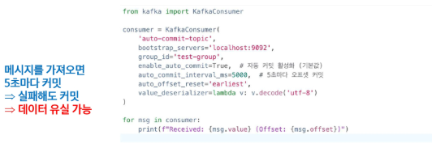

    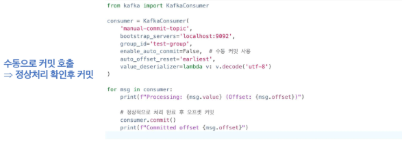

- 수동 Commit 전략
  - 1. Batch 단위 처리 : 프로듀서의 Batch 처럼 일정 데이터가 모이면 처리, 대용량 데이터 적합
  - 2. 주기 처리 : 일정 시간 주기마다 처리, 시간기반 데이터 적합(예: 실시간 로그)
  - 3. 정상처리 후 커밋 : 메시지 별로 정상 처리를 확인 후 Commit, 안전하지만 높은 부하(예 : 금융 시스템)
  - 4. 1+N Hybrid : N개를 처리 후 마지막 메시지만 Commit, 안정성과 효율의 중간, Kafka 권장

    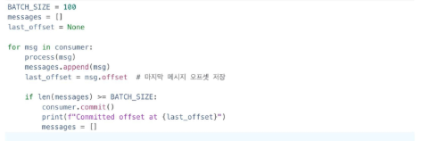

- auto.offset.reset 설정값
  - earliest : 가장 초기의 offset값을 설정 => 처음부터 다시 시작해야할 때
  - latest : 가장 마지막의 offset 값으로 설정 => 실시간 데이터 소비
  - none : 이전 offset 값을 찾지 못하면 error 발생

    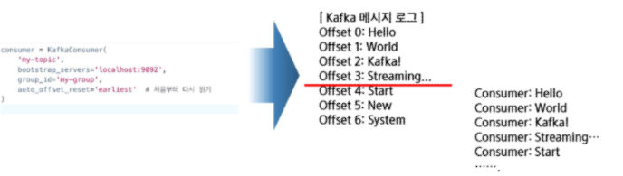

    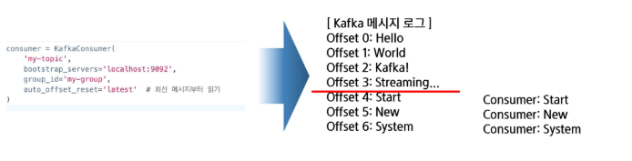

# 3. 주요 설정 파라미터 이해
### Topic 및 Replica 관련 설정
- Topic 및 Replica 관련 설정
  - num.partitions : 파티션 수 조정, 기본값 1(기본값으로 거의 안씀), 한번 설정 후 줄일 수는 없음
  - replicatioin.factor : 파티션별 replica 수
  - min.sync.replicas : 정상 동작해야하는 최소 replica의 수

    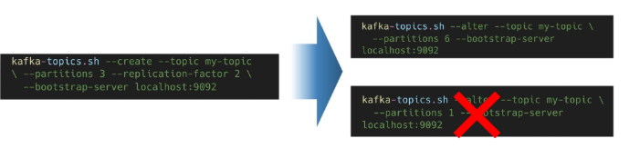

    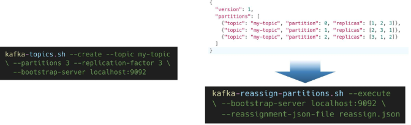

### 네트워크 및 메모리 설정 최적화
- 네트워크 및 메모리 설정 최적화
  - socket.send/receive.buffer.bytes : 네트워크 버퍼 크기, 기본값 100KB, 0 설정 시 자동조정(추천)
  - log.flush.interval.messages/ms : 로그 플러쉬 주기 조절, 기본값 Long.MAX_VALUE
  - message.max.byte:브로커가 수용하는 메시지 최대 크기, 기본값 1MB, 10MB이상 넘기지 않는 것 추천
  - num.network.threads : 네트워크 요청 처리 스레드 수, 기본값 3, CPU 코어수와 비슷하게 설정

    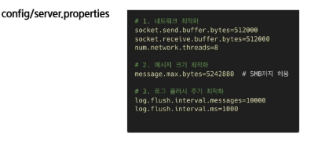

### 브로커 리소스 최적화
- 기타 브로커 리소스 설정값
  - KAFKA_HEAP_OPTS : 카프카가 사용할 JVM 힙 메모리 크기, 기본값 1GB,  4~8GB 추천
  - num.io.threads : Disk I/O 스레드 수, 기본값 8, CPU코어에 맞춰서 높이기
  - replica.fetch.min.bytes: 팔로워가 리더로부터 받는 데이터크기, 기본값 1Byte, 1MB 정도 추천

    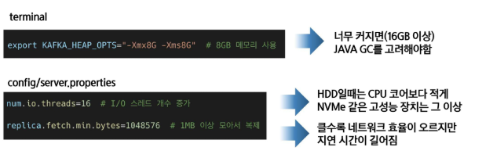

### Zookeeper 관련 설정
- Zookeeper 관련 설정 최적화 값
  - maxClientCnxns : 주키퍼 최대 연결 수, 기본값 60, 브로커 1개당 20정도 필요
  - syncLimit : 리더-팔로워 최대 지연 시간, 기본값 10초
  - autopurge.snapRetainCount : 저장하고 있는 스냅샷 수, 기본값 3
  - autopurge.purgeInterval : 저장하고 있는 로그 삭제 주기, 기본값 24시간

    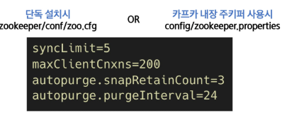

# 4. Kafka 데이터의 저장
### Log 저장 방식 최적화
- Segment 저장 관련 설정값
  - log.retention.ms : 로그 보관 시간, 기본값 7일, 장기 보관 시 별도의 저장장치로 백업 추천
  - log. segment.bytes : 세그먼트 크기 설정, 기본값 1GB
  - log.cleanup.policy : 오래된 데이터를 삭제할 지 압축할지 결정, 기본값은 'delete', 동시에 설정도 가능
  - log.cleaner.enable : 데이터를 정리할 때 키 별로 최신 로그를 남길지 여부, 기본값 False

    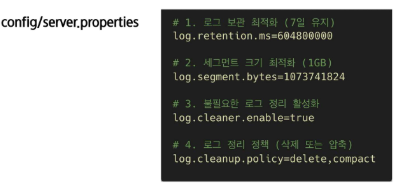

- Segment 압축하기
  - 앞서 나왔던 메시지의 압축과는 다름
  - 동일한 key 값의 최신 데이터만 남게 하는 것이 목표

    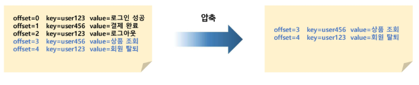

    

