# 1. Kafka 모니터링의 필요성 및 주요 지표
### Kafka 모니터링이란?
- 모니터링의 정의 및 기본 구조
  - 모니터링 : 시스템의 상태, 성능, 이상징후를 감시 분석하는 시스템
  - 테이터 수집 -> 시각화 및 분석 -> 알림 및 대응 단계로 이루어짐

### Kafka 모니터링이 필요한 이유
- 모니터링이 필요한 이유
  - 장애 발생 예방 : 데이터의 흐름 및 자원 과부화 상황을 파악하여 문제가 될 부분을 사전에 감지
  - 장애 발생 감지 : 시스템 이상 징후를 빠르게 파악하고 알림
  - 성능 최적화 : 메시지 지연시간, 메시지 처리율 등 직접적인 성능 문제 파악
  - 문제 해결 : 데이터들을 축적하고 분석하여 문제 해결책 도출

    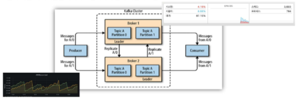

    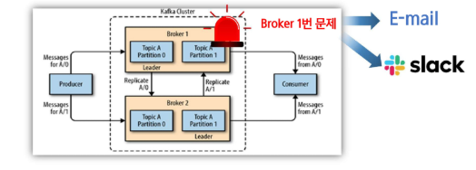

    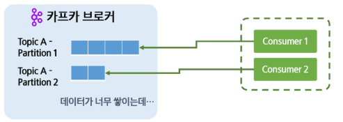

    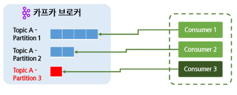

### Kafka 모니터링 주요 지표
- 프로듀서(Producer) 성능 지표
  - 초당 메시지 전송량 (Records send rate) : 프로듀서가 초당 전송하는 메시지 개수
  - 요청 지연 시간 (Request Latency) : 프로듀서가 브로커로 메시지를 전송할 때 걸리는 응답 시간
  - 재전송 횟수(Retries) : 프로듀서가 메시지를 재전송하는 횟수

    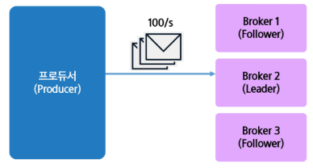

    

    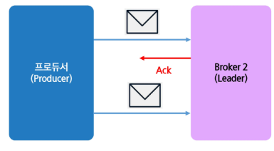

- 컨슈머(Consumer) 성능 지표
  - 컨슈머 랙(Consumer Lag) : 브로커와 컨슈머의 offset 차이, 즉 브로커에서 가져와야 할 메시지의 개수로
  - 메시지 처리량(Consumed Messages per second) : 컨슈머가 초당 처리하는 메시지 개수
  - 메시지 지연 시간(Fetch Latency) : 컨슈머가 메시지를 가져오는 데 걸리는 시간
  - 커밋 빈도(Commit Rate) : 컨슈머가 오프셋을 얼마나 자주 커밋하는지

    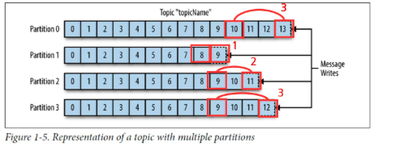

    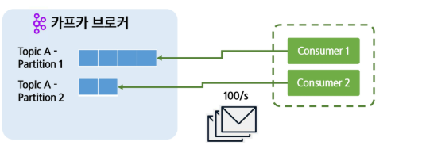

    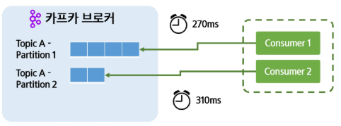

    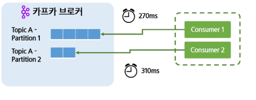

- 브로커(Broker) 성능 지표
  - 초당 처리량(Throughput, MB/s) : Kafka 브로커가 초당 처리하는 데이터의 양
  - 리소스 사용량(CPU, Memory, Disk, Network Usage) : 브로커 노드의 CPU, 메모리, 디스크, 네트워크 사용률
  - 요청 처리 시간(Request Time) : Request가 브로커에서 처리되는 시간

    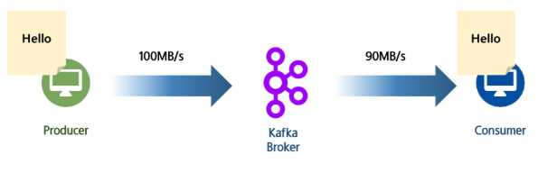

    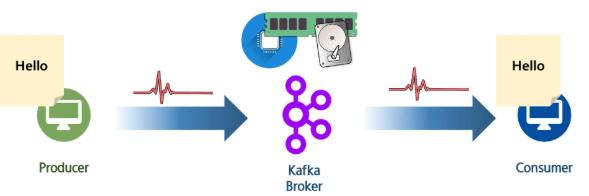

    

- 파티션(Partition) 성능 지표
  - 레플리케이션 간 랙(Partition Replication Lag) : 팔로워와 리더간 동기화 정도, ISR 관리 척도
  - 파티션 균등분포(Topic Partition Distribution) : 특정 토픽의 브로커 간 파티션 분포 상태
  - 리더수(Leader Count) : 브로커가 담당하는 리더의 수

    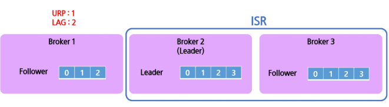

    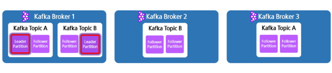

    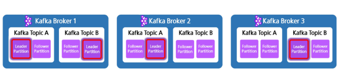

# 2. Kafka 모니터링 툴
### Kafka 모니터링 방법
- Kafka의 모니터링 방법
  - 기본 스크립트 : --describe, --list 같은 옵션을 통해 기본적인 정보를 얻을 수 있음
  - JMX(Java Management eXtention) : 자바에서 제공하는 모니터링 표준 인터페이스, Kafka도 있음
  - 외부 모니터링 툴 : 다양한 기능과 편리한 시각화, JMX의 데이터를 활용하는 경우도 있음

- Kafka Burrow
  - Linked in 에서 제작한 모니터링 도구
  - 컨슈머 랙의 정보를 집중적으로 제공하는 전문 모니터링 도구

    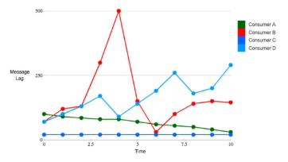

- Confluent Control Center
  - Kafka를 관리하는 Confluent에서 직접 제공한 모니터링 도구
  - Kafka를 직접 관리 조작도 가능하며 JMX와 연동해서 작동됨
  - 유료 버전을 써야 온전히 기능을 사용할 수 있음

    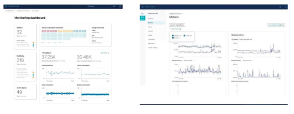

- Datadog
  - 클라우드 기반 환경에 최적화된 모니터링 도구
  - 시각화와 모니터링 범위가 넓고 장애 감지 및 알림 기능이 잘 되어있음
  - 유료이며 SaaS 플랫폼에서 분석하기 때문에 데이터 반출 문제가 있음

    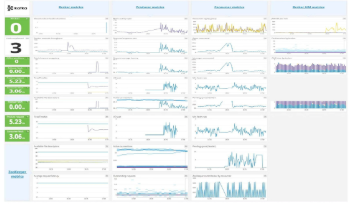

- Prometheus + Grafana
  - Prometheus : 시계열 데이터를 수집 관리할 수 있는 도구 데이터베이스
  - Grafana : 시계열 데이터를 시각화 해주는 오픈소스 도구
  - 무료지만 유연하게 기능 추가가 가능함, JMX나 Kafka Exporter 같은 데이터 소스가 필요함

    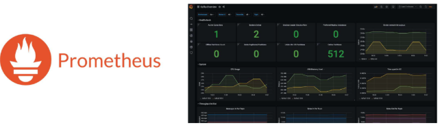
  
    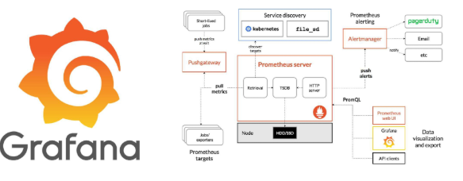

    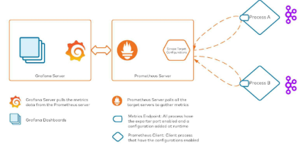

# 3. Kafka 모니터링 환경 구성
### Kafka 기본 스크립트 사용해보기
- Kafka 기본 스크립트
  - 카프카의 스크립트들은 --list, --describe 옵션을 통해 기본적인 정보들을 제공함
  - .../kafka/logs/... 처럼 카프카가 설치된 폴더 안에 로그들이 저장되어 있음

    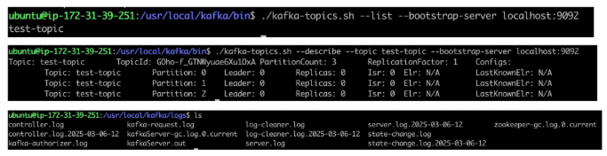

- Kafka JMX 설치하기
  - JMX는 추가적인 설치가 필요 없이 바로 사용할 수 있음
  - 하지만 비활성화 되어이쓴ㄴ 포트를 활성화 시켜야함

  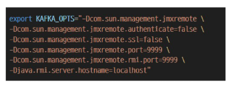

- Kafka JMXTerm 설치하기
  - JMXTerm : JMX의 데이터를 CLI를 통해 접근하게 해주는 모니터링 툴
  - 별도의 설치 및 실행이 필요

  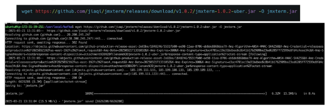

  

- Kafka JMXTerm 사용해보기
  - bean : 자신이 확인하고 싶은 Mbean(로직) 등록, 아래 예시는 사용중인 JVM 메모리를 보여줌
  - get : Mbean에서 원하는 값을 출력, 여기서는 Heap 메모리 사용량을 선택

    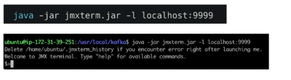

### Kafka Grafana + Prometheus
- Kafka Prometheus 설치하기
  - Prometheus 설치 후 압축 풀고 실행하기

    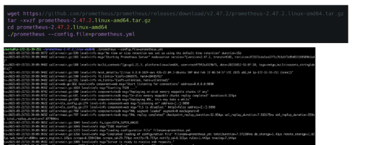

- Kafka JMX Prometheus 연동하기
  - JMX Exporter : JMX의 데이터를 Prometheus가 읽기 쉽게 변환
  - HTTP 형태를 읽을 수 있게 변환해줌

    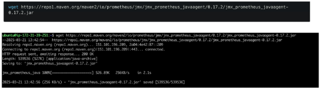

    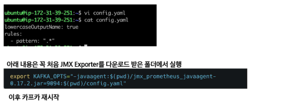

    

- Kafka Grafana 설치하기
  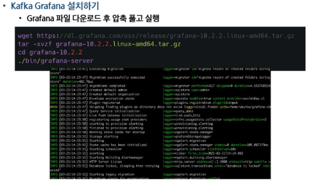

### Kafka 모니터링 환경 Docker Compose로 구축도 가능

  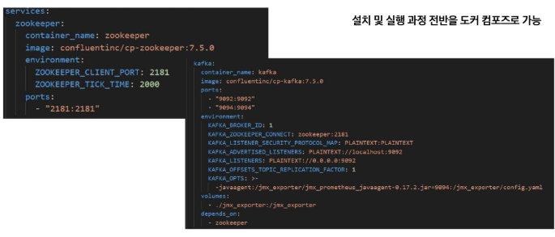

  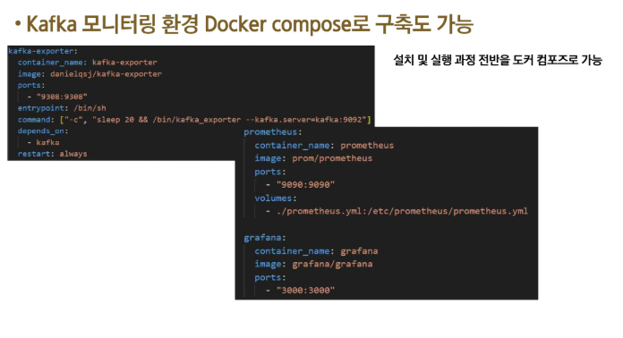

### Kafka Grafana + Prometheus
- Kafka JMX 및 Kafka의 Prometheus 접속하기
  - 정상적으로 설치 동작 되었다면 http:localhost:9090 접속
  - 쿼리에 up을 입력하고 보면 아래와 같은 내용이 출력

    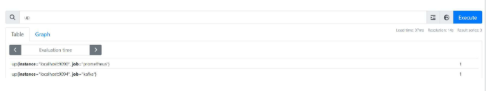

  - 세부내용 파악

    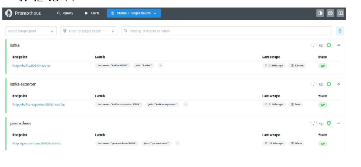
  
- Kafka Grafana에 Promethues 연동하기
  - 정상 세팅 시 http://localhost:3000 으로 접속하면 아래와 같은 화면이 뜸
  - 기본 계정(admin/admin)

    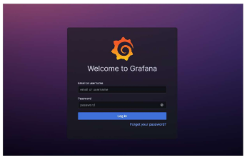
  
  - Datasource 추가 선택

    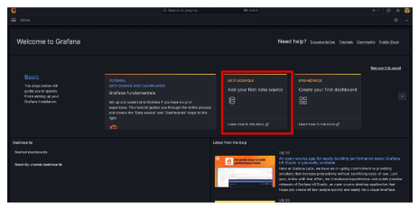

  - Datasource 중 Prometheus 선택

    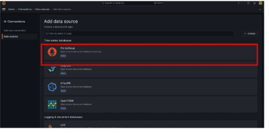

    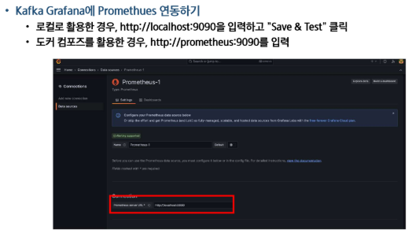

    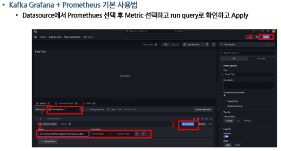

    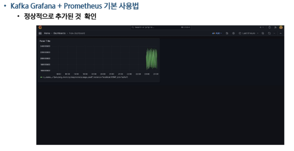

    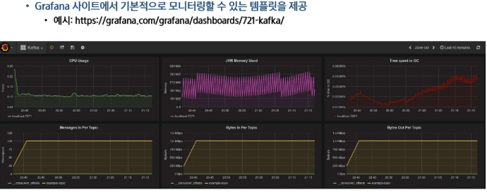

    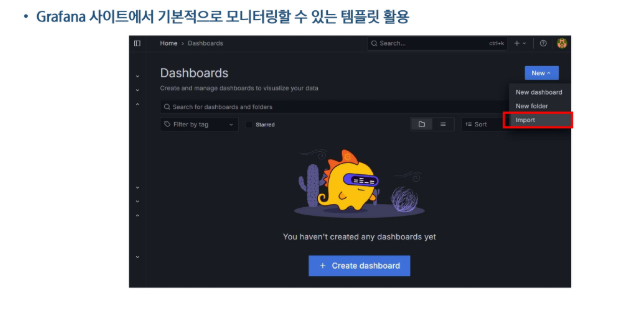

    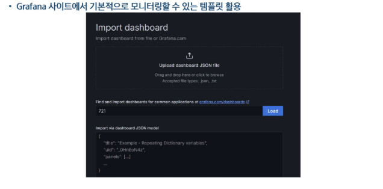

    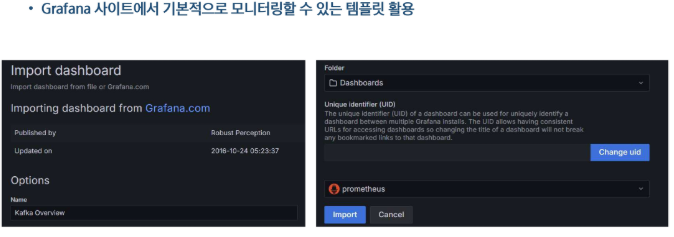

    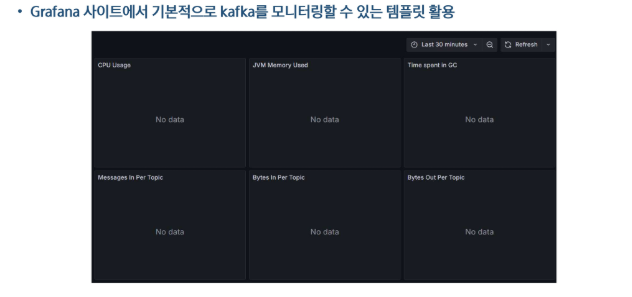

    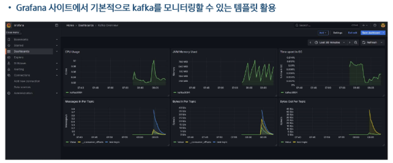