# 1. Flink 개요
### Flink 등장 배경
- 데이터 파이프라인 : 배치 방식(Batch Processing)
  - 많은 기업들이 오랫동안 주로 ETL 또는 ELT 방식의 배치 데이터 파이프라인을 사용
- 배치 데이터 파이프라인의 장점
  - 구현 및 운영이 용이
  - 안정적이고 일관된 데이터 처리
  - 대규모 데이터 처리에 적합
- 배치 데이터 파이프라인의 한계점
  - 실시간 대응 불가능
  - 지연된 데이터 품질 확인
  - 변경 관리의 복잡성

- 기존 배치 처리 시스템의 한계
  - 높은 지연 시간 : 배치 처리는 데이터를 모아서 한 번에 처리
  - 유연성 부족 : 배치 워크플로우를 조정의 어려움
  - 오류 처리의 복잡성 : 배치 처리 중 오류가 발생하면 전체 배치에 영향을 미침
  - 리소스 관리 문제 : 데이터 양이 증가함에 따라 배치 크기와 처리 시간도 늘어남
  - 데이터 품질 관리 : 데이터 검증, 정제, 변환 과정이 필요하여 배치 처리 워크플로우의 복잡성 증가

    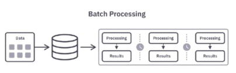

- 실시간 분석을 지원하기 위한 새로운 기술 필요
  - 높은 지연 시간 -> 실시간 스트림 처리, 이벤트 시간 기반 처리
  - 유연성 부족 -> 배치와 스트림 데이터를 동일 API로 통합 처리
  - 오류 처리의 복잡성 -> 체크포인트 기반 장애 허용, 상태 기반 연산
  - 리소스 관리 문제 -> 파이프라인 병렬 처리
  - 데이터 품질 관리 -> 윈도우 기반 검증, 스트리밍 ETL(예시:Kafka -> Flink -> Elasticsearch)

### 배치 처리 vs 스트림 처리
- 배치처리 : 특정 시간 범위 내에서 대량의 데이터를 일괄 처리

  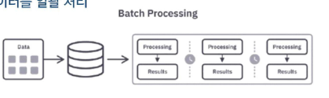

- 스트림 처리 : 데이터가 생성되는 즉시 처리
  
  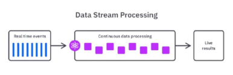

### Flink 등장 배경
- 실시간 데이터 처리 기술의 발전
  - 2010년, 실시간 데이터 처리를 위해 Complex Event Processing(CEP) 기술 개발
  - 트위터의 Storm, Yahoo의 S4 같은 분산 스트림 병렬 처리 시스템이 개발된
  - Google의 MapReduce와 Hadoop 프레임워크는 대용량 데이터 배치 처리와 실시간 처리를 모두 지원하며 빅데이터 기술 발전을 가속화 시킴

    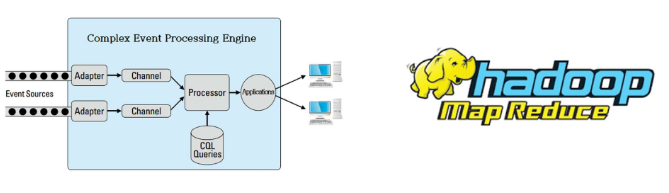

- 실제 스트리밍 데이터 파이프라인의 구조
  - 데이터 소스에서 발생하는 실시간 이벤트를 kafka와 같은 플랫폼을 통해 Flink로 전달
  - Flink에서 데이터를 필터링하고 중복 제거, 유효성 검사, 데이터 결합 및 집계를 수행
  - 최종적으로 정제된 데이터는 분석 시스템(OLAP)이나 머신러닝 모델, 모니터링 시스템, OLTP로의 전송(운영 DB) 등으로 전달

### Spark vs Flink 비교

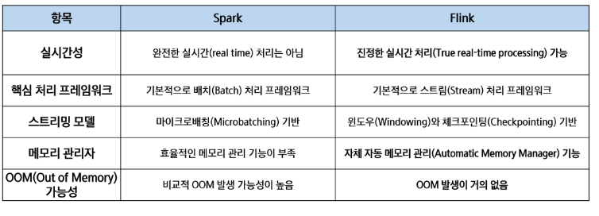

### Spark vs Flink, Yahoo's Benchmark

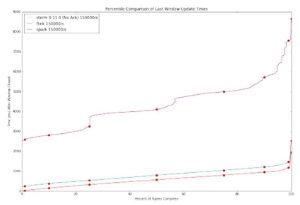

- 벤치마크 설정
  - 캠페인 수 : 100 개
  - 캠페인 당 광고(ads) 수 : 10개
  - 데이터 스트림 생성 : Kafka 사용
  - 데이터 전송 속도 : 초당 50k ~ 170k(50k/s ~ 170k/s)

- 결과
  - Flink 지연 시간(약 40초)
  - Spark 지연 시간(백프레셔 미적용 시, 70초)
  - Spark 지연 시간(백프레셔 적용 시, 120초)

  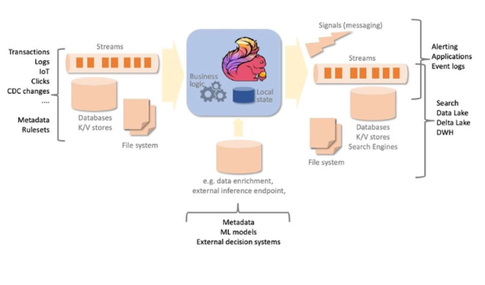

### Flink 특징
- 분산 스트림 처리 엔진
  - Flink 클러스터 환경에서 분산 방식으로 데이터를 처리
  - 데이터 흐름을 스트림(stream) 형태로 다루며, 각 데이터를 이벤트 단위로 지속적으로 처리
  - 병렬성과 확장성이 뛰어나기 때문에 대규모 데이터에 적합
- 무한한 스트림 데이터를 실시간으로 처리
  - 정해진 배치(batch) 처리와 달리, Flink는 무한한 데이터 흐름을 실시간(real-time)으로 처리
  - Kafka 등과 연동하여 데이터가 발생하는 즉시 처리 가능하며, 지연 시간이 매우 낮음(low-latency)
- 무한 스트림(Unbounded Streams)
  - 시작점은 있지만 끝이 정의되지 않은 스트림
  - 데이터를 계속해서 실시간으로 처리해야하며, 데이터를 모두 수집한 후 처리하는 것은 불가능
- 유한 스트림(Bounded Streams)
  - 이벤트의 순서가 중요하지 않음(유한한 데이터셋은 항상 정렬할 수 있으므로)
  - 이런 유한 스트림 처리 방식은 배치 처리(Batch Processing) 라고도 부륾

    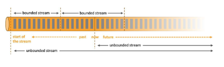

### Flink Architecture

  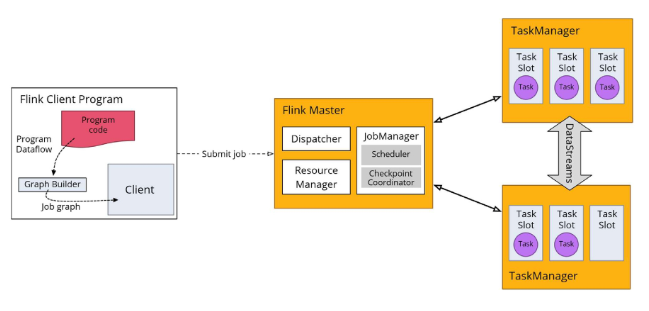

- Flink 실행 흐름
  - Program(프로그램 작성)
    - 클라이언트 시스템이 실행을 위해 제출하는, 사용자가 개발한 애플리케이션 프로그램
  - Parse and Optimize(파싱 및 최적화) 
    - 이 단계에서는 코드를 파싱하여 문법 오류를 확인하고, 타입 추출(Type Extractor), 최적화 작업을 수행
  - DataFlow Graph(데이터 플로우 그래프 변환)
    - 애플리케이션 작업이 데이터 플로우 그래프로 변환되어 이후 실행 단계에서 사용할 수 있도록 준비
  - Job Manager(잡 매니저 처리)
    - 이 단계에서 Flink의 Job Manager 데몬이 태스크를 스케줄링하고, Task Manager에게 실행을 위임하고, 중간 처리 결과를 모니터링하는 역할도 수행
  - Task Manager(태스크 매니저 처리)
    - 이 단계에서 Task Manager는 Job Manager가 할당한 작업을 실제로 실행

- 시퀀스 흐름
  - 하나의 Task Slot에서 여러 개의 연산자(Source, map 등)를 개발자가 CLI 등을 통해 Flink 애플리케이션 제출
  - JobManager가 JobGraph -> Task Execution Graph 변환 및 병렬화
  - Resource Manager가 Task Slot을 할당
  - TaskManager가 Task Slot에서 병렬로 데이터 스트림 처리 수행

    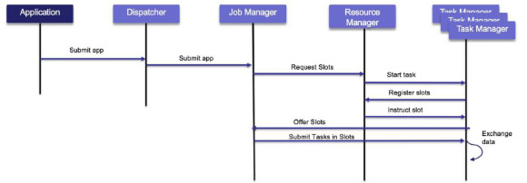

### Flink Architecture - Flink Program
- 데이터 소스 정의 및 데이터 변환
- 데이터 싱크 정의
- DataFlow Graph 생성
- 실행 계획 최적화
- JobManager에 실행 계획 전달

  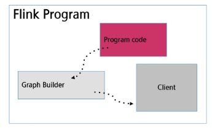

### Flink Architecture - Flink Master
- 작업 계획 및 스케줄링
- 리소스 관리
- 장애 복구
- 통신 및 조정
- 웹 인터페이스 제공

  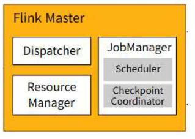

### Flink Architecture - TaskManager
- 태스크 실행
- 리소스 할당 및 관리
- 데이터 버퍼링 및 전송
- 메모리 관리
- 하트비트 및 상태 모니터링

  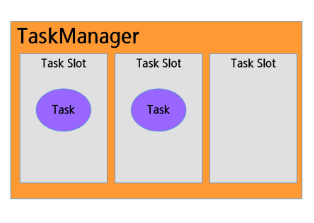

### Flink Archtecture
- 각 슬롯에 메모리 할당(1/n)
  - Task는 TaskManager 내 Task Slot에서 병렬 실행
  - 하나의 Task Slot에서 여러 개의 연산자(Source, map 등)를 실행할 수 있음

    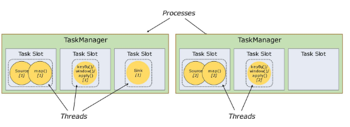

- 작업 슬롯 공유
  - 리소스를 완전히 활용 가능
  - 하위 작업이 TaskManager에 공정하게 분배

    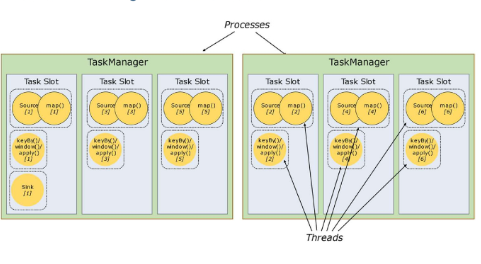

### Flink 장점
- 실시간 처리
  - 매우 낮은 지연시간과 높은 처리량을 제공하여 초당 수백만 개의 이벤트를 처리
- 정확한 결과 보장(Exactly-once)
  - 체크포인트와 세이브포인트 기능을 통해 데이터 중복이나 손실 없이 정확히 한 번만 처리
- 상태 관리(Stateful Processing)
  - 복잡한 이벤트 집계, 윈도우 연산, 패턴 인식을 위해 내부 상태를 효율적으로 관리
- 확장성 및 분산 처리
  - 클러스터 내 다수의 노드와 태스크 슬롯을 통해 애플리케이션을 수평적으로 확장 가능

- 유연한 API 제공
  - SQL/Table API : Flink 애플리케이션 작성 시 Bounded 및 Unbounded Streams 모두에서 사용 가능한 선언적 고수준 API
  - DataStream API : Flink 애플리케이션 작성 시 UnBounded Streams에서 사용되는 고수준 API
  - DataSet API : Flink 애플리케이션 작성 시 Bounded Streams에서 사용되는 더 낮은 수준의 API

### Flink 사례 : Netflix
- 데이터를 빠르게 처리하고 분석하기 위해 Apache Flink를 사용하여 스트림 데이터를 실시간으로 처리
- 데이터 처리 과정에서 발생할 수 있는 장애 상황에 대비하여, Flink의 체크포인팅(checkpointing) 및 백프레셔(backpressure) 관리 기능을 적극 활용

  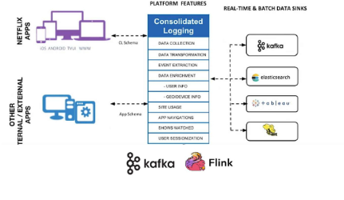

### Flink 사례 : SmartThings
- 데이터 플랫폼은 실시간으로 데이터를 처리하는 것이 중요
- Apache Spark의 마이크로 비트 처리보다 Apache Flink의 실시간 데이터 처리 모델이 더 적합
- 서버리스, 완전 관리형 솔루션 등을 제공하여 독립적 작동, 주기적 저장 지점 생성 가능

  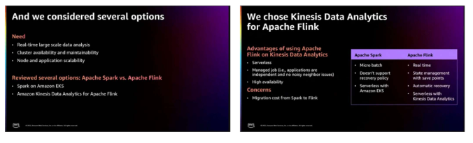

### Flink 코드 구조
- DataStream API 기준
  - 실행 환경 생성
  - 데이터 소스 정의
  - 데이터 변환 적용
  - 데이터 싱크 설정
  - 작업 실행 env.execute()

- 실행 환경 생성
  - Flink 작업을 구성하고 실행하는 중심 객체
  - 데이터 소스, 변환, 싱크 등을 생성하는 메서드를 제공

    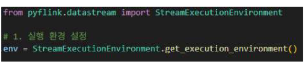

- 데이터 소스 정의
  - 외부 데이터를 PyFlink 내부로 불러오는 역할(파일, 소켓, 컬렉션 등)

    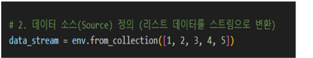

- 데이터 변환(Transformation) 적용
  - 입력 데이터를 원하는 형태로 가공(예: 매핑, 필터링, 집계 등)

    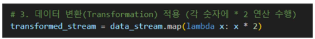

- 데이터 싱크 설정
  - 처리된 데이터를 외부 시스템으로 출력(콘솔, 파일, 데이터베이스 등)

    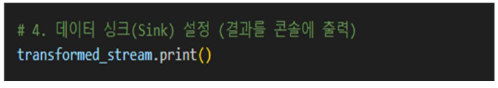

- 작업 실행 env.execute()
  - 지금까지 구성한 소스, 변환, 싱크를 기반으로 실행

    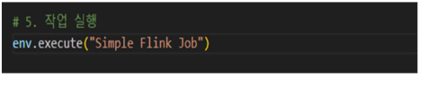

# 2. Flink 설치 및 실행 환경설정
### Apache Flink 설치

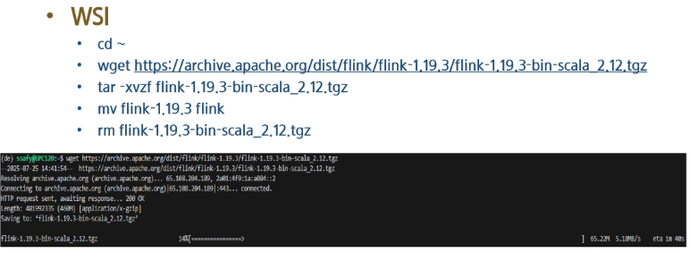

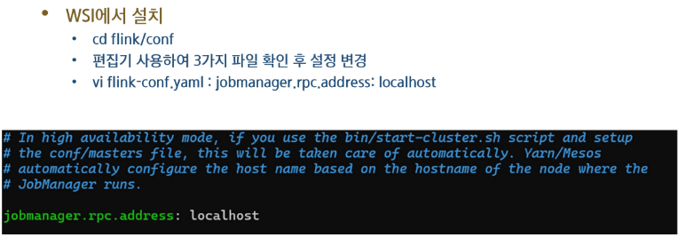

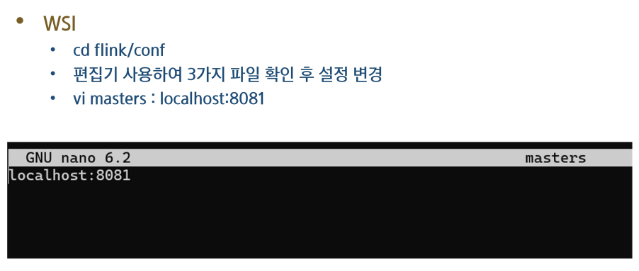

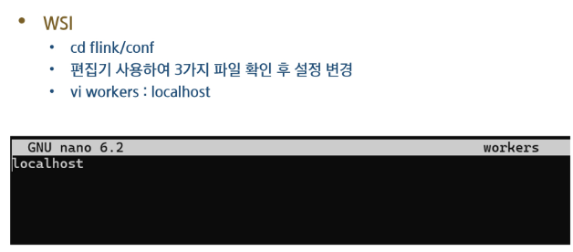

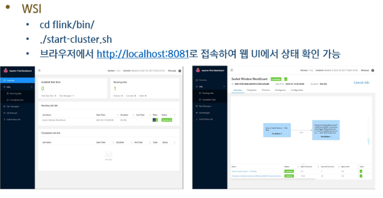

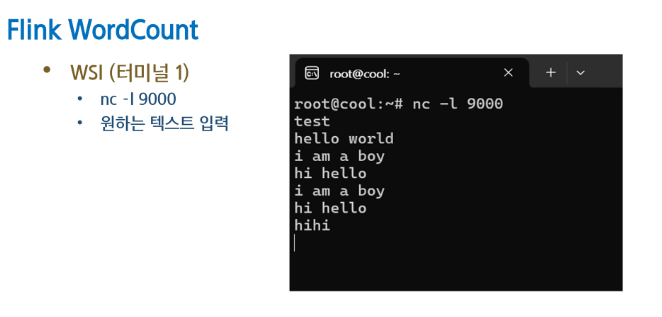

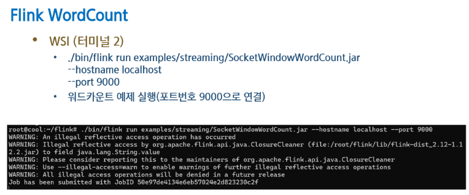

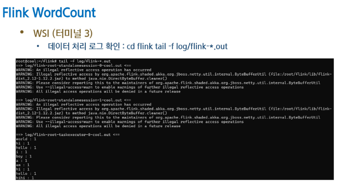

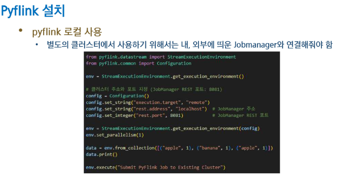

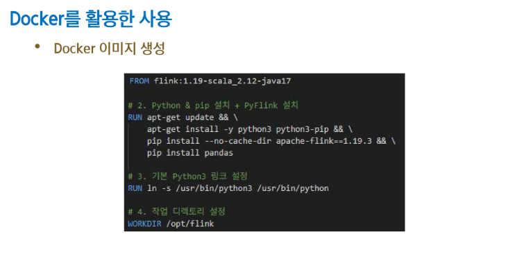

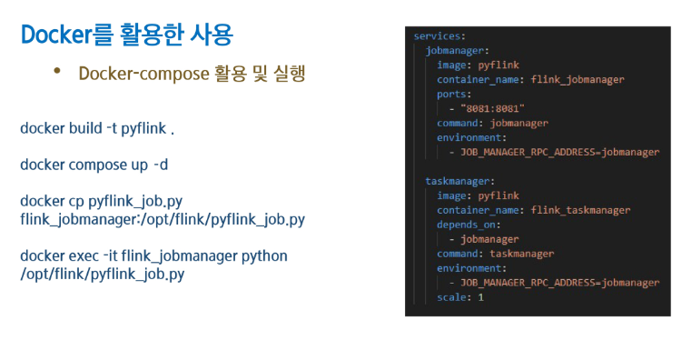

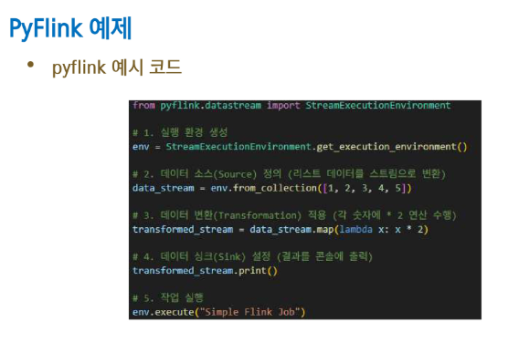

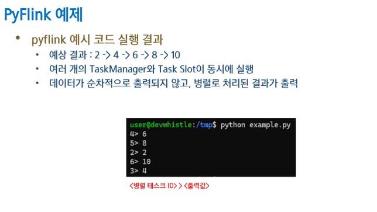

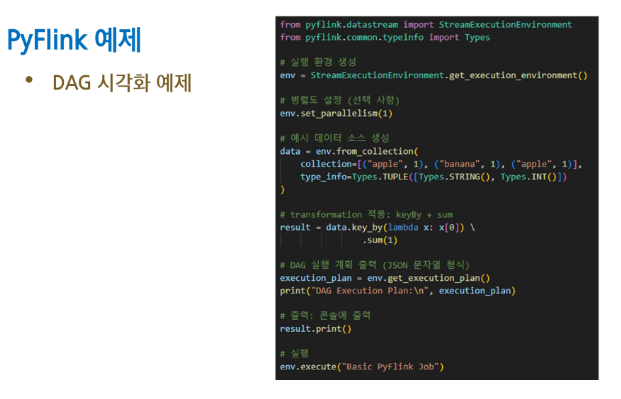

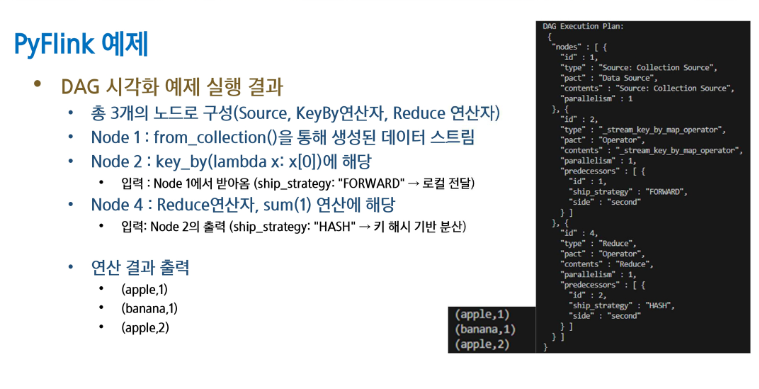

