# 02-pjt

## 팀원
송영석
소재헌
김은수

## 역할분담
송영석 : 데이터 처리, 모델링 및 관계 설정(F01), 전체 영화 목록 조회 api (F03)

소재헌 : urls 경로 생성, 단일 영화 상세 정보 조회 api (F04), 특정 영화에 대한 리뷰 생성 api (F07), 로그인/회원가입/인증/권한 구현

김은수 : 전체 장르 목록 조회 api (F02), 전체 리뷰 목록 조회 api (F05), 단일 리뷰 조회/수정/삭제 api (F06)

## 실행결과
### Django 
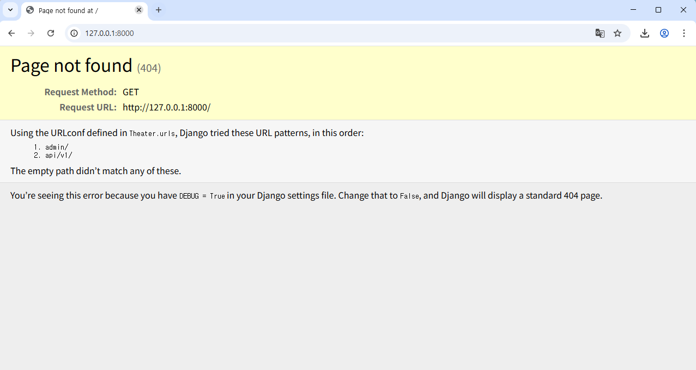

### F01: 모델링 및 관계 설정
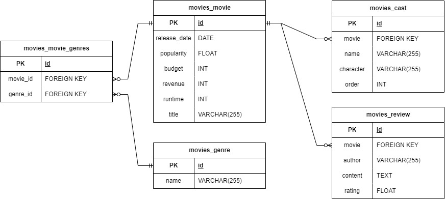
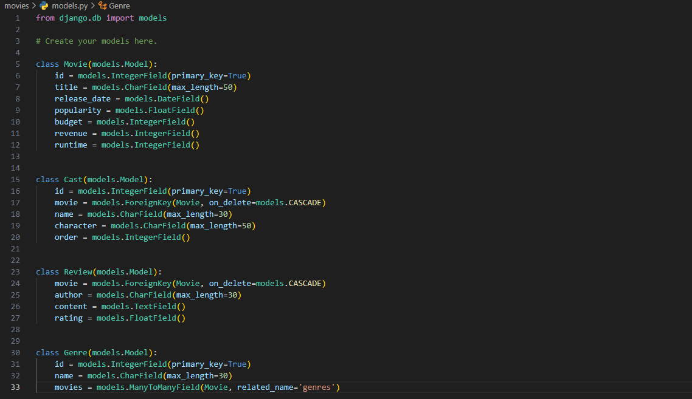

### F02: 전체 장르 목록 조회
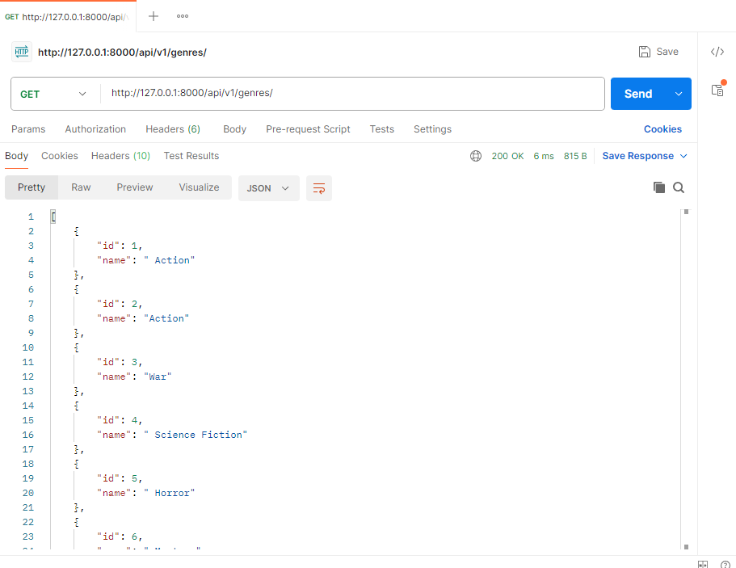

### F03: 전체 영화 목록 조회
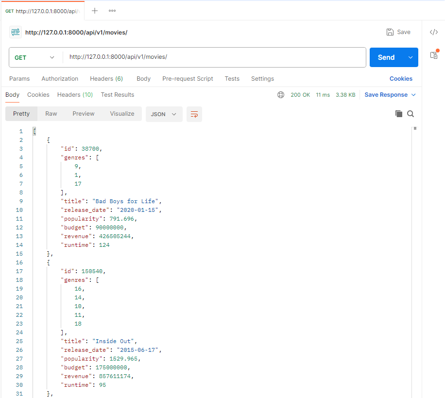

### F04: 단일 영화 상세 정보 조회
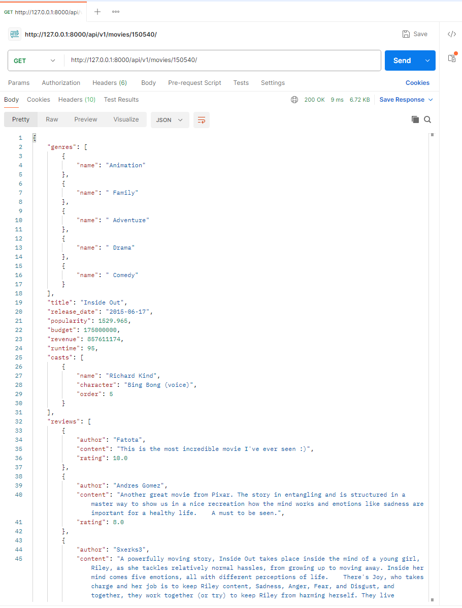

### F05: 전체 리뷰 목록 조회
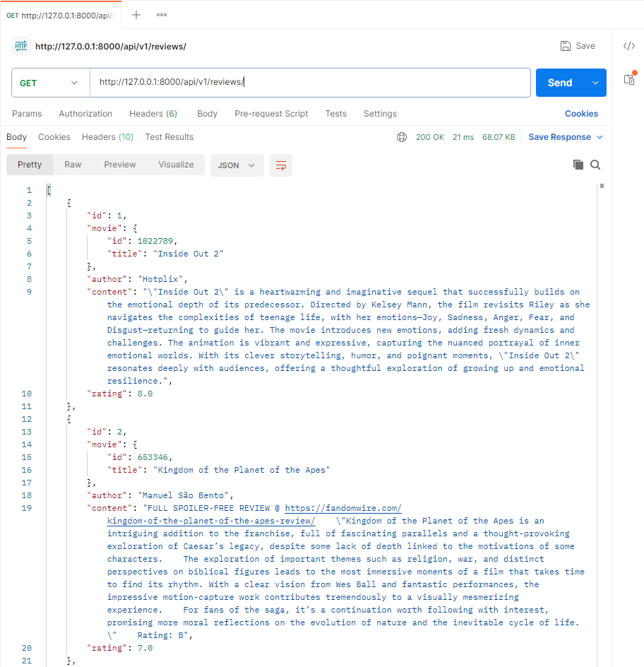

### F06: 단일 리뷰 조회
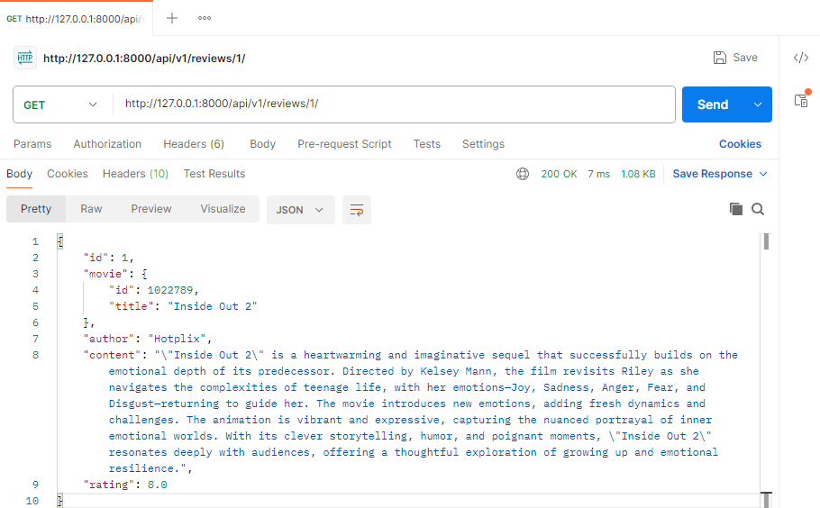

### F06: 단일 리뷰 수정 - 전체필드
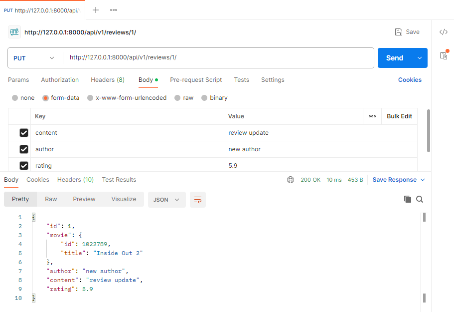
### F06: 단일 리뷰 수정 - 일부필드 (실패)
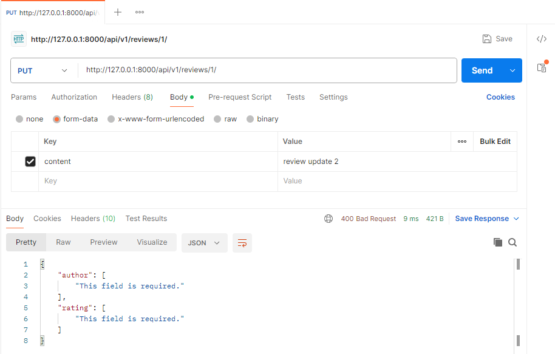
### F06: 단일 리뷰 수정 - 일부필드 (성공)
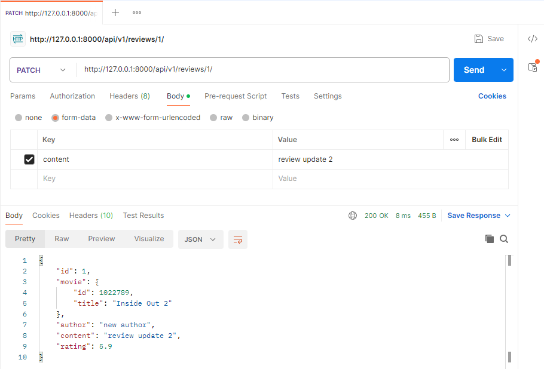

### F06: 단일 리뷰 삭제
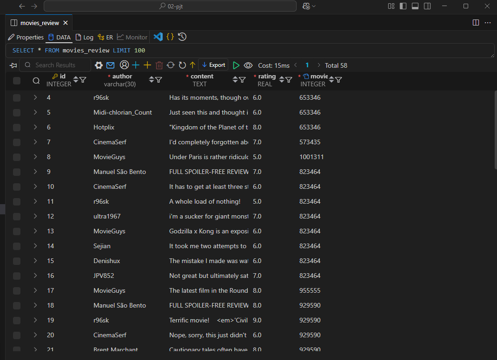
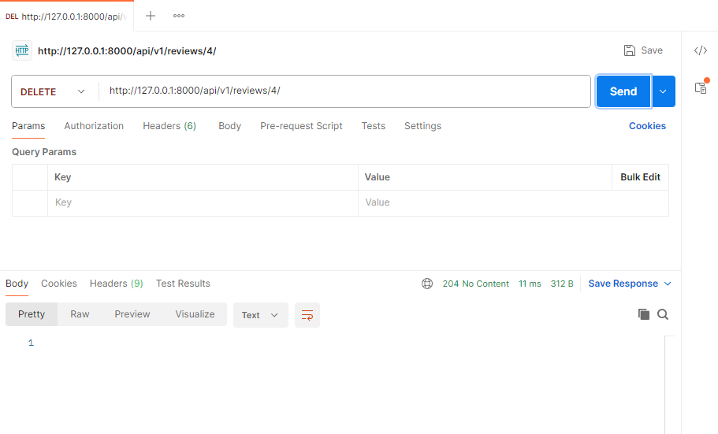
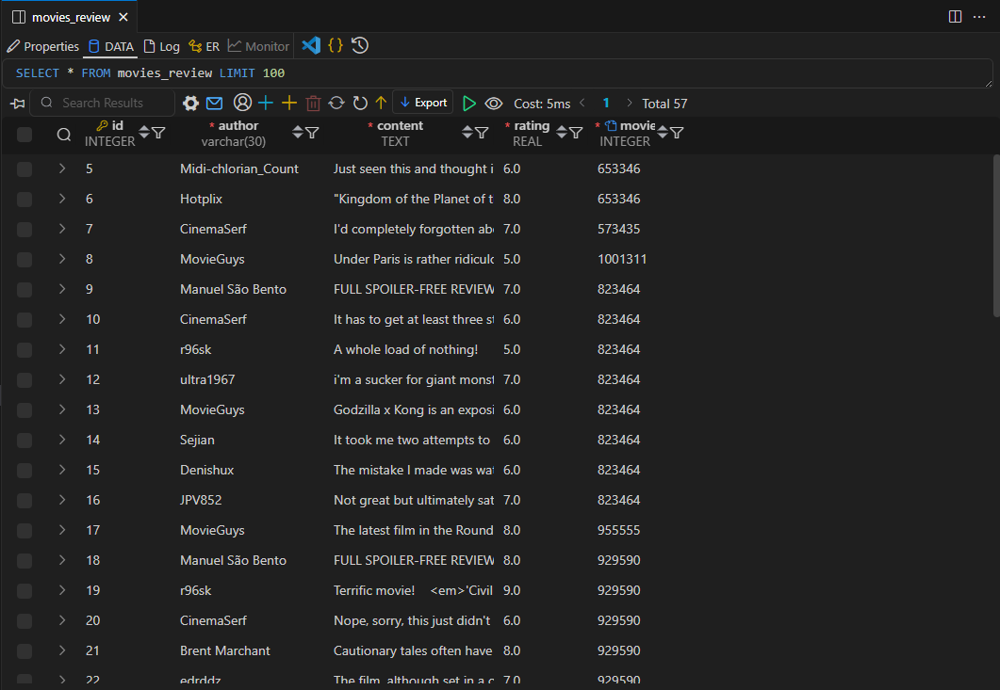

### F07: 특정 영화에 대한 리뷰 생성
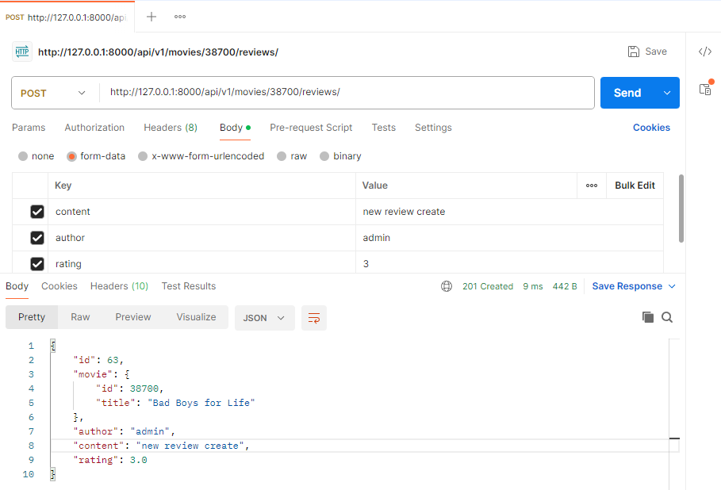

### F08: 로그인 회원가입 인증 권한 구현
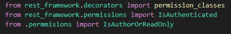

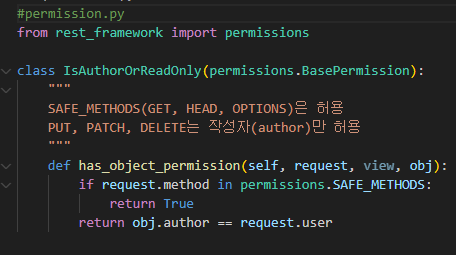

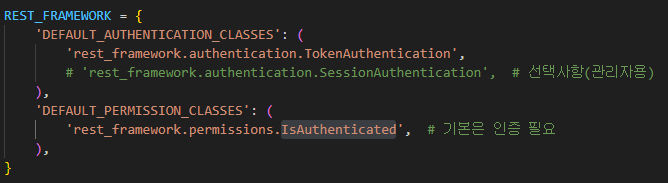

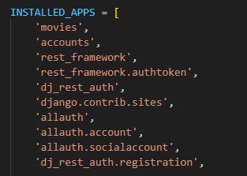

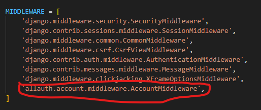

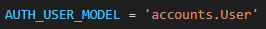

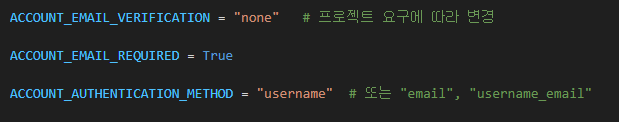

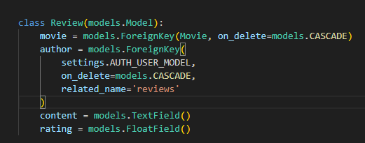

## 기록
### 영석
#### 코드 설명
`models.py` 파일은 데이터베이스의 구조를 정의해준다. 요구사항에 따라 Movie, Cast, Review, Genre를 정의하고, 서로의 관계를 특정해주었다. Movie와 Cast는 1:N, Movie와 Review는 1:N, Movie와 Genre는 M:N 관계를 가진다고 하니, 그에 따라 데이터베이스를 정의하였다. 이후 makemigrations와 migrate를 진행하면 우리가 원하는 데이터베이스 구조가 만들어진다.
`data/preprocessing.py` 파일은 주어진 데이터를 데이터베이스에 import할 수 있도록 csv 파일을 가공하는 역할을 한다. 특히 장르에 대한 데이터는 직접적으로 가져올 수 없기에, `movie_details.csv`에서 장르 리스트를 가져오고, 그 장르에 적절한 ID값을 더해주는 아이디어가 필요했었다. set을 사용하였기에 겹치는 데이터에 대한 고려를 크게 하지 않아도 되었으나, 그 set 내의 데이터에 순서를 더해주는 아이디어가 중요했던 것 같다.   
```python
genre_id_map = {genre: idx + 1 for idx, genre in enumerate(genre_data)}
```
이 부분 덕분에 장르 데이터에 바로 id값을 부여할 수 있었고, 또한 영화-장르 관계도에 문자열로 저장했던 장르 데이터의 id를 저장할 수 있었다.


#### 느낀점
우선 전처리하는 과정이 굉장히 중요하다는 생각이 들었다. 이러한 전처리 과정이 있었기에 데이터베이스에 데이터를 원하는 형식으로 넣을 수 있었고, 그렇기에 그 데이터를 사용해서 오류를 해결하고 우수한 결과물을 만들 수 있었다.

또한 이 과정을 마무리한 후에 코드 리뷰를 하면서 서로 협력하는 것이 얼마나 중요한 것인지 깨달았다. 동시에 서로 다른 코드를 짤 수 있기도 하고, 그러한 코드를 서로 보면서 놓친 부분이나 오류가 있는 것을 확인해 고치면서 더 좋은 결과물을 만들 수 있었다.

---

### 재헌 
#### 오류 수정
- 특정 영화에 대한 리뷰 생성
  - review 시리얼라이즈에 pk를 삽입할 지 고민이였습니다
    ``` python 
    # F07 특정 영화에 대한 리뷰 생성 api
    @api_view(['POST'])
    def movie_get_review(request,movie_pk):
        if request.method == 'POST':
            movie = get_object_or_404(Movie, pk=movie_pk)
        
            serializer = ReviewSerializer(data=request.data)
            if serializer.is_valid():
                serializer.save(movie=movie)
                return Response(serializer.data, status=status.HTTP_201_CREATED)
            return Response(serializer.errors, status=status.HTTP_400_BAD_REQUEST)
    ```
    ``` python
      class ReviewSerializer(serializers.ModelSerializer):
        class MovieShortSerializer(serializers.ModelSerializer):
            class Meta:
                model = Movie
                fields = ('id', 'title')
                
        movie = MovieShortSerializer(read_only=True)
        
        class Meta:
            model = Review
            fields = '__all__'
    ```
  - movie_pk 변수를 통해 특정 movie를 불러온다.
  - review 시리얼 라이즈를 블러와 movie와 함께 저장
---

## 은수
#### 오류 수정
  - git pull
  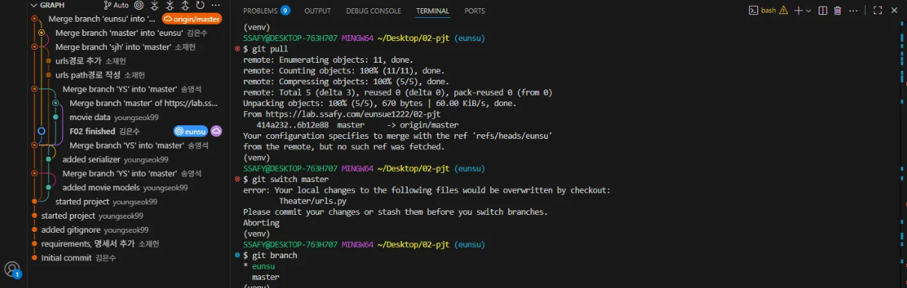
    - git add/commit/push 후 conflict가 나서 원격 저장소에서 merge를 수행했다.
    - 로컬 컴퓨터에서 수정 후 브랜치를 변경하려고 할 때 문제가 생겼다. <- master 브랜치와의 충돌 위험 때문.
    - git clone 해서 해당 레포지토리를 다시 받아왔다.

#### 느낀점

  - django serializers 구현의 어려움
    - 원하는 대로 데이터를 직렬화하거나 필터링하는데 어려움이 있었다.
  

  - 협업 시 git 사용의 어려움
    - 브랜치 생성 및 전환
    ```
    git branch eunsu # 브랜치 생성
    git status # 상태 확인
    git switch eunsu # 브랜치 전환
    ```
    - 작업 후
    ```
    git status # 상태 확인
    git add . # staged
    git commit -m "작업 내용" # commit 
    git push origin eunsu # push
    ```
    - merge request
      ```
      (merge request 생성)
      ```
      - 충돌이 있는 경우
      ```
      git add .
      git commit -m "conflicts solved"
      git push origin eunsu
      git pull
      ```

      - 충돌이 없는 경우
      ```
      (merge 클릭)
      ```
    - pull
    ```
    git pull
    ```